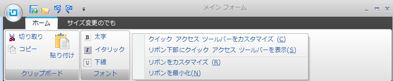
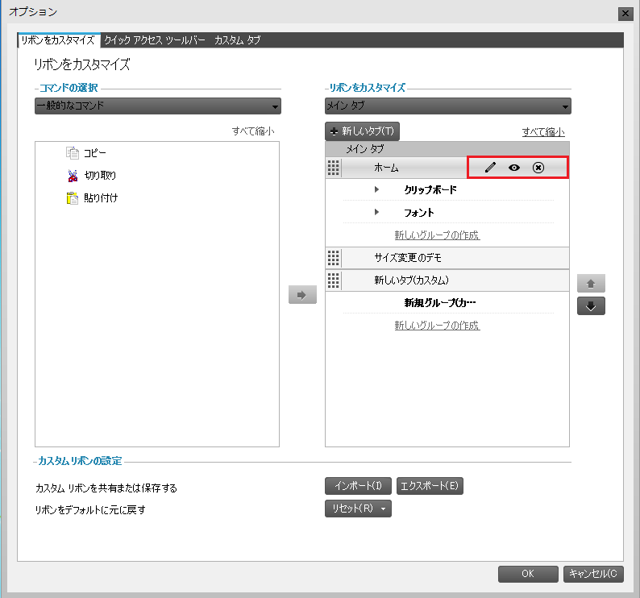

////

|metadata|
{
    "name": "wants-new-for-wintoolbarsmanager",
    "controlName": [],
    "tags": ["Commands","Editing"],
    "guid": "4d8be528-04a7-4f75-9938-ccbbe300b5b2",  
    "buildFlags": [],
    "createdOn": "2011-05-13T17:40:10.0026752Z"
}
|metadata|
////

= WinToolbarsManager の新機能

== リボンをカスタマイズ

Office 2010 のリリースによって、Microsoft® は各 Office アプリケーション内でリボンのレイアウトをカスタマイズする機能をユーザーに提供しています。今回の {ProductName} 2011 Volume 1 のリリースでは、同様の方法で、WinToolbarsManager™ コンポーネントのリボンのレイアウトを変更する機能をエンドユーザーに提供します。

== 新しいコンポーネント - WinRibbonCustomizationProvider™

カスタマイズは、WinRibbonCustomizationProvider™ という新しいコンポーネントで実行されます。このコンポーネントは WinToolbarsManager に接続されると、カスタマイズ機能を公開する新しいダイアログを提供します。

*C# の場合:*

----
using Infragistics.Win.UltraWinToolbars;
this.ultraToolbarsManager1.Ribbon.RibbonCustomizationProvider = this.ultraRibbonCustomizationProvider1;
----

*Visual Basic の場合:*

----
Imports Infragistics.Win.UltraWinToolbars
Me.ultraToolbarsManager1.Ribbon.RibbonCustomizationProvider = this.ultraRibbonCustomizationProvider1
----

== 新しいコンテキスト メニュー項目 - リボンをカスタマイズとクイック アクセス ツール バーをカスタマイズ

WinRibbonCustomizationProvider コンポーネントが WinToolbarsManager に接続されるとすぐに、2 つの新しいコンテキスト メニュー項目である、リボンをカスタマイズとクイック アクセス ツール バーをカスタマイズがリボンで自動的に使用可能になります。

これらの新しいコンテキスト メニュー項目のひとつを選択すると、ユーザーが以下を実行できる新しいダイアログが表示します。

* リボン タブ、グループ、ツールで以下のアクションを実行

** 追加
** 削除
** 表示／非表示
** 名前の変更
** 位置変更

* リボンのレイアウトのインポート/エクスポート
* リボンを元のレイアウトにリセット

== カスタマイズ ダイアログ

== 関連トピック

* link:winribboncustomizationprovider-about-winribboncustomizationprovider.html[WinRibbonCustomizationProvider について]
* link:winribboncustomizationprovider-using-the-ribbon-customization-dialog.html[リボン カスタマイズ ダイアログを使用]
* link:winribboncustomizationprovider-adding-custom-tab-to-ribbon-customization-dialog.html[カスタム タブをリボン カスタマイズ ダイアログに追加]