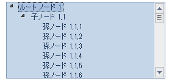

////

|metadata|
{
    "name": "whats-new-application-styling-new-office-2010-look-and-feel",
    "controlName": [],
    "tags": [],
    "guid": "b5b99fa2-cf6c-4788-bf94-ee7514b0bb44",  
    "buildFlags": [],
    "createdOn": "2010-09-16T20:30:54.5810255Z"
}
|metadata|
////

= 新しい Office 2010 のルック アンド フィール

今回の Infragistics® Windows Forms のリリースによって、アプリケーションは新しい Microsoft® Office 2010 のルック アンド フィールを取得できます。新しい Office2010Blue StyleSet がスタイル ライブラリに追加されました。 link:{ApiPlatform}win{ApiVersion}~infragistics.win.appstyling.stylemanager.html[StyleManager] クラスの link:{ApiPlatform}win{ApiVersion}~infragistics.win.appstyling.stylemanager~load.html[Load] メソッドを使用して、StyleSet（isl ファイル）をアプリケーションにロードすることによって、この新しいスタイルを利用できます。これでアプリケーション全体で新しいスタイルを利用できるようになりました。

Office2010Blue StyleSet が適用された WinTree

Office2010Blue StyleSet が適用された WinGrid

image::images/Whats_New_New_Office_2010_Look_and_Feel_02.png[]

関連トピック:

link:styling-guide-loading-a-stylelibrary.html[スタイル ライブラリのロード]