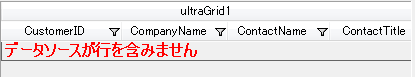
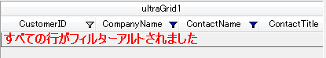

////

|metadata|
{
    "name": "whats-new-in-2012-volume-1",
    "controlName": [],
    "tags": [],
    "guid": "514be838-d9b3-42dc-ba03-8997a274126c",  
    "buildFlags": [],
    "createdOn": "2012-02-09T17:27:42.9873016Z"
}
|metadata|
////

= 2012 Volume 1 の新機能

[[topictop]]

このトピックでは {ProductName} 2012 Volume 1 リリースで導入された新しい機能とコンポーネントについて紹介します。

このトピックには次のセクションがあります。

*新機能とコンポーネント*

** <<ExcelEngine,Infragistics Excel Engine>>
** <<WinGanttViewPrintDocument,WinGanttViewPrintDocument>>
** <<WinGridEmptyMessage,WinGrid - 空メッセージ>>
** <<WinGridExternalFiltering,WinGrid - 外部フィルタリング>>
** <<WinGridExternalSummaryCalculations,WinGrid - 外部集計計算>>
** <<WinGridRowsCollection,WinGrid - フィルター変更イベントの行コレクション>>

[[ExcelEngine]]
== Infragistics Excel Engine

以下の表では、2012 Volume 1 リリースに含まれる新しい Infragistics Excel Engine 機能について整理しています。

=== Reference Name による Cells および Regions へのアクセス

Worksheet object の link:{ApiPlatform}documents.excel{ApiVersion}~infragistics.documents.excel.worksheet~getcell.html[GetCell] および link:{ApiPlatform}documents.excel{ApiVersion}~infragistics.documents.excel.worksheet~getregion.html[GetRegion] メソッドで、セルまたは範囲を示す参照名を使用することができます。以前はこれらのメソッドではセルまたは範囲のアドレスしか使用できませんでした。

==== 関連トピック:

* link:excelengine-accessing-cells-and-cell-regions-by-name.html[Reference Name による Cell および Region へのアクセス]

=== Excel 書式設定のサポート

Excel ライブラリは今回、組み込みのスタイル、親スタイル、書式オプション、スタイルに関係する多数の Microsoft Excel ビヘイビアーおよび解決済みのセル書式の決定機能へのアクセスをサポートしています。

==== 関連トピック:

* link:excelengine-excel-format-support.html[Excel 書式設定のサポート]

=== Excel 2007 カラー モデル

このリリースは更新されたカラー オブジェクト モデルを採用しています。Excel 2007 カラー モデルを使用すると、カラーを指定し、Workbook パレットで作業して、セルを塗りつぶすために新しい link:{ApiPlatform}documents.excel{ApiVersion}~infragistics.documents.excel.iworksheetcellformat~fill.html[Fill] プロパティを使用できます。

==== 関連トピック:

* link:excelengine-excel-2007-color-model.html[Excel 2007 カラー モデル]

=== Excel 表計算で名前付きテーブルをサポート

Excel ライブラリは今回、ワークシートからのデータで名前付きテーブルにアクセスおよび作成する機能をサポートします。このテーブルを並べ替えて、フィルターし集計できます。

==== 関連トピック:

* link:excelengine-support-named-tables-in-an-excel-spreadsheet.html[Excel 表計算で名前付きテーブルをサポート]

=== テーブルをフィルター

フィルターはフィルターを適用することで実行されます。フィルターが列で適用されると、テーブルのすべてのフィルターは、表示される行を決定するために再評価されます。この操作は、すべてのセルがテーブルの列のフィルター基準を満たす行を示します。

==== 関連トピック:

* link:excelengine-filtering-tables.html[テーブルのフィルタリング]

=== テーブルを並べ替え

テーブルの列で並べ替えの条件を設定することによって並べ替えが実行されます。並べ替え条件が列で設定されると、テーブルのすべての並べ替え条件は、テーブルのセルの順番を決定するために再評価されます。並べ替えの基準を満たすためにセルを移動させる必要があるとき、テーブルのセルの行全体が 1 つの単位として移動されます。テーブルのデータがそれ以降変更される場合、並べ替え条件は再評価されません。

==== 関連トピック:

* link:excelengine-sorting-tables.html[テーブルの並べ替え]

=== セル テキストの取得

このトピックは、セルの値、書式文字列、列幅およびワークシートのオプションを前提として、Microsoft Excel に表示されるテキストを決定する方法を説明します。

==== 関連トピック:

* link:excelengine-retrieving-the-cell-text-as-displayed-in-excel.html[Excel に表示されるセル テキストを取得 (セル テキストを取得)]

== 関連コンテンツ

=== トピック

以下のトピックでは、このトピックに関連する情報を提供しています。

[options="header", cols="a,a"]
|====
|トピック|目的

| link:excelengine-using-the-infragistics-excel-engine.html[Infragistics Excel Engine の使用]
|このセクションでは、Infragistics Excel Engine が提供する様々な特徴と機能を効果的に使用するための、タスク ベースの重要な情報について説明します。

|====

=== サンプル

以下のサンプルでは、このトピックに関連する情報を提供しています。

[options="header", cols="a,a"]
|====
|サンプル|目的

|名前付きテーブル
|このサンプルは Excel で名前付きテーブルを使用する方法を紹介します。ワークシート領域をテーブルとして書式設定できます。各テーブルに名前を設定し、テーブルを名前によって取得し、テーブルに適用するスタイルを指定できます。テーブルの各列で並べ替え条件とフィルターを取得または設定できます。テーブルのスタイル、列の並べ替え順序、列のフィルターなどのオプションを指定できます。Excel ファイルを保存して設定を確認します。

|新しいカラー モデル
|このサンプルでは、セル書式で新しいカラー モデルの使用法を紹介します。RGB 色を指定して、セル書式のすべての色プロパティに濃淡値を指定できます。セルで線状グラデーションと矩形グラデーションを使用できます。

|====

^<<topictop,機能に戻る>>

== WinGanttViewPrintDocument

[[WinGanttViewPrintDocument]]

{ProductName} 2012 Volume 1 から、アプリケーション内で使用されている UltraGanttView™ の内容をエンドユーザーが印刷できるようになりました。これは、Windows Forms ツール セットに新たに追加された UltraGanttViewPrintDocument™ コンポーネントによって実現されています。このコンポーネントを利用することにより、Microsoft® Project と同様に、紙面上のキャプションや凡例などを自由に配置、カスタマイズすることができます。

== 関連コンテンツ

=== トピック

以下のトピックでは、このトピックに関連する情報を提供しています。

[options="header", cols="a,a"]
|====
|トピック|目的

| link:winganttviewprintdocument-print-preview-with-winganttviewprintdocument.html[WinGanttViewPrintDocument を使用した印刷プレビュー]
|このトピックでは theWinGanttViewPrintDocument™ の印刷プレビュー機能の使用方法を説明します。このトピックでは具体的な例として、WinGanttViewPrintDocument™ と WinPrintPreviewDialog™ を使用して WinGanttView™ コントロールの印刷プレビューを行います。

| link:winganttviewprintdocument-configuring-the-legend.html[凡例の構成]
|WinGanttViewPrintDocument™ コンポーネントの凡例機能をご紹介します。

| link:winganttviewprintdocument-customizing-the-print-version-of-the-winganttview-control.html[WinGanttView コントロールの印刷版をカスタマイズする]
|このトピックでは link:{ApiPlatform}win.ultrawinganttview{ApiVersion}~infragistics.win.ultrawinganttview.ultraganttviewprintdocument~initializeganttview_ev.html[InitializeGanttView] イベントを使用して WinGanttView コントロールの印刷版をカスタマイズする方法についてコード例を用いて説明します。

|====

^<<topictop,機能に戻る>>

[[WinGridEmptyMessage]]
== WinGrid - 空メッセージ

WinGrid™ では、グリッドにデータ ソースがバインドされていない場合、またはバインドされているデータ ソースに行が含まれていない場合に、ランタイムにカスタム メッセージを表示することができます。

[[_Ref319929275]]
== 新 / 主要機能

=== 機能の概要

以下の表では、WinGrid コントロールに新しく追加された空データ メッセージ機能についてまとめています。

[options="header", cols="a,a"]
|====
|機能|説明

|<<_Ref319934753,データ ソース メッセージなし>>
|WinGrid にデータ ソースが定義されていない場合、メッセージを表示してユーザーに通知します

|<<_Ref319934758,行メッセージなし>>
|データ ソースが定義されていても、データ ソースに行が含まれていない場合にはメッセージを表示してユーザーに通知します

|<<_Ref319934762,表示対象の行メッセージはありません>>
|データ ソースが定義されていて、データ ソースには行が含まれていても、すべての行がフィルターによって除外されている場合、通知メッセージを表示します

|====

[[_Ref319934753]]

=== データ ソース メッセージなし

WinGrid にデータ ソースが定義されていない場合、カスタムメッセージを表示してユーザーに通知します。

image::images/WinGrid_-_Whats_New_-_Empty_Message_1.png[]

==== 関連トピック:

* link:wingrid-displaying-empty-message-in-wingrid.html[WinGrid に空メッセージを表示します]

[[_Ref319934758]]

=== 行メッセージなし

データ ソースが定義されているが、行が含まれていない場合、カスタム通知メッセージを表示してユーザーに通知します。

==== 関連トピック:

* link:wingrid-displaying-empty-message-in-wingrid.html[WinGrid に空メッセージを表示します]

[[_Ref319934762]]

=== 表示対象の行メッセージはありません

データ ソースが定義されていて、行が含まれているが、すべての行がフィルターによって除外されている場合、カスタム通知メッセージを表示してユーザーに通知します。

==== 関連トピック:

* link:wingrid-displaying-empty-message-in-wingrid.html[WinGrid に空メッセージを表示します]

== 関連コンテンツ

=== トピック

以下のトピックでは、このトピックに関連する情報を提供しています。

[options="header", cols="a,a"]
|====
|トピック|目的

| link:wingrid-displaying-empty-message-in-wingrid.html[WinGrid に空メッセージを表示します]
|このトピックでは、ランタイムにカスタマイズされたメッセージを表示し、グリッドにデータ ソースがバインドされていない、バインドされているデータ ソースに行が含まれていない、またはすべての行がフィルターによって除外されていることの表示方法を示します。

| link:wingrid-binding-wingrid-to-a-flat-data-source-clr2.html[WinGrid をフラット データ ソースにバインドする]
|このトピックでは、WinGrid コントロールを Visual Studio .NET プロジェクトに追加し、それをフラット データ ソース (子の行を含まない) にバインドする方法について説明します。

| link:wingrid-binding-wingrid-to-a-hierarchical-data-source-clr2.html[WinGrid を階層データ ソースにバインドする]
|このトピックでは、WinGrid コントロールを Visual Studio .NET プロジェクトに追加し、それを階層的なデータ ソース (子の行を含む) にバインドする方法について説明します。

|====

^<<topictop,機能に戻る>>

[[WinGridExternalFiltering]]
== WinGrid - 外部フィルタリング

{ProductName} 2012 Volume 1 から WinGrid™ コントロールに外部フィルタリングを使用できるようになりました。外部フィルタリングを利用することにより、WinGrid 上のデータに対しカスタムフィルタリングロジックを適用したり、LoadOnDemand 機能を有効にすることができます。これまでは、UltraGrid コントロールがすべての行を読み込んでから繰り返し走査を行っていたため、フィルタリング実行時は link:{ApiPlatform}win.ultrawingrid{ApiVersion}~infragistics.win.ultrawingrid.loadstyle.html[LoadOnDemand] 設定が事実上無効になっていました。この内部フィルタリングロジックを回避しても、内蔵フィルタリング UI を保持しカスタム フィルタリング コードを供給できます。

詳しくは、 link:wingrid-enabling-external-filtering.html[外部フィルタリングを有効にする]を参照してください。

== 関連コンテンツ

以下のトピックでは、このトピックに関連する情報を提供しています。

[options="header", cols="a,a"]
|====
|トピック|目的

| link:wingrid-enabling-external-filtering.html[外部フィルタリングを有効にする]
|このトピックでは、 WinGrid™ コントロールの外部フィルタリング機能を有効にし実装する方法を、コード例を交えながら説明します。

|====

^<<topictop,機能に戻る>>

[[WinGridExternalSummaryCalculations]]
== WinGrid - 外部集計計算

{ProductName} 2012 Volume 1 を起動すると、Load-On-Demand 機能を有効にして WinGrid™ コントロール上で集計を計算できます。これまでは、集計計算時に、WinGrid コントロールの計算ロジックがすべてのデータを読み込んだ上で行を繰り返し走査していました。現在は、内部集計計算ロジックをバイパスして集計値を直接提供することができるため、すべてのデータを読み込んだり、行コレクションを繰り返し走査する必要がなくなりました。

詳しくは、 link:wingrid-performing-external-summary-calculations.html[外部集計計算の実行]を参照してください。

== 関連コンテンツ

以下のトピックでは、このトピックに関連する追加情報を提供しています。

[options="header", cols="a,a"]
|====
|トピック|目的

| link:wingrid-performing-external-summary-calculations.html[外部集計計算の実行]
|このトピックでは、UserGrid™ コントロールで外部集計計算を実行する際によく行われるタスクについて、コード例を交えながら説明します。

|====

^<<topictop,機能に戻る>>

[[WinGridRowsCollection]]
== WinGrid - フィルター変更イベントの行コレクション

WinGrid™ コントロールにおいて、`BeforeRowFilterChanged` と `AfterRowFilterChanged` イベントの引数は `RowsCollection` を含みます。これで外部の処理とフィルタリングを実行できます。`BeforeRowFilterChanged` および `AfterRowFilterChanged` イベントで列フィルターが適用されている行を露呈させる際に、`RowsCollection` が提供されます。

== 関連コンテンツ

以下のトピックでは、このトピックに関連する追加情報を提供しています。

[options="header", cols="a,a"]
|====
|トピック|目的

| link:wingrid-performing-external-summary-calculations.html[外部集計計算の実行]
|このトピックでは、UserGrid™ コントロールで外部集計計算を実行する際によく行われるタスクについて、コード例を交えながら説明します。

| link:wingrid-binding-wingrid-to-a-flat-data-source-clr2.html[WinGrid をフラット データ ソースにバインドする]
|このトピックでは、WinGrid コントロールを Visual Studio .NET プロジェクトに追加し、それをフラット データ ソース (子の行を含まない) にバインドする方法について説明します。

| link:wingrid-binding-wingrid-to-a-hierarchical-data-source-clr2.html[WinGrid を階層データ ソースにバインドする]
|このトピックでは、WinGrid コントロールを Visual Studio .NET プロジェクトに追加し、それを階層的なデータ ソース (子行を含むデータ ソース) にバインドする方法を説明します。

|====

^<<topictop,機能に戻る>>