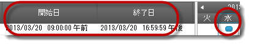
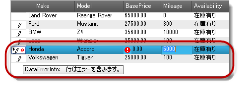
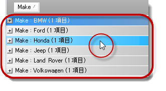

////
|metadata|
{
    "name": "whats-new-in-2013-volume-1",
    "controlName": [],
    "tags": [],
    "guid": "53206436-9e53-4cc4-8189-c1fa43062e40",
    "buildFlags": [],
    "createdOn": "2013-01-08T17:54:45.4288031Z"
}
|metadata|
////

= 2013 Volume 1 の新機能

=== 機能の概要

以下の表では、{ProductName} 2013 Volume 1 の新機能を簡単に説明します。詳細については、概要表の下をご覧ください。

++++
<table cellspacing="0" cellpadding="0">
    <tbody>
        <tr>
            <th>
                
コントロール

            </th>

            <th>
                
機能

            </th>

            <th>
                
説明

            </th>
        </tr>

        <tr>
            <td>
                

                    <a href="#_Ref350521203">タッチ対応コントロールのジェスチャ</a>
                

            </td>

            <td>
                

                    <a href="#_Ref350521227">タッチ ジェスチャ</a>
                

            </td>

            <td>
                
Infragistics のタッチ対応コントロールのタッチ ジェスチャを紹介します。

            </td>
        </tr>

        <tr>
            <td>
                

                    <a href="#_Ref346785024">WinActivityIndicator</a>
                

            </td>

            <td>
                

                    <a href="#_Ref346785035">アクティビティ インジケーターにテキストの表示</a>
                

            </td>

            <td>
                
実行しているアクティビティであるかどうかに関係なくコントロールがテキストを表示できます。

            </td>
        </tr>

        <tr>
            <td>
                

                    <a href="#_Ref349910337">WinComboEditor</a>
                

            </td>

            <td>
                

                    <a href="#_Ref349910347">AutoSuggest 強調表示の外観</a>
                

            </td>

            <td>
                
項目のドロップダウン リストのスタイル設定および強調表示を許可するには、この機能は valueList の機能を拡張します。

            </td>
        </tr>

        <tr>
            <td>
                

                    <a href="#_Ref349910356">WinDateTimeEditor</a>
                

            </td>

            <td>
                

                    <a href="#_Ref349910365">WinDateTimeEditor 入力の無効化</a>
                

            </td>

            <td>
                
ユーザーが直接 DateTime エディターに入力することを無効にするために WinDateTimeEditor を構成します。

            </td>
        </tr>

        <tr>
            <td>
                

                    <a href="#_Ref349910372">WinDesktopAlert</a>
                

            </td>

            <td>
                

                    <a href="#_Ref349910379">オープン アラーム ウィンドウの公開</a>
                

            </td>

            <td>
                
オープン アラーム ウィンドウを公開し、ナビゲートする機能を提供します。

            </td>
        </tr>

        <tr>
            <td>
                

                    <i><a href="#_Ref346785111">WinForms エディター コントロール</a></i>
                

            </td>

            <td>
                

                    <a href="#_Ref346785121">タッチ対応エディター コントロールおよび要素</a>
                

            </td>

            <td>
                
WinForms エディター コントロールのタッチ対応のビジュアル要素を紹介します。

            </td>
        </tr>

        <tr>
            <td>
                

                    <i><a href="#_Ref346785133">WinForms タブ コントロールおよびコンポーネント</a></i>
                

            </td>

            <td>
                

                    <a href="#_Ref346785143">タッチ対応エディター コントロールおよび要素</a>
                

            </td>

            <td>
                
WinFormsタブ コントロールおよびコンポーネントのタッチ対応ビジュアル要素を紹介します。

            </td>
        </tr>

        <tr>
            <td>
                

                    <a href="#_Ref346785151">WinGanttView</a>
                

            </td>

            <td>
                

                    <a href="#_Ref346785159">タイムラインのタスク配置</a>
                

            </td>

            <td>
                
スケジュール タスクの位置とサイズを構成します。

            </td>
        </tr>

        <tr>
            <td rowspan="4">
                

                    <a href="#_Ref346785172">WinGrid</a>
                

            </td>

            <td>
                

                    <a href="#_Ref346785183">空行の隔行の外観</a>
                

            </td>

            <td>
                
WinGrid の空行を隔行の外観で表示します。

            </td>
        </tr>

        <tr>
            <td>
                

                    <a href="#_Ref347760633">DataErrorInfo サポート</a>
                

            </td>

            <td>
                
データ検証サポートを DataErrorInfo を使用するために拡張します。IDataErrorInfo インターフェイスの独立なデータ検証処理を許可します。

            </td>
        </tr>

        <tr>
            <td>
                

                    <a href="#_Ref346785218">グループ化された行の HotTracking 外観</a>
                

            </td>

            <td>
                
WinGrid のグループ化された行の HotTracking 外観の構成を許可します。

            </td>
        </tr>

        <tr>
            <td>
                

                    <a href="#_Ref346785228">タッチ対応 WinGrid コントロール要素</a>
                

            </td>

            <td>
                
WinGrid コントロールのタッチ対応ビジュアル要素を紹介します。

            </td>
        </tr>

        <tr>
            <td>
                

                    <a href="#_Ref346785740">WinGridExcelExporter</a>
                

            </td>

            <td>
                

                    <a href="#_Ref346785766">DropDown リストを Excel にエクスポート</a>
                

            </td>

            <td>
                
Excel へドロップダウン リストのエクスポートを有効にします。たとえば、WinGrid に埋め込んだドロップダウン項目がある ValueList を含む
                WinComboEditor をグリッドから Excel へエクスポートできます。ドロップダウン リストは Excel に利用可能です。

            </td>
        </tr>

        <tr>
            <td>
                

                    <a href="#_Ref347759475">WinLabel</a>
                

            </td>

            <td>
                

                    <a href="#_Ref347759486">AutoEllipses サポート</a>
                

            </td>

            <td>
                
テキストがコントロールの境界線以外に表示されるかどうかを決定する新しい AutoEllipses プロパティを紹介します。その場合、楕円 (...)
                を挿入し、ツールチップに完全のテキストを表示します。

            </td>
        </tr>

        <tr>
            <td>
                

                    <a href="#_Ref346785801">WinListView</a>
                

            </td>

            <td>
                

                    <a href="#_Ref346785811">タッチ対応 <i>WinListView</i> コントロール</a>
                

            </td>

            <td>
                
WinListView コントロールのタッチ対応ビジュアル要素を紹介します。

            </td>
        </tr>

        <tr>
            <td>
                

                    <a href="#_Ref350242897">WinMaskedEdit</a>
                

            </td>

            <td>
                

                    <a href="#_Ref350242909">IP と Email のデフォルト マスク</a>
                

            </td>

            <td>
                
IPv4、IPv6、および Email の 3 つの追加の入力マスクを紹介します。

            </td>
        </tr>

        <tr>
            <td>
                

                    <a href="#_Ref346785843">WinTree</a>
                

            </td>

            <td>
                

                    <a href="#_Ref346785854">タッチ対応 <i>WinTree</i> コントロール</a>
                

            </td>

            <td>
                
WinTree コントロールのタッチ対応ビジュアル要素を紹介します。

            </td>
        </tr>

        <tr>
            <td>
                

                    <a href="#_Ref346785866">WinSchedule</a>
                

            </td>

            <td>
                

                    <a href="#_Ref346785875">スクロール可能な AllDayEvent 領域</a>
                

            </td>

            <td>
                
AllDayEvent 領域のビューで項目の無限スクロールを紹介します。

            </td>
        </tr>
    </tbody>
</table> 
++++

[[_Ref350521203]]
== タッチ対応コントロールのジェスチャ

[[_Ref350521227]]

=== タッチ ジェスチャ

Infragistics タッチ対応コントロールはタッチ画面のさまざまなジェスチャをサポートします。アプリケーション レベルの代わりにコントロールで特定のジェスチャを有効または無効に設定できます。ジェスチャは、動作を許可または回避するために処理可能なイベントがあります。

==== 関連トピック:

* link:touch-gestures.html[タッチ ジェスチャ]

[[_Ref346785024]]
== _WinActivityIndicator_

[[_Ref346785035]]

=== アクティビティ インジケーターにテキストの表示

_WinActivityIndicator_   コントロールは、アニメーションを再生しているかどうかに基づいて別のテキスト メッセージを表示するための 2 つのプロパティを提供します。`Text` プロパティは、アクティビティ インジケーターが再生されていない場合にテキストを表示します。`AnimationEnabledText` プロパティは、再生している場合にテキストを表示します。

==== 関連トピック:

* link:winactivityindicator-displaying-text-on-activity-indicator.html[アクティビティ インジケーターにテキストの表示]

[[_Ref349910337]]
== _WinComboEditor_

[[_Ref349910347]]

=== AutoSuggest 強調表示の外観

ValueList オブジェクトは、 _WinComboEditor_   および  _WinGrid_   の埋め込み  _WinComboEditor_   のドロップダウン リストの項目のスタイル設定および強調表示を許可します。

選択を強調表示するには、ユーザーの入力した文字の前景外観は青色に設定し、背景は黄色に設定されています。

image::images/Whats_New_in_2013_Volume_1_1.png[]

==== 関連トピック:

* link:wincomboeditor-autosuggest-highlight-appearance.html[AutoSuggest 強調表示の外観]

[[_Ref349910356]]
== _WinDateTimeEditor_

[[_Ref349910365]]

=== WinDateTimeEditor 入力の無効化

`DropDownStyle` プロパティを  _DropDownList_   に設定すると、エディターに日付の入力を無効にできます。この設定を使用すると、日付の選択が有効ですが、エディターに入力することはできません。プロパティを  _DropDown_   に設定すると、ユーザーは日付を選択、またはエディターに直接に入力できます。

==== 関連トピック:

* link:windatetimeeditor-preventing-from-typing-into-windatetimeeditor.html[WinDateTimeEditor 入力の無効化]

[[_Ref349910372]]
== _WinDesktopAlert_

[[_Ref349910379]]

=== オープン アラーム ウィンドウの公開

_WinDesktopAlert_   コントロールの `OpenWindows` プロパティは、オープン アラーム ウィンドウを公開し、ナビゲーションを許可します。現在開いているウィンドウを制御できます。

==== 関連トピック:

* link:windesktopalert-exposing-openalert-windows.html[オープン アラーム ウィンドウの公開]

[[_Ref346785111]]
== WinForms エディター コントロール

[[_Ref346785121]]

=== タッチ対応エディター コントロールおよび要素

_WinForms_   エディター コントロールは以下のタッチ サポート コントロールを含みます。

*  _WinCalculatorDropDown_  
*  _WinCalendarCombo_  
*  _WinCheckEditor_  
*  _WinColorPicker_  
*  _WinCombo_  
*  _WinComboEditor_  
*  _WinCurrencyEditor_  
*  _WinDateTimeEditor_  
*  _WinFontNameEditor_  
*  _WinFormattedTextEditor_  
*  _WinMaskedEdit_  
*  _WinNumericEditor_  
*  _WinOptionSet_  
*  _WinTextEditor_  
*  _WinTimeSpanEditor_  
*  _WinTimeZoneEditor_  

==== 関連トピック:

* link:touch-enabled-editor-controls.html[タッチ エディター コントロールおよび要素]

[[_Ref346785133]]
== WinForms タブ コントロールおよびコンポーネント

[[_Ref346785143]]

_WinForms_   タブ コントロールおよびコンポーネントはタッチ機能をサポートします。

タッチ サポートのタブ コントロール:

*  _WinTab_  
*  _WinTabStrip_  

タッチ サポートのタブ コンポーネント:

*  _WinTabbedMdiManager_  

==== 関連トピック:

* link:touch-enabled-tab-controls.html[タッチ タブ コントロールおよびコンポーネント]

[[_Ref346785151]]
== _WinGanttView_

[[_Ref346785159]]

=== タイムラインのタスク配置

_WinGanttView_   コントロールは、またがる期間に基づくスケジュール タスクの配置およびサイズのカスタム構成を許可する拡張機能を紹介します。タイムスロットの幅に対するタイムラインの配置の精度を確認してください。

==== 関連トピック:

* link:winganttview-timeline-task-positioning.html[タイムラインのタスク配置]

[[_Ref346785172]]
== _WinGrid_

[[_Ref346785183]]

=== 空行の隔行の外観

_WinGrid_   は、 _WinGrid_   の link:{ApiPlatform}win.ultrawingrid{ApiVersion}~infragistics.win.ultrawingrid.emptyrowsettings~rowalternateappearance.html[EmptyRowSettings.RowAlternateAppearance] プロパティを使用し、データの下にある空行の隔行に外観を適用する機能を提供します。

image::images/Whats_New_in_2013_Volume_1_3.png[]

==== 関連トピック:

* link:wingrid-showing-empty-rows.html[空行の表示]

[[_Ref347760633]]

=== DataErrorInfo サポート

このトピックは、 _WinGrid_   コントロールの拡張されたデータ検証機能を紹介し、構成例を提供します。依存の `IDataErrorInfo` と違います。

==== 関連トピック:

* link:wingrid-dataerrorinfo-support.html[DataErrorInfo サポート]

[[_Ref346785218]]

=== グループ化された行の HotTracking 外観

_WinGrid_   コントロールの HotTracking 機能はセル、行、およびヘッダーだけでなく、グループ化された行もサポートされます。

==== 関連トピック:

* link:wingrid-hottracking-grouped-rows.html[グループ化された行のホット トラッキング]

[[_Ref346785228]]

=== タッチ対応 WinGrid コントロール要素

_WinGrid_ コントロールはタッチ機能をサポートします。

==== 関連トピック:

* link:touch-enabled-wingrid-control-elements.html[タッチ WinGrid コントロール要素]

[[_Ref346785740]]
== _WinGridExcelExporter_

[[_Ref346785766]]

=== DropDown リストを Excel にエクスポート

_WinGridExcelExporter_   コントロールは  _WinDropDown_  、 _WinCombo_  、または  _WinComboEditor_   などの ValueList プレゼンター コントロールの Excel へのエクスポートをサポートします。 バインドされる値のリストを Excel にエクスポートします。

==== 関連トピック:

* link:wingridexceledporter-exporting-dropdown-list-to-excel.html[DropDown リストを Excel にエクスポート]

[[_Ref347759475]]
== _WinLabel_

[[_Ref347759486]]

=== AutoEllipses サポート

_WinLabel_   コントロールは新しい link:{ApiPlatform}win.misc{ApiVersion}~infragistics.win.misc.ultralabel~autoellipsis.html[AutoEllipsis] プロパティをサポートします。テキストがコントロールの境界線以外に描画するシナリオを決定し、処理します。

このプロパティはデフォルトで True です。長いテキストを示すために、楕円 (...) と置き換えします。マウスがコントロールの上にホバーされた場合、完全テキストを表示するツールチップが作成されます。

このプロパティが False の場合、 _WinLabel_   コントロールは自動的にテキストのトリミングを処理しません。

[[_Ref346785801]]
== _WinListView_

[[_Ref346785811]]

=== タッチ対応 WinListView コントロール

_WinListView_ コントロールはさまざまなビューでタッチ機能をサポートします。

==== 関連トピック:

* link:touch-enabled-winlistview-control.html[タッチ WinListView コントロール]

[[_Ref350242897]]
== _WinMaskedEdit_

[[_Ref350242909]]

=== IP と Email のデフォルト マスク

_WinMaskedEdit_ コントロールは 13.1 リリースの 3 つの新しいマスク (IPv4、IPv6、および Email) を紹介します。

==== 関連トピック:

* link:winmaskededit-default-masks-for-ip-and-email.html[IP と Email のデフォルト マスク]

[[_Ref346785843]]
== _WinTree_

[[_Ref346785854]]

=== タッチ対応 WinTree コントロール

_WinTree_ コントロールはさまざまなビューでタッチ機能をサポートします。

==== 関連トピック:

* link:touch-enabled-wintree-control.html[タッチ WinTree コントロール]

[[_Ref346785866]]
== _WinSchedule_

[[_Ref346785875]]

=== スクロール可能な AllDayEvent 領域

_WinSchedule_ コントロールは  _UltraDayView_ コントロールの link:{ApiPlatform}win.ultrawinschedule{ApiVersion}~infragistics.win.ultrawinschedule.appointment~alldayevent.html[AllDayEvent] 領域を拡張しました。スクロールをサポートし、以前の 16 イベント制限を解除します。この制限を解除すると、イベントの数の制限なしで、表示領域以外のイベントを表示するには、スクロールバーおよびスクロール ボタンを構成できます。

image::images/Whats_New_in_2013_Volume_1_6.png[]

==== 関連トピック:

* link:winschedule-scrollable-alldayevent-area.html[スクロール可能な AllDayEvent 領域]