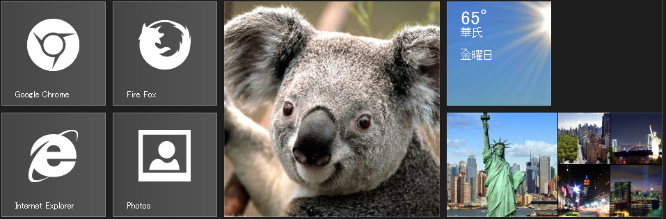
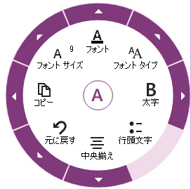
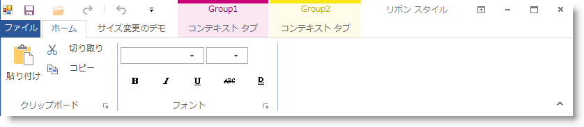

////
|metadata|
{
    "name": "whats-new-in-2013-volume-2",
    "controlName": [],
    "tags": [],
    "guid": "12838259-7b0c-42f9-80d4-5f591a7c38e6",
    "buildFlags": [],
    "createdOn": "2013-09-20T18:46:44.6025427Z"
}
|metadata|
////

= 2013 Volume 2 の新機能

=== 機能の概要

以下の表では、 _Infragistics_   Windows Forms 2013 Volume 2 の新機能を簡単に説明します。詳細については、表の後をご覧ください。

++++
<table cellspacing="0" cellpadding="0">
    <tbody>
        <tr>
            <th>
                
コントロール

            </th>

            <th>
                
機能

            </th>

            <th>
                
説明

            </th>
        </tr>

        <tr>
            <td><a href="#_Ref366743382">WinLiveTileView</a>™</td>

            <td>
                
<a href="#_Ref366743417">新規コントロール</a>

            </td>

            <td>
                
WinLiveTileView コントロールは 13.2 で {ProductName} ファミリーに新しく追加されました。Windows 8
                のスタート画面と類似した外観および動作を提供します。

            </td>
        </tr>

        <tr>
            <td><a href="#_Ref366743425">WinRadialMenu</a>™</td>

            <td>
                
<a href="#_Ref366743642">新規コントロール</a>

            </td>

            <td>
                
WinRadialMenu コンポーネントも 13.2 で {ProductName} ファミリーに新しく追加されました。Microsoft
                OneNote MX 2013 ラジアル メニューと類似の機能性を提供します。

            </td>
        </tr>

        <tr>
            <td><a href="#_Ref366743440">WinToolbarsManager</a>™</td>

            <td>
                
<a href="#_Ref366743451">Office 2013 リボン スタイル</a>

            </td>

            <td>
                
WinToolbarsManager のリボン コントロールのスタイル設定オプションが拡張され、新しく Office 2013
                Ribbon スタイルになりました。

            </td>
        </tr>

        <tr>
            <td><a href="#_Ref366743460">WinGrid</a>™</td>

            <td>
                
<a href="#_Ref366743481">印刷中の改ページ</a>

            </td>

            <td>
                
開発時に、印刷プレビューおよび印刷で特定の行に改ページが挿入できるようになりました。

            </td>
        </tr>

        <tr>
            <td><a href="#_Ref366743500">WinTree</a>™</td>

            <td>
                
<a href="#_Ref366743509">印刷プレビューおよび印刷</a>

            </td>

            <td>
                
開発時に、WinTree の印刷プレビューおよび印刷機能が使用できるようになりました。

            </td>
        </tr>

        <tr>
            <td>
                
<a href="touch-enabled-windesktopalert.html">WinDesktopAlert</a>™

            </td>

            <td rowspan="11">
                

                    <a href="WinTouchProvider.html" data-auto-update-caption="true">タッチ サポート</a>
                

            </td>

            <td rowspan="11">
                
タッチ サポートおよびタッチ ジェスチャが、ほぼすべてのコントロールに実装されました。

            </td>
        </tr>

        <tr>
            <td>
                
<a href="touch-enabled-winmessagebox.html">WinMessageBox</a>™

            </td>
        </tr>

        <tr>
            <td>
                
<a href="touch-enabled-schedule-controls.html#-Ref366599899">WinDayView</a>™

            </td>
        </tr>

        <tr>
            <td>
                
<a href="touch-enabled-schedule-controls.html#-Ref366599947">WinMonthViewSingle</a>™

            </td>
        </tr>

        <tr>
            <td>
                
<a href="touch-enabled-schedule-controls.html#-Ref366599969">WinMonthViewMuilti</a>™

            </td>
        </tr>

        <tr>
            <td>
                
<a href="touch-enabled-schedule-controls.html#-Ref366600008">WinCalendarCombo</a>™

            </td>
        </tr>

        <tr>
            <td>
                
<a href="touch-enabled-winexplorerbar.html">WinExplorerBar</a>™

            </td>
        </tr>

        <tr>
            <td>
                
<a href="touch-enabled-wintimelineview.html">WinTimelineView</a>™

            </td>
        </tr>

        <tr>
            <td>
                
<a href="touch-enabled-winganttview.html">WinGanttView</a>™

            </td>
        </tr>

        <tr>
            <td>
                
<a href="touch-enabled-windockmanager.html">WinDockManager</a>™

            </td>
        </tr>

        <tr>
            <td>
                
<a href="touch-enabled-wintoolbarsmanager-and-ribbon.html">WinToolbarsManager</a>™

            </td>
        </tr>

        <tr>
            <td>
                
<a href="#_Ref366743522">Infragistics Document Engine</a>™

            </td>

            <td>
                
<a href="#_Ref366743578">プログレス インジケーター</a>

            </td>

            <td>
                
この機能は、開発するアプリケーションでプログレス インジケーターを表示するための情報を提供します。ドキュメントの保存中に表示されます。

            </td>
        </tr>
    </tbody>
</table> 
++++

[[_Ref366743382]]
== _WinLiveTileView_

[[_Ref366743417]]

=== 新規コントロール

_WinLiveTileView_   コントロールは、パン、ズーム、長押しなどのタッチ ジェスチャに完全にサポートする、Microsoft Windows 8 のスタート画面のルック アンド フィールをエミュレートします。

このコントロールは、コントロールのデザイナー インターフェイスや  _Infragistics AppStylist_™ から、グループやタイル、その他のビジュアル要素の外観を簡単にスタイル設定する方法を提供します。

_WinLiveTileView_   のもう 1 つの主要な機能であるローカライズは、Microsoft Windows 8 タイル パラダイムが対応するローカライズと類似しています。この機能を使用すると、「`fr-FR`」(フランス) などのカルチャ固有の名称をタイルに設定できます。また、コンピュータのロケール設定と指定したカルチャ固有の名称に一致した場合に、テキストを表示する言語でローカライズされたテキストを表示します。

==== 関連トピック:

* link:winlivetileview.html[WinLiveTileView]

[[_Ref366743425]]
== _WinRadialMenu_

[[_Ref366743642]]

_WinRadialMenu_   コンポーネントは、Microsoft  _OneNote MX 2013_   ラジアル メニューと類似したツールおよび機能性を提供します。Windows 8 のみではなく、Windows 7 および Windows XP OSとも互換性があります。

このコンポーネントにより、コントロールのデザイナー インターフェイスや  _Infragistics AppStylist™_   から、ツールの外観を簡単にスタイル設定する方法が提供されています。

異なる機能や設定を持つアプリケーションを、1 つまたは複数の  _WinRadialMenu_   コンポーネントに表示することができます。 *マウス* 、 *キーボード* およびタッチ対応モニタの *タッチ* 操作をサポートしています。

==== 関連トピック:

* link:winradialmenu.html[WinRadialMenu]

[[_Ref366743440]]
== _WinToolbarsManager_

[[_Ref366743451]]

=== Office 2013 リボン スタイル

_WinToolbarsManager_   コンポーネントでは、Office 2007、Office 2010、Scenic Ribbons などの複数のビュー スタイルがサポート対応済みです。さらに、新しい Office 2013 のスタイルと同様に Microsoft Office 2013 の新しいリボンのバージョンにも対応しています。今回の実装には主として、 _WinToolbarsManager_   の既存のリボン アーキテクチャのスタイル変更を含んでいます。

==== 関連トピック:

* link:wintoolbarsmanager-office-2013-ribbon-look-and-feel.html[Office 2013 リボンのルック アンド フィール]

[[_Ref366743460]]
== _WinGrid_

[[_Ref366743481]]

=== 印刷中の改ページ

_WinGrid_   コントロールの印刷機能が拡張され、印刷プレビューおよび印刷中に特定の行または行グループで改ページが挿入できる改ページオプションがサポートされています。

新しいページを開始するための行が設定されていない場合、この機能拡張は既存の処理を変更しません。

==== 関連トピック:

* link:wingrid-page-break-when-printing.html[印刷中の改ページ]

[[_Ref366743500]]
== _WinTree_

[[_Ref366743509]]

=== 印刷プレビューおよび印刷

_WinTree_   印刷機能が提供する印刷プレビューや印刷機能を使用して、 _標準_  、 _OutlookExpress_  、 _グリッド_  、 _フリーフォーム_  などのサポートされたビュー スタイルで  _WinTree_   による表示および印刷が実行できます。

==== 関連トピック:

* link:wintree-printing-wintree.html[WinTree の印刷]

[[_Ref366743522]]
== _Infragistics ドキュメント エンジン_

[[_Ref366743578]]

=== プログレス インジケーター

Infragistics ドキュメント エンジン の拡張により、保存中の PDF や XPS ドキュメントの情報を開発者が取得できるようになりました。取得した情報を使用して、保存処理の実行中にプログレス インジケーターを表示することができます。

.注:
[NOTE]
====
この機能では、進捗の情報のみが提供され、プログレス インジケーター コントロールは提供されません。
====

開発者による link:{ApiPlatform}documents.reports{ApiVersion}~infragistics.documents.reports.report.report_members.html[Report] オブジェクトの link:{ApiPlatform}documents.reports{ApiVersion}~infragistics.documents.reports.report.report~reportpublishing_ev.html[ReportPublishing] イベント処理が必要です。進捗を表示するイベントから返されたパラメーターを使用します。

[options="header", cols="a,a"]
|====
|パラメーター名|説明

|Percentage
|保存処理中に保存された項目の合計数の割合です。

|Total
|保存処理中の項目の合計数です。

|Current
|現在、保存中のオブジェクトです。

|IsFinished
|保存操作が終了したかどうかを示すブール値 (`True` または `False`)。

|====

==== 関連トピック:

* link:waw-infragistics-document-engine.html[Infragistics ドキュメント エンジン]