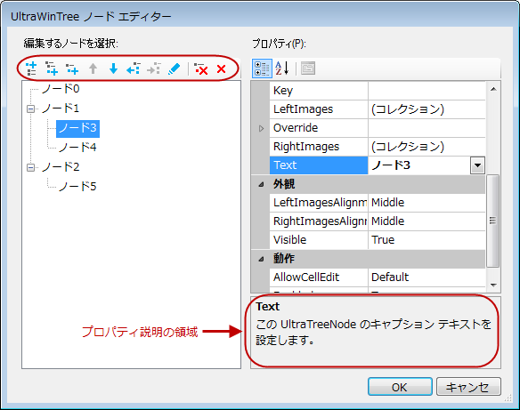

////

|metadata|
{
    "name": "whats-new-in-2014-volume-1",
    "controlName": [],
    "tags": [],
    "guid": "bbf97a74-9db5-43aa-986d-141528b967dc",  
    "buildFlags": [],
    "createdOn": "2014-01-29T18:20:44.1472239Z"
}
|metadata|
////

= 2014 Volume 1 の新機能

== トピックの概要

=== 目的

このトピックは、Infragistics® Windows Forms 2014 Volume 1 リリースの新しいコントロール、新機能、および更新機能の概要を提供します。

== 新機能の概要

=== 新機能の概要表

以下の表は 2014 Volume 1 の新機能の概要を提供します。詳細については、概要表の下をご覧ください。

==== WinPivotGrid

[options="header", cols="a,a"]
|====
|機能|説明

|<<_Ref382587830,新規コントロール>>
|Windows Forms® 製品の 2014.1 リリースには _WinPivotGrid_ コントロールが追加されました。

|====

==== 共通機能

[options="header", cols="a,a"]
|====
|機能|説明

|<<_Ref382587568,右から左サポート>>
|Infragistics エディター コントロールの表示されるテキストおよび UI 要素で右から左モードを追加しました。

|<<_Ref382587624,スピン ボタンのアクセラレーション>>
|スピン ボタンは、エディターで表示される値を増加するか、減少する機能を提供します。

|====

==== WinTab と WinTabStrip

[options="header", cols="a,a"]
|====
|機能|説明

|<<_Ref382587852,新しいタブ ボタンを追加する>>
|この機能は、UI から新しいタブを追加する「新しいタブ」ボタンを追加できます。

|====

==== WinToolbarsManager

[options="header", cols="a,a"]
|====
|機能|説明

|<<_Ref382587855,構成可能なタブ項目の表示状態>>
|この機能は、リボン タブ項目の表示状態を構成できます。

|<<_Ref382587860,優先ツールの表示状態>>
|この機能は、頻繁に使用されるツールの重要レベルを構成できます。頻繁に使用されるツールの優先順位を設定できます。

|====

==== WinCombo と WinComboEditor

[options="header", cols="a,a"]
|====
|機能|説明

|<<_Ref382587774,オートコンプリートで分音記号を無視>>
|この機能は _WinCombo_ および _WinComboEditor_ コントロールで実装されます。分音記号を無視して検索を実行できます。

|====

==== WinGrid

[options="header", cols="a,a"]
|====
|機能|説明

|<<_Ref382587678,行削除の確認の無効化>>
|ユーザーが行を削除しようとした場合の確認ダイアログを無効にできます。

|<<_Ref382587687,構成可能な最初の並べ替え順序>>
|この機能は、定義済みの最初の並べ替え順序を適用するオプションを提供します。

|====

==== WinSpellChecker

[options="header", cols="a,a"]
|====
|機能|説明

|<<_Ref382587845,構成可能な SpellChecker の下線>>
|この機能は、スペルミスの単語の下に表示される下線の垂直オフセットを変更できます。

|====

==== WinTilePanel

[options="header", cols="a,a"]
|====
|機能|説明

|<<_Ref382587868,タッチ対応の WinTilePanel>>
|_WinTilePanel_ コントロールでタッチ サポートおよびジェスチャを実装しました。

|====

==== WinTree

[options="header", cols="a,a"]
|====
|機能|説明

|<<_Ref382587898,ノード エディターのデザイナー ダイアログ>>
|ツリーのノード デザイナー ダイアログを更新しました。開発者がツリー ノードをデザイン タイムに作成し、変更できます。

|====

[[_Ref380501687]]
== _WinPivotGrid_

[[_Ref382587830]]

=== 新規コントロール

_WinPivotGrid_   コントロールは Windows Forms 製品の 2014.1 リリースに追加しました。

_WinPivotGrid_   コントロールは、ビジネス アプリケーションで多次元 (OLAP) データを集計する解析ツールです。

image::images/Whats_New_in_2014_Volume_1_1.png[]

==== 関連するトピック:

* link:winpivotgrid.html[WinPivotGrid]

== 共通機能

[[_Ref382587568]]

=== 右から左サポート

この機能は、エディター コントロールで右から左モードを構成します。コントロールの表示されるテキストおよび UI 要素を水平方向に反転します。コントロールの表示されるテキストおよび UI 要素がミラーされます。この要素は通常 Left-to-Right 方向で表示さます。

==== サポートされるコントロール:

* _WinButton_

* _WinCalculatorDropDown_

* _WinCalendarCombo_

* _WinCheckEditor_

* _WinColorPicker_

* _WinCombo_

* _WinComboEditor_

* _WinCurrencyEditor_

* _WinDateTimeEditor_

* _WinDropDownButton_

* _WinFontNameEditor_

* _WinFormattedLinkLabel_

* _WinFormattedTextEditor_

* _WinLabel_

* _WinMaskedEdit_

* _WinNumericEditor_

* _WinOptionSet_

* _WinProgressBar_

* _WinScrollBar_

* _WinTextEditor_

* _WinTimeSpanEditor_

* _WinTimeZoneEditor_

* _WinTrackBar_

==== 関連するトピック:

* link:right-to-left-support.html[右から左サポート]

[[_Ref382587624]]

=== スピン ボタンのアクセラレーション

スピン ボタン アクセラレーションでは、スピン ボタンを長押しした際にエディターの値のスピンの速度を速めることができます。

この機能は Infragistics エディター コントロールで実装し、スピン ボタン アクセラレーションを可能にできます。スピン ボタンにしきい値を設定すると、アクセラレーションを開始するトリガーを設定できます。

==== サポートされるコントロール:

* _WinCalculatorDropDown_

* _WinCalendarCombo_

* _WinColorPicker_

* _WinCombo_

* _WinComboEditor_

* _WinCurrencyEditor_

* _WinDateTimeEditor_

* _WinFontNameEditor_

* _WinFormattedTextEditor_

* _WinMaskedEdit_

* _WinNumericEditor_

* _WinTextEditor_

* _WinCalculatorDropDown_

* _WinTimeSpanEditor_

* _WinTimeZoneEditor_

==== 関連するトピック:

* link:wineditors-configuring-the-spin-acceleration.html[スピン アクセラレーションの構成]

== _WinTab_   と  _WinTabStrip_

[[_Ref382587852]]

=== 新しいタブ ボタンを追加する

この機能は、最新ブラウザーのタブのようにアプリケーション実行中に新しいタブを追加する機能を提供します。

==== 関連するトピック:

* link:wintab-adding-new-tab-button.html[新しいタブ ボタンの追加]

== _WinToolbarsManager_

[[_Ref382587855]]

=== 構成可能なタブ項目の表示状態

この機能は、リボン タブ項目の表示状態を構成できます。タブ項目を表示または非表示にできます。タブ項目を非表示するとリボン領域の高さが減少します。

==== 関連するトピック:

* link:wintoolbarsmanager-configuring-ribbon-tab-item-visibility.html[リボンのタブ項目の表示状態の構成]

[[_Ref382587860]]

=== 優先ツールの表示状態

この機能はツールの優先プロパティを追加します。データ使用によるツールバーのスペースに制限がある場合、ツールの優先順位を設定できます。ツールバーですべてのツールを表示するスペースがない場合、ツールバーはよく使用されるツールのみを表示し、その他のツールはメニューに表示します。

各ツールは `SharedProps` オブジェクトで link:{ApiPlatform}win.ultrawintoolbars{ApiVersion}~infragistics.win.ultrawintoolbars.sharedprops~priority.html[Priority] プロパティを公開します。このプロパティはツールの重要性を指定します。また、 _UltraToolbarsManager_   はツールの使用頻度データ (利用状況データ) を保存し、ツールの優先の並べ替えで使用されます。

_UltraToolbarsManager_   クラスは新しい link:{ApiPlatform}win.ultrawintoolbars{ApiVersion}~infragistics.win.ultrawintoolbars.ultratoolbarsmanager~toolsortingprecedence.html[ToolSortingPrecedence] プロパティを公開します。優先または使用データの重要性を指定できます。

== _WinCombo_  と  _WinComboEditor_

[[_Ref382587774]]

=== オートコンプリートで分音記号を無視

この機能は、検索文字列で分音記号を無視する機能を提供します。検索結果に分音記号がある単語を含むか、除外することができます。

==== 関連するトピック:

* link:wincomboeditor-ignoring-diacritics-on-autocomplete.html[オートコンプリートで分音記号を無視]

[[_Ref382519448]]
[[_Ref380501819]]
== _WinGrid_

[[_Ref382587678]]

=== 行削除の確認の無効化

この機能は、ユーザーが行を削除するときに確認ダイアログを無効にする新しいプロパティを開発者に提供します。

デフォルトで、 _WinGrid_   から行を選択し、削除する場合、行を削除する前に削除操作を確認するための確認ダイアログ ボックスは表示されます。

==== 関連するトピック:

* link:wingrid-disabling-delete-row-confirmation.html[行削除の確認の無効化]

[[_Ref382587687]]

=== 構成可能な最初の並べ替え順序

この機能は、最初に列を並べ替えるときに定義済みの並べ替え順序を使用するオプションを提供します。

==== 関連するトピック:

* link:wingrid-configuring-initial-sort-order.html[並べ替え順序の初期設定を構成]

[[_Ref382428454]]

[[_Ref382519482]]

== _WinSpellChecker_

[[_Ref382587845]]

=== 構成可能な SpellChecker の下線

link:{ApiPlatform}win.ultrawinspellchecker{ApiVersion}~infragistics.win.ultrawinspellchecker.ultraspellchecker~underlineverticaloffset.html[UnderlineVerticalOffset] プロパティを使用すると、SpellChecker の下線を構成できます。スペルミスの単語の下に描画される下線の垂直オフセットを設定するために整数値を受け付けます。

==== 関連するトピック:

* link:winspellchecker-offsetting-the-spellchecker-underline.html[SpellChecker の下線のオフセット]

[[_Ref382519521]]

== _WinTilePanel_

[[_Ref382587868]]

=== タッチ対応の WinTilePanel

_WinTilePanel_   コントロールでタッチ サポートおよびジェスチャを実装しました。

==== 関連するトピック:

* link:touch-enabled-wintilepanel.html[タッチ対応の WinTilePanel]

[[_Ref382519534]]

[[_Ref382519548]]

== _WinTree_

[[_Ref382587898]]

=== 新しいノード エディターのデザイナー ダイアログ

新しいデザイナー ダイアログで、ツリー ノードの作成および変更のためのアイコン ボタンはダイアログの上部分に表示されます。ダイアログは、デザイン タイムにプロパティの情報を表示するためにプロパティの説明領域を含みます。

デザイナーでノードの位置を変更するためにドラッグ アンド ドロップできます。ボタンの有効状態はツリー構造およびノードの選択に基づいて変更されます。

==== 関連するトピック:

* link:wintree.html[WinTree]

=== ノードのチェックボックスの同期化

この機能を使用すると、チェックボックスを自動的に同期化できます。親ノードは、子ノードのチェック状態に基づいてチェック済み、未チェック、または不確定の状態になります。

==== 関連するトピック:

* link:wintree-synchronizing-check-boxes-of-the-tree-nodes.html[ツリー ノードのチェックボックスの同期化]