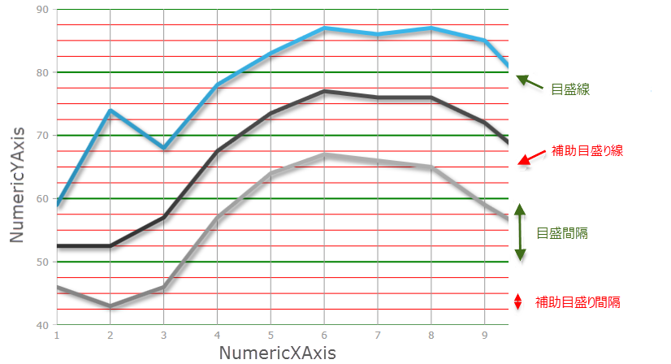

////
|metadata|
{
    "name": "whats-new-in-2015-volume-2",
    "controlName": [],
    "tags": [],
    "guid": "a715d375-738c-4326-b253-e8a384ddc934",
    "buildFlags": [],
    "createdOn": "2015-07-13T15:04:52.2879592Z"
}
|metadata|
////

= 2015 Volume 2 の新機能

== トピックの概要

=== 目的

このトピックでは、Infragistics® Windows Forms 2015 Volume 2 リリースの新規コントロール、新規・改善機能の概要について紹介します。

[[_Ref386478097]]
[[_Configuring_a_Custom]]
== 新機能

=== 新機能概要:

[options="header", cols="a,a"]
|====
|機能|コンポーネント

|
* <<Intervals,軸間隔 (主グリッド線/副グリッド線)>> 

* <<AnnotationLayer,注釈レイヤー>> 

* <<BubbleSeries,バブル シリーズ>> 

* <<PolarSeries,極座標シリーズ>> 

* <<RadialSeries,ラジアル シリーズ>> 

* <<StackedSeries,積層シリーズ>> 

* <<CategoryAngleAxis,カテゴリ角度軸>> 

* <<NumericAngleAxis,数字角度軸>> 

* <<NumericRadiusAxis,数字半径軸>> 

* <<CategoryTooltipLayer,カテゴリ ツールチップ レイヤー>> 

* <<ItemTooltipLayer,項目ツールチップ レイヤー>> 

* <<CategoryHighlightLayer,カテゴリ強調表示レイヤー>> 

* <<CategoryItemHighlightLayer,カテゴリ項目強調表示レイヤー>> 

* <<CrosshairLayer,十字線レイヤー>> 

* <<SaveTo,SaveTo (ImageType)>> 

* <<ScaleLegend,スケールの凡例>> 

* <<TouchGesture,タッチ ジェスチャ>> 

* <<ValueOverlay,値オーバーレイ>> 

|UltraDataChart

|<<Subscript_SuperScript,下付き文字および上付き文字の書式設定>>
|UltraFormattedTextEditor および UltraFormattedLinkLabel

|<<StartPositionStartLocation,StartPosition および StartLocation プロパティ>>
|UltraMessageBoxInfo

|<<MinSummaryRowHeight_DefaultSummaryRowHeight,MinSummaryRowHeight および DefaultSummaryRowHeight プロパティ>>
|UltraGrid

|<<NotificationBadges,通知バッジ>>
|UltraToolbarsManager

|<<FlatDataSource_DataAdapter,FlatDataSource DataAdapter クラス>>
|UltraPivotGrid

|<<Spreadsheet,新しいコントロール>>
|スプレッドシート (CTP)

|====

== UltraDataChart

[[Intervals]]
=== 主軸と副軸の間隔

DataChartView は、軸に垂直に表示される主軸と副軸の両方の間隔をサポートします。

以下は、緑の線で主間隔に値 10 を使用した NumericYAxis 上の主間隔の画像です。NumericYAxis の副間隔には赤い線と値に 2.5 を使用しています。

==== 関連トピック:

* link:datachart-configuring-major-and-minor-intervals.html[主間隔と副間隔の構成]

[[SaveTo]]

=== チャートの保存

このトピックでは、要素の SaveTo メソッドを使用して UltraDataChart の画像を保存する方法を紹介します。

==== 関連トピック:

* link:datachart-saving-a-chart-to-an-image.html[SaveTo メソッドの使用]

[[ScaleLegend]]

=== スケールの凡例

このトピックでは、UltraDataChart のスケールの凡例の使用法を紹介します。

==== 関連トピック:

* link:datachart-legends.html#Legends[スケールの凡例]

[[BubbleSeries]]

=== バブル シリーズ

このトピックでは、UltraDataChart のバブル シリーズの使用法を紹介します。

==== 関連トピック:

* link:datachart-bubble-series.html[散布バブル シリーズ]

[[StackedSeries]]

=== 積層シリーズ

このトピックでは、UltraDataChart の積層シリーズの使用法を紹介します。

==== 関連トピック:

* link:datachart-category-stacked-spline-series.html[積層型スプライン シリーズ]
* link:datachart-category-stacked-spline-area-series.html[積層型スプライン エリア シリーズ]
* link:datachart-category-stacked-line-series.html[積層型折れ線シリーズ]
* link:datachart-category-stacked-column-series.html[積層型柱状シリーズ]
* link:datachart-category-stacked-bar-series.html[積層型棒シリーズ]
* link:datachart-category-stacked-area-series.html[積層型エリア シリーズ]
* link:datachart-category-stacked-100-area-series.html[積層型 100 エリア シリーズ]
* link:datachart-category-stacked-100-bar-series.html[積層型 100 棒シリーズ]
* link:datachart-category-stacked-100-column-series.html[積層型 100 柱状シリーズ]
* link:datachart-category-stacked-100-line-series.html[積層型 100 折れ線シリーズ]
* link:datachart-category-stacked-100-spline-area-series.html[積層型 100 スプライン エリア シリーズ]
* link:datachart-category-stacked-100-spline-series.html[積層型 100 スプライン シリーズ]

[[PolarSeries]]

=== 極座標シリーズ

このトピックは、UltraDataChart コントロールの極座標シリーズの一般的なプロパティを説明します。

==== 関連トピック:

* link:datachart-polar-series-overview.html[極座標シリーズの概要]

[[RadialSeries]]

=== ラジアル シリーズ

このトピックは、UltraDataChart コントロールのラジアル シリーズの一般的なプロパティを説明します。

==== 関連トピック:

* link:datachart-radial-series-overview.html[ラジアル シリーズの概要]

[[NumericAngleAxis]]

=== 数字角度軸

このトピックでは、UltraDataChart の数字角度軸の使用法を紹介します。

==== 関連トピック:

* link:datachart-using-numeric-angle-axis.html[数値角度軸の使用]

[[CategoryAngleAxis]]

=== カテゴリ角度軸

このトピックでは、UltraDataChart のカテゴリ角度軸の使用法を紹介します。

==== 関連トピック:

* link:datachart-using-category-angle-axis.html[カテゴリ角度軸の使用]

[[NumericRadiusAxis]]

=== 数字半径軸

このトピックでは、UltraDataChart の数字半径軸の使用法を紹介します。

==== 関連トピック:

* link:datachart-using-numeric-radius-axis.html[数値半径軸の使用]

[[TouchGesture]]

=== タッチ ジェスチャのサポート

このトピックでは、UltraDataChart の数字半径軸の使用法を紹介します。

==== 関連トピック:

* link:datachart-navigating-chart-using-touch-gestures.html[タッチ ジェスチャを使用してチャートをナビゲート]

[[AnnotationLayer]]

=== 注釈レイヤー

このトピックでは、UltraDataChart の注釈およびホバー インタラクションの外観を提供します。

==== 関連トピック:

* link:datachart-chartannotationlayers.html[チャート注釈レイヤー]

[[CategoryTooltipLayer]]

=== カテゴリ ツールチップ レイヤー

このトピックは、DataChart のホバー操作に使用されるカテゴリ ツールチップ レイヤーについての情報を提供します。

==== 関連トピック:

* link:datachart-categorytooltiplayer.html[カテゴリ ツールチップ レイヤー]

[[ItemTooltipLayer]]

=== 項目ツールチップ レイヤー

このトピックは、DataChart のホバー操作に使用される項目ツールチップ レイヤーについての情報を提供します。

==== 関連トピック:

* link:datachart-itemtooltiplayer.html[項目ツールチップ レイヤー]

[[CrosshairLayer]]

=== 十字線レイヤー

このトピックは、DataChart のホバー操作に使用される十字線レイヤーについての情報を提供します。

==== 関連トピック:

* link:datachart-crosshairlayer.html[十字線レイヤー]

[[CategoryHighlightLayer]]

=== カテゴリ強調表示レイヤー

このトピックは、DataChart のホバー操作に使用されるカテゴリ強調表示レイヤーについての情報を提供します。

==== 関連トピック:

* link:datachart-categoryhighlightlayer.html[カテゴリ強調表示レイヤー]

[[CategoryItemHighlightLayer]]

=== カテゴリ項目強調表示レイヤー

このトピックは、DataChart のホバー操作に使用されるカテゴリ項目強調表示レイヤーについての情報を提供します。

==== 関連トピック:

* link:datachart-categoryitemhighlightlayer.html[カテゴリ項目強調表示レイヤー]

[[ValueOverlay]]

=== 値オーバーレイ

このトピックでは、DataChart の値オーバーレイを紹介します。

==== 関連トピック:

* link:datachart-series-value-overlay.html[値オーバーレイ]

== FormattedTextEditor & FormattedLinkLabel

[[Subscript_SuperScript]]

=== 下付き文字と上付き文字の使用

このトピックでは、FormattedTextEditor および FormattedLinkLabel コントロールで下付き文字と上付き文字を使用する方法を紹介します。

==== 関連トピック:

* link:formattedtexteditor-using-subscript-and-superscript.html[下付き文字と上付き文字の使用]

== UltraMessageBoxInfo

[[StartPositionStartLocation]]

=== StartPosition および StartLocation

このトピックでは、UltraMessageBoxInfo コントロールで StartPosition および StartLocation プロパティを使用する方法を紹介します。

==== 関連トピック:

* link:winmessageboxmanager-setting-up-the-startposition-and-startlocation-properties.html[StartPosition および StartLocation プロパティの設定。]

== UltraWinGrid

[[MinSummaryRowHeight_DefaultSummaryRowHeight]]

=== 新しい集計プロパティ

このトピックは、UltraGrid の MinSummaryRowHeight および DefaultSummaryRowHeight プロパティの使用方法を紹介します。

==== 関連トピック:

* link:wingrid-using-the-minsummaryrowheight-and-defaultsummaryrowheight.html[MinSummaryRowHeight および DefaultSummaryRowHeight の使用。]

== UltraToolbarsManager

[[NotificationBadges]]

=== 通知バッジ

このトピックは、UltraToolbarsManager の NotificationBadges 機能の使用方法を紹介します。

==== 関連トピック:

* link:wintoolbarsmanager-using-the-notification-badge.html[WinToolbarsManager 通知バッジの使用]

== UltraPivotGrid

[[FlatDataSource_DataAdapter]]

=== FlatDataSource DataAdapters

このトピックでは、FlatDataSource データ アダプターを使用して WinPivotGrid にバインドする方法を紹介します。

==== 関連トピック:

* link:winpivotgrid-using-the-flatdatasource-dataadapter-classes.html[FlatDataSource DataAdapter クラスの使用]

== スプレッドシート (CTP)

[[Spreadsheet]]

=== 新しいコントロール

Spreadsheet コントロールでは、Infragistics Excel Engine でサポートされるデータ モデルによって表されるスプレッドシートを表示、編集できます。以下のスクリーンショットは、スプレッドシート データを表示する Spreadsheet コントロールを示します。

image::images/Spreadsheet_CTP_What'sNew.png[]

==== アセンブリ

* link:{ApiPlatform}win.ultrawinspreadsheet{ApiVersion}.html[Infragistics4.Win.UltraWinSpreadsheet.v15.2 アセンブリ]