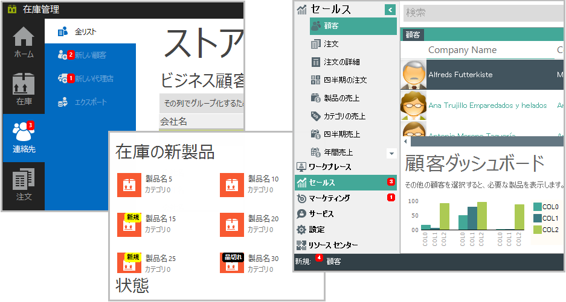
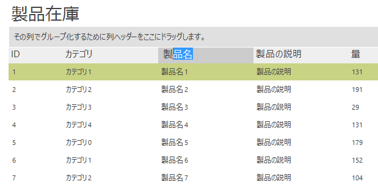
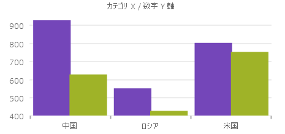
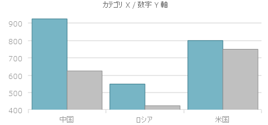
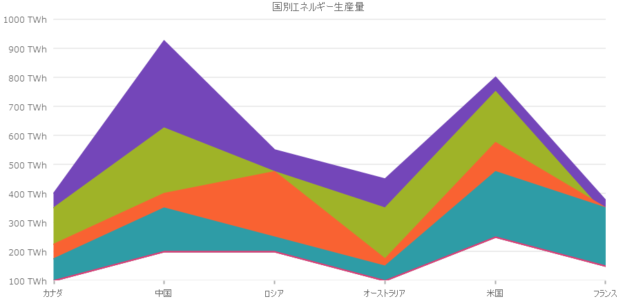
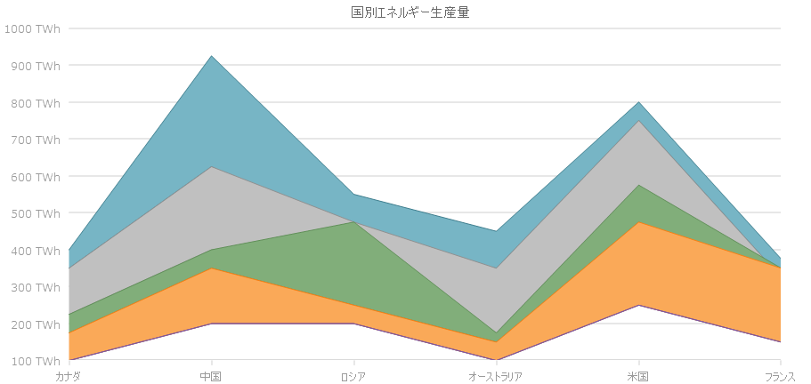
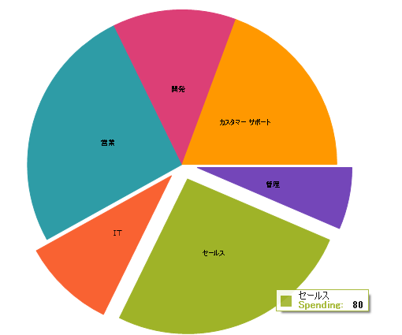

////
|metadata|
{
    "tags": [],
    "controlName": [""]
}
|metadata|
////

= 2017 Volume 1 の新機能

このトピックは、Infragistics® Windows Forms 2017 Volume 1
リリースの新しいコントロール、新機能、および更新コントロールと機能の概要を提供します。

toc::[]

== ColPosChanged イベントの改善

4 つの ColPosChanged イベントの改善により、列の固定機能が向上しました。機能の向上は以下のイベントに適用されます。

* link:{ApiPlatform}win.ultrawingrid{ApiVersion}~infragistics.win.ultrawingrid.ultragridbase~beforecolposchanged_ev.html[BeforeColPosChanged]
* link:{ApiPlatform}win.ultrawingrid{ApiVersion}~infragistics.win.ultrawingrid.ultragridbase~aftercolposchanged_ev.html[AfterColPosChanged]
* link:{ApiPlatform}win.ultrawingrid{ApiVersion}~infragistics.win.ultrawingrid.ultragrid~beforegroupposchanged_ev.html[BeforeGroupPosChanged]
* link:{ApiPlatform}win.ultrawingrid{ApiVersion}~infragistics.win.ultrawingrid.ultragrid~aftergroupposchanged_ev.html[AfterGroupPosChanged]

以前は、PosChanged 引数は発生した位置変更のタイプを記述していましたが、固定操作で列の位置が変更されたことを示す列挙はありませんでした。代わりに、PosChanged の値が Moved になっていたため、固定操作と移動操作間の曖昧さが生じていました。

PosChanged の代わりに新しく ColumnPosChangedType 引数を導入しています。新しい引数には、固定操作と移動操作を区別するための FixedStateChanged フラグ付き列挙オプションが含まれています。

一方、PosChanged は廃止されましたが削除されていないため、この引数に依存する既存のアプリケーションは設計通りに動作します。したがって、この機能の向上は重大な変更ではありません。

*関連トピック*

* link:wingrid-specifying-fixed-columns.html[固定列の指定 -- ColPosChanged イベント]

== WinMaskedEdit/WinDateTimeEditor での和暦サポート
link:winmaskededit.html[WinMaskedEdit] および link:windatetimeeditor.html[WinDateTimeEditor] に、`InputMask` の `g` または `gg` オプションを使用して DateTime の年号を示す機能が追加されました。年号は、和暦を含めコントロールのカルチャにより表示されます。

デフォルトでは、カルチャはマシンのカルチャに設定されます。したがって、 `WinDateTimeEditor` および `WinMaskedEdit` は、カルチャの設定に従ってそのまま動作します。コントロールのカルチャは、`WinMaskedEdit` の `CultureInfo` プロパティ、または `WinDateTimeEditor` の `FormatProvider` プロパティで手動で指定することもできます。

*関連トピック:*

* link:{ApiPlatform}win.ultrawinmaskededit{ApiVersion}~infragistics.win.ultrawinmaskededit.ultramaskededit~inputmask.html[InputMask プロパティ (UltraMaskedEdit)]

== WinEditorMaskedControlBase スピン折り返し
link:windatetimeeditor.html[WinDateTimeEditor]、link:wincurrencyeditor.html[WinCurrencyEditor]、link:winmaskededit.html[WinMaskedEdit] および link:winnumericeditor.html[WinNumericEditor] に特定の入力を実行すると現在の値をインクリメントする機能があります。17.1 には、数値セクションが最大範囲を超えてインクリメントされた場合の、エディターの動作を SpinWrapBehavior プロパティで設定できるようになりました。以下は使用可能なオプションです。

* `Default` -- デフォルトでは、コントロールは `WrapAcrossSections` の動作に従います。
* `NoWrapping` -- 値は、最大/最小値で増減を停止します。
* `WrapAcrossSections` -- 値は最小値/最大値に達し、次に高いセクションが増減されます。
+
たとえば、12 の値がある月セクションをスピンアップすると、月は 1 になり、年セクションは 1 でインクリメントします。
* `WrapCurrentSection` -- 値は最小値/最大値に達しますが、他のセクションは影響を受けません。
+
たとえば、12 の値がある月セクションをスピンアップすると、月は 1 になりますが、年セクションは変わりません。

`SpinWrap` プロパティが非推奨となり、代わりに `SpinWrapBehavior` が導入されました。既存のアプリケーションへの支障を軽減するために、SpinWrap は置き換えではなく非推奨となります。推奨されている実装が SpinWrapBehavior であるため、SpinWrap は IntelliSense では表示されませんが、レガシーコードで使用するための設定があります。

影響を受けるすべてのコントロールのデフォルトの動作が `NoWrapping` から `WrapAcrossSections` に変更されたため、SpinWrap が明示的に設定されていないエディターでは、その変更がデフォルト動作になります。この変更は、 link:win-breaking-changes-in-2017-volume-1.html[2017 Volume 1 の重大な変更] に記述されています。

*関連トピック:*

* link:winmaskededitorbase-spinning.html[WinEditorMaskedControlBase スピン]

== WinRadioButton
link:{ApiPlatform}win.ultrawineditors{ApiVersion}~infragistics.win.ultrawineditors.ultraradiobutton.html[WinRadioButton] は、グループ内の他の WinRadioButton にリンクされたチェック可能なボタンです。グループ内の 1 つの WinRadioButton のみがチェックされるため、WinRadioButton が選択されると、グループ内の他のすべてのボタンがチェック解除されます。これは、相互に排他的なオプションの選択が必要なシナリオで役に立ちます。

image:images/winradiobutton-control-containers.png[alt="WinGroupBoxes での WinRadioButtons はデフォルトでグループ化されます"]
 
WinRadioButton はデフォルトで同じコントロール コンテナ内の他の WinRadioButton と自動的にグループ化されます。または、link:{ApiPlatform}win.ultrawineditors{ApiVersion}~infragistics.win.ultrawineditors.ultraradiobuttongroupmanager[WinRadioButtonGroupManger] コンポーネントを使用して手動でグループ化し、カスタム スキーマと統一した `Appearance` 設定を実現します。さらに、WinRadioButton を `WinGrid` で使用して、グリッド行を排他的に選択できるようにします。

*関連トピック:*

* link:winradiobutton-about.html[WinRadioButton について]
* link:winradiobutton-using-winradiobutton-within-wingrid.html[WinGrid での WinRadioButton の使用]

== {GeoMapName}
link:{GeoMapLink}.{GeoMapName}.html[{GeoMapName}] コントロールによって、地理的位置を含むデータを表示したり、地理的画像地図でシェイプ ファイルから読み込まれた地理的データを表示できます。

[cols="a,a"]
|====

|image:images/Whats_New_GeographicMap_2017_1_1.png[alt="Open Street Maps からの地理的画像がある {GeoMapName}"] 

図 1: Open Street Maps からの地理的画像がある {GeoMapName} 

|image:images/Whats_New_GeographicMap_2017_1_2.png[alt="Bing™ Maps からの地理的画像がある {GeoMapName}"]

図 2: Bing™ Maps からの地理的画像がある {GeoMapName} 

|====

|image:images/Whats_New_GeographicMap_2017_1_3.png[alt="複数の地理的シリーズがある {GeoMapName} "]

図 3: 複数の地理的シリーズがある {GeoMapName} 

*関連トピック:*

* link:{GeoMapLink}.{GeoMapName}.html[{GeoMapName}]

== UltraPeekPopup

link:winofficenavbar-peek-window.html[OfficeNavBar プレビュー ウィンドウ] 同様、WinPeekPopup™ は、Windows Forms コントロールをスタイル付きポップアップ ウィンドウに表示できます。新しい UltraPeekPopup は、他のコントロールに依存しないスタンドアロン コンポーネントです。

*関連トピック:*

* link:winpeekpopup.html[WinPeekPopup]
* link:winpeekpopup-about-winpeekpopup.html[WinPeekPopup について]
* link:winpeekpopup-using-a-winpeekpopup.html[WinPeekPopup の使用]

== 通知バッジ

通知バッジでは重要なイベントをユーザーにお知らせします。以前は UltraToolbarsManager 固有の機能でしたが、次のコントロールでもサポートされます。

* link:wintree.html[WinTree]
* link:wintab.html[WinTab と WinTabStrip]
* link:winstatusbar.html[WinStatusBar]
* link:winlistview.html[WinListView]
* link:winexplorerbar.html[WinExplorerBar]

*関連トピック:*

* link:wintree-using-the-notification-badge.html[通知バッジが使用されている WinTree]
* link:wintoolbarsmanager-using-the-notification-badge.html[通知バッジが使用されている WinToolbarsManager]
* link:winlistview-using-the-notification-badge.html[通知バッジが使用されている WinListView]
* link:winstatusbar-using-the-notification-badge.html[通知バッジが使用されている WinStatusBar]
* link:winexplorerbar-using-the-notification-badge.html[通知バッジが使用されている WinExplorerBar]
* link:wintab-using-the-notification-badge.html[通知バッジが使用されている WinTab]

== 編集可能なヘッダー
編集可能なヘッダー機能を有効にすると、UltraGrid の列ヘッダー、グループ ヘッダーおよびバンド ヘッダーを変更できます。有効にすると、ヘッダーをダブルクリック、または開発者が指定した他のアクションを実行して編集できます。

*関連トピック:*

* link:wingrid-editable-headers-in-wingrid.html[WinGrid でヘッダーの編集]

== UltraDataChart

=== デザインの変更 
Infragistics 2017 Volume 1 リリースでは、UltraDataChart、UltraPieChart、UltraDoughnutChart および UltraRadialGauge コントロールのデフォルト スタイルを更新しました。

以下のスクリーンショットは変更を示します。

==== *柱状チャート*
*新規* 

*以前*

==== *積層型エリア*

*新規*

*以前*

==== *ローソク足チャート*

*新規*

image:images/chart_design_financial_new.png[financialnew]

*以前*

image:images/chart_design_financial_previous.png[financialprevious]

==== *円チャート*

*新規*

*以前*

image:images/chart_design_pie_previous.png[pieprevious]

==== *ラジアル ゲージ*

*新規*

image:images/chart_design_radial_gauge_new.png[radialnew]

*以前*

image:images/chart_design_radial_gauge_previous.png[radialprevious]