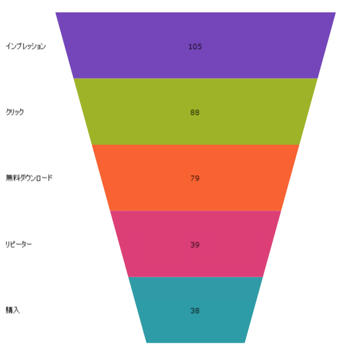
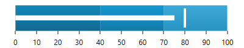
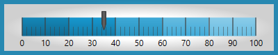
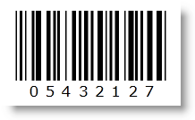

////
|metadata|
{
    "tags": [],
    "controlName": [""]
}
|metadata|
////

= 2017 Volume 2 の新機能

このトピックは、Infragistics® Windows Forms 2017 Volume 2 リリースの新しいコントロール、新機能、および更新コントロールと機能の概要を提供します。

toc::[]

= 新しいコントロール
== UltraCategoryChart
UltraCategoryChart は軽量で高パフォーマンスなチャートです。このチャートは、シンプルで直感的な API を使用したカテゴリ データの表示を簡単に構成できます。データ (コレクションまたはコレクションのコレクション) をバインドするだけで後の作業はチャートがすべて行います。次のスクリーンショットは、カテゴリ チャートに表示される柱状シリーズを示しています。

image::images/Whats_New_in_2017_Volume_2_1.png[]

スマート データ アダプターは、データを分析して適切なビジュアライゼーションを描画します。たとえば ChartType を Auto に設定した場合、大きなデータセットで折れ線チャートを描画する間、コントロールは小さなデータセットを提供して柱状チャートがプロットされるかどうかを決定します。

ただし、ChartType を明示的に以下に設定してチャート タイプを指定することもできます。

* 折れ線

* エリア

* 柱状

* ポイント

* スプライン

* スプライン エリア

* ステップ エリア

* ステップ折れ線

* ウォーターフォール

その他のカテゴリ チャート コントロールの直感的な動作の例は、明示的にラベルを設定する必要がないことです。カテゴリ チャートは、提供したデータ内で最初の適切な文字列プロパティを使用し、ラベルに使用します。コントロールは簡単に構成できるよう構築されており、エンジンとしてデータチャート コントロールを使用しています。つまり、高パフォーマンスでパワフルなデータ チャートの利点を備えています。また、データ チャート コントロールの機能も利用できます。

*関連トピック:*

* link:categorychart-overview.html[UltraCategoryChart]

== UltraFunnelChart
ファンネル チャートは、円チャートのように全体に対するパーセンテージで量を表示するタイプのチャートです。ファンネル チャートは、一般的に処理の段階で量的なデータを表示するために使用されます。たとえば、ファンネル チャートは、製造段階から実際の製品販売への製品の経費を表示します。

*関連トピック:*

* link:funnelchart.html[UltraFunnelChart]

== UltraBulletGraph
UltraBulletGraph コントロールは、ブレット グラフ形式でデータを可視化する Ultimate UI for Windows Forms コントロールです。このコントロールはリニア デザインで、スケール (オプションで他のメモリ) に対する比較が可能な主目盛りをシンプルに表示できます。

*関連トピック:*

* link:bulletgraph.html[UltraBulletGraph]

== UltraLinearGauge
UltraLinearGauge コントロールは、データをリニア ゲージ形式で可視化するコントロールです。スケールおよび 1 つ以上の比較範囲と比較した主要な値をシンプルで簡潔に表示します。

*関連トピック:*

* link:lineargauge.html[UltraLinearGauge]

== UltraSparkline

UltraSparkLine は、以下のチャート タイプを描画できる軽量チャート作成コントロールです。

==== 折れ線
image::images/Whats_New_in_2017_Volume_2_5.png[]

==== エリア
image::images/Whats_New_in_2017_Volume_2_6.png[]

==== 柱状
image::images/Whats_New_in_2017_Volume_2_7.png[]

==== Win/Loss
image::images/Whats_New_in_2017_Volume_2_8.png[]

グリッド セルなど小さなレイアウトで描画する目的で作成されています。スタンドアロンでも描画できます。以下のプレビューは、4 種類のスパークラインを示しています。

*関連トピック:*

* link:sparkline.html[UltraSparkline]

== バーコード
=== Code 39
UltraCode39Barcode™ は Code 39 記号を生成します (USS Code 39、Code 3 of 9 としても知られている) 。これはリテール以外の環境で使用されるように開発された最初の英数字記号です。ほとんどすべてのバーコード リーダーでデコードできます。

image::images/Whats_New_in_2017_Volume_2_9.png[]

*関連トピック:*

* link:xambarcode-xamcode39barcode.html[Code 39]

=== Ean\UPC
UltraEanUpcBarcode™ は、CodeType プロパティ値で設定された以下の数字の記号をサポートします。

EAN-13 - CodeType = "Ean13"で設定します。このシンボルは 12 桁の数字をエンコードし、Data 値自体に含まれない 1 つのチェック ディジットを追加します。EAN13 データは以下の情報で構成されます : ナンバー システムに 1 桁、メーカー コードに 6 桁、製品コードに 5 桁、そしてチェック デジットが 1 桁です。記数法は、バーコードの左側に配置されます。製造者コードと製品コードはバーコードの下にあり、ガードバーで区切られています。

image::images/Whats_New_in_2017_Volume_2_10.png[]

*関連トピック:*

* link:xambarcode-xameanupcbarcode.html[Ean\UPC]

=== Interleaved 2 of 5

Interleaved 2 Of 5 バーコードは、高品位の数値バーコード記号です。偶数桁のみをエンコードします。奇数が入力されると、先頭に 0 が追加されるからです。UltraInterleaved2Of5Barcode™ コントロールのプロパティ ShouldGenerateChecksum を True に設定することによってチェックサムを生成できます。

チェックサムはデータ値プロパティに含まれません。

*関連トピック:*

* link:xambarcode-xaminterleaved2of5barcode.html[Interleaved 2 of 5]

=== Intelligent Mail
Intelligent Mail バーコードは、USPS メール ストリームで使用するための 65 バーコードです。4 つの異なる垂直バー タイプ （各バーは、フルバー、アッセンダー、トラッカー、ディセンダーのいずれかの状態にあります） を使用して、ルーティング ZIP コード情報とトラッキング情報を 1 つのバーコードにまとめます。これは、POSTNET および PLANET バーコードのデータを効率よく 1 つのバーコードにエンコードし、広範囲のトラッキング データを提供します。

image::images/Whats_New_in_2017_Volume_2_12.png[]

*関連トピック:*

* link:xambarcode-xamintelligentmailbarcode.html[Intelligent Mail]

=== GS1 DataBar
GS1 DataBar はデータをエンコードするコード記号で、 AI で始まり GTIN が後ろに続きます。AI は Application Identifier – ‘(01)’ で、これは GS1 DataBar Expanded バージョンを除きデータ入力では使用されません。GTIN は、GS1 組織によって開発された Global Trade Item Number の頭字語で、取引商品を識別します。GTIN の最初の数字は梱包インジケーターです。0 と 9 という数字には特別な意味があります。0 は多くの場合箱の中に 1 品目入っていることを意味し、9 は可変の品目が入っていることを示します。梱包インジケーターの次に GS1 会社プレフィックス (GS1 によって指定) と品目番号 (会社によって指定) が続きます。GS1 DataBar はバーコード記号の仲間です。GS1 DataBar 記号の最初のグループ (Omnidirectional、Truncated、Stacked および Stacked Omnidirectional を含む) と 2 番目のグループ (Limited を含む) は、要素文字列 AI (01) をエンコードします。そのため、要素文字列 AI (01) 自体はデータ入力の一部ではありません。この要素文字列 は、GTIN-12、GTIN-13 または GTIN-14 Data Structures に基づいており、11、12 または 13 桁長でなければなりません。最後のチェック デジットは内部で計算されるからです。GTIN-14 Data Structure を Limited 記号と使用する時は、インジケーター値 (1桁目) 1 しか許可されません。GS1 DataBar Limited バーコード記号は、全方向 POS （Point-of-Sale） スキャナーで読み取る必要のない小物用に設計されています。Expanded バージョンと呼ばれる、GS1 DataBar 記号の 3 つめのグループは、Expanded および ExpandedStacked  記号を含みます。これらは可変長のリニアな記号で、AI 要素文字列データで数字の場合は最大 74 文字、アルファベットの場合は最大 41 文字までエンコードできます。2 つのバージョンは POS またはその他のアプリケーションのために商品の一次データと補助データをエンコードするように設計されています。

image::images/Whats_New_in_2017_Volume_2_13.png[]

*関連トピック:*

* link:xambarcode-xamgs1databarbarcode.html[GS1 DataBar]

=== Royal Mail

Royal Mail 4-state Customer Code  (RM4SCC) は、郵便の自動仕分けで使用される高さによって変調されるバーコードです。それ自体 Data の一部でないエラー保護を提供するために最終文字としてチェックサムが印刷されます。

image::images/Whats_New_in_2017_Volume_2_14.png[]

*関連トピック:*

* link:xambarcode-xamroyalmailbarcode.html[Royal Mail]

=== PDF 417
PDF 417 は、主に輸送、身分証明書、在庫管理などの多種多様なアプリケーションで使用される、集合リニア形式バーコードです。PDF とははポータブル データ ファイルののことです。417 は、コードの各パターンが 4 つのバーおよびスペースで構成され、各パターンが 17 単位長であることを示します。PDF 417 は、米国郵政公社が受け入れた、郵便料金を印刷するために使用できる形式（データ マトリックスとともに）の 1 つです。PDF 417 は、航空業界の Bar Coded Boarding Pass standard (BCBP) によって、紙搭乗券の 2D バーコード記号として選択されています。PDF 417 は RealID 準拠の運転免許証および州発行の身分証明書の機械読み取り可能ゾーン技術として国土安全省が選択した基準です。また、FedEx はパッケージラベルにも使用しています。

image::images/Whats_New_in_2017_Volume_2_15.png[]

*関連トピック:*

* link:xambarcode-xampdf417barcode.html[PDF 417]

=== Maxi Code

MaxiCode はパッケージ追跡のために United Parcel Service (UPS) によって使用される平面エラー修正マトリックス記号です。2 次元記号は、bullseye とも呼ばれる一意の円形ファインダー パターンの周りの六角形要素のオフセット行でできています。これは方向にかかわらず記号のすばやい配置に役に立ちます。

image::images/Whats_New_in_2017_Volume_2_16.png[]

*関連トピック:*

* link:xambarcode-xammaxicodebarcode.html[Maxi Code]

= 機能の向上

=== UltraGrid - ColumnHeaders のエディター
ヘッダーに Editor プロパティを設定することにより、EmbeddableEditorBase を継承したエディターを UltraGrid の列ヘッダー、グループ ヘッダー、またはバンド ヘッダーに埋め込むことができるようになりました。高度にカスタマイズ可能なエディターを複数提供し、さらに独自のエディターを追加する機能もサポートします。ヘッダーをダブルクリックするか、開発者が指定した動作でヘッダーを編集します。

*関連トピック:*

* link:wingrid-editable-headers-in-wingrid.html[WinGrid でヘッダーの編集]