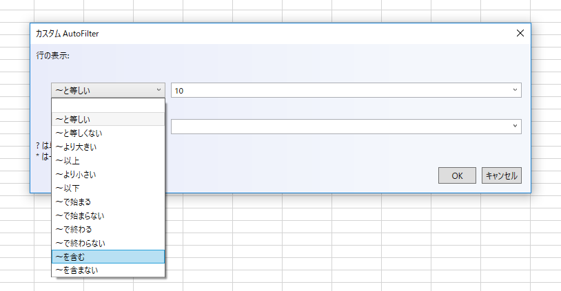
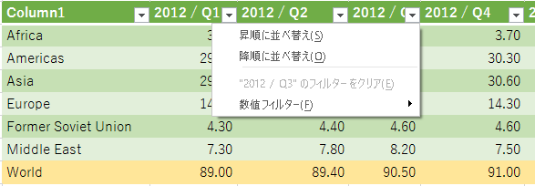
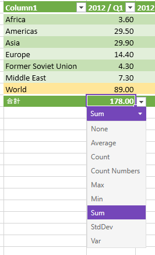

////
|metadata|
{
    "tags": [],
    "controlName": [""]
}
|metadata|
////

= 2018 Volume 1 の新機能

toc::[]

= 機能およびコントロールの向上

== Excel Engine の機能

=== 自動幅調整

WorksheetColumn に追加された 2 つの新しいメソッドは幅の自動調整をサポートします。

CalculateAutoFitWidth メソッドは、すべての要素に合わせるために必要な特定の WorksheetColumn の幅を返します。

AutoFitWidth メソッドは、CalculateAutoFitWidth メソッドから返された幅に WorksheetColumn をサイズ設定します。

=== 条件付き書式
条件付き書式は、セル値に基づいてセルに色、アイコン、またはデータ バーなどの書式設定を適用します。それには条件付き書式ルールを作成する必要があります。たとえば、条件付き書式ルールは、値が $2000 より小さい場合、セルの色を赤に設定します。このルールを適用する場合、$2000 より小さい値を持つセルを簡単に表示できます。

=== ワークシートの並べ替えとフィルタリング
WorksheetTable のエンジンに並べ替えおよびフィルタリングのサポートがあります。Excel では、ワークシートでテーブル以外に並べ替えおよびフィルタリングが可能な単一の領域を定義できます。また、ワークシートで並べ替えたその他の領域を定義できます。したがって、ワークシート レベル並べ替えおよびフィルタリング操作のサポートを Excel Engine に追加しました。また、アイコン並べ替え/フィルタリング クラスを公開しました。以前アイコンはアイコン セットの条件付き書式で指定していましたが、条件付き書式はサポートされていなかったために内部用でした。

* Infragistics {SpreadsheetName} の詳細については、   link:excelengine-worksheet-level-sorting.html[{SpreadsheetName} 並べ替え]を参照してください。  
* {ExcelEngineName} の詳細については、 link:excelengine-worksheet-level-sorting.html[{ExcelEngineName} 並べ替え] を参照してください。

=== 追加された Excel 関数のサポート
Excel Engine は現時点で 100 種上の関数をサポートします。
link:excelengine-list-of-supported-built-in-functions.html[サポートされる Excel 関数のリスト]

== {SpreadsheetName} 機能

=== 条件付き書式
Excel Engine で条件付き書式機能の追加で、スプレッドシートにもこの機能を使用できます。スプレッドシートは Microsoft Excel に利用可能なすべての条件付き書式機能の描画をサポートします。Microsoft Excel に複数の定義済みスタイル (プリセット) があります。これを使用すると、条件付き書式をデータにすばやく適用できます。3 つのカテゴリにグループ化されます。

* データ バーは、各セルに追加された棒グラフのようなデータ バー水平バーです。

image:images/ConditionalFormattingDataBars.png[]

* カラー スケールは、各セルの色をその値に基づいて変更します。各色スケールは、2 色または 3 色のカラー グラデーションを使用します。たとえば、緑黄赤 (GYR) 色スケールで最大値の色は緑、平均値は黄色、最小値は赤になります。

image:images/ConditionalFormattingColorScales.png[]

* アイコン セットは特定のアイコンをその値に基づいて各セルに追加します。

image:images/ConditionalFormattingIconSets.png[]

注: 条件書式設定はスプレッドシート内でコピー/貼り付けする際にコピーされます。

=== ワークシート フィルタリング
ワークシートの情報をフィルタリングして値をすばやく見つけることができます。1 列以上のデータをフィルターできます。フィルタリングでは、表示する項目だけでなく除外する項目も設定できます。リストの選択に基づいてフィルタリング、または特定のフィルターを作成して必要なデータのみ表示できます。
データのフィルター時、1 列以上の値がフィルター条件に合わない場合、すべての行が非表示になります。数値またはテキスト値をフィルターできます。あるいは、背景やテキストに色書式を適用したセルの色でフィルターできます。

{SpreadsheetName} のセルのコンキスト メニューでフィルター オプションを使用できます。フィルター適用後、ユーザーはフィルター ドロップダウンで *カスタム フィルター* オプションを選択し、その他のフィルタリング オプションのあるフィルタードロップダウンを開くことができます。

=== AutoFilter サポート
WorksheetTable のヘッダーとワークシート レベルのフィルタリング領域のヘッダー セルにフィルター関連メニューを表示するドロップダウン ボタンを表示します。  ボタンは並べ替えとフィルター、ツールチップは列のフィルターを表示します。メニューは並べ替えとフィルタリングのオプションを表示します。フィルター オプションは、Excel と同様に列のデータ タイプに依存しません。以下のいずれかが表示されます。

* テキスト フィルター
* 数値フィルター
* 日付フィルター

=== 表の機能拡張
==== コピー/貼り付け
表は、ソース選択がテーブル全体を含む場合にコピーされます。テーブル全体 (セルでクリック、ctrl+a を数回押下) を選択、クリップボードにコピー、貼り付けます。これで表のコピーが作成されました。
WorksheetTable 内で貼り付けした場合、自動的に表を展開して貼り付け領域を含みます。

==== 編集
WorksheetTable の右端/下端に直ちに合わせるために入力または編集した場合、表を展開 (Excel と同様の個別の処理の取り消し不可) します。

==== タブ ナビゲーション
表内のタブ ナビゲーションは、次行または前行にラップするテーブル内をナビゲーションします。Excel 同様、表の最後の表示セルからタブしたときに表が自動的に展開されます。

==== 集計行の数式
Excel で表の集計行がアクティブな場合、ドロップダウン ボタンが表示されて表に共通の数式を選択できます。Excel ではその他の数式を選択するためのダイアログを表示するオプションがあります。ドロップダウン ボタンをクリックまたはセルがアクティブなときに Alt+Down を押して表示できます。

==== コンテキスト メニュー機能拡張
コンテキスト メニューが追加されました。行列を表に挿入や追加、表の行列の選択、集計行の切り替え、表を範囲に変換を追加がメニュー項目に含まれます。

表のセル コンテキストは、アクティブ セルが WorksheetTable の一部である場合に表示される以外はセル コンテキスト メニューと同様です。新しいメニューには、表に影響する新しいコマンドがあります。ActiveTable および ActiveCell が表の一部として公開されました。  

==== リスト検証
Excel では、値を明示的なリスト、または値を含むセルの範囲にポイントを含むセルのリスト データ入力規則と呼ばれる特別なデータ入力規則タイプを定義できます。セル ドロップダウンを示すかどうかを検証するオプションがあります。Excel エンジンではデータ入力規則クラスをサポートし、スプレッドシートでも編集時に入力規則を使用していますが、有効な値一覧は公開していませんでした。本リリースではエンドユーザーに一覧を公開します。ドロップダウン ボタンの表示をサポート (ShowDropdown が true の場合) し、値のドロップダウン リストを表示します。ドロップダウン ボタンをクリックまたはセルがアクティブなときに Alt+Down を押して表示できます。

==== セル ドロップダウン
セル ドロップダウンを表示する方法が 2 つあります。セルのコンテキスト メニューから*ドロップダウン リストから選択*を使用、あるいは Alt+Down で表示します。アクティブ セルの真上または真下にテキスト/文字列の値のドロップダウンを表示します。そのため、リスト データの検証のようにはリストのコンテンツを明示的に定義しません。

注: {SpreadsheetName} は Excel とは異なり、このドロップダウンは編集時には表示されません。Excel 同様、数値を無視して空白や境界などで停止します。

== UltraGrid API の新しいイベント

グリッド列の幅が自動サイズ変更されるときに発生する 2 つの新しいイベントが、UltraGrid API に追加されました。

** link:{ApiPlatform}win.ultrawingrid{ApiVersion}~{ApiPlatform}win.ultrawingrid.ultragridbase~beforeautosizecolumn_ev.html[BeforeAutoSizeColumn イベント]
** link:{ApiPlatform}win.ultrawingrid{ApiVersion}~{ApiPlatform}win.ultrawingrid.ultragridbase~afterautosizecolumn_ev.html[AfterAutoSizeColumn イベント]

BeforeAutoSizeColumn イベントは、グリッドが列を自動サイズ変更する前に発生します。AfterAutoSizeColumn イベントがグリッドが列を自動サイズ変更した後に発生します。

== {DataChartName} 機能

==== 新しい散布シリーズ
{DataChartName} コントロールに 4 つの新しい散布シリーズ型を追加しました。以下の画像はこのシリーズのプレビューを表示します。以下の表はシリーズの説明および詳細なトピックへのリンクを提供します。
 
image:images/datachart-new-scatter-series.png[散布シリーズ]

[options="header", cols="30a,70a"]
|====
|シリーズ タイプ |説明

|`ScatterAreaSeries` 
|link:datachart-scatter-area-series.html[散布エリア シリーズ] は各ポイントに割り当てられた数値を使って、X および Y データの三角形分割に基づいて、色付きのサーフェスを描画します。このシリーズはヒート マップ、磁場の強さ、またはオフィスの Wi-Fi の強さを描画する場合などに便利です。

|`ScatterContourSeries` 
|link:datachart-scatter-contour-series.html[散布等高線シリーズ]  は各ポイントに割り当てられた数値を使って、X および Y データの三角形分割に基づいて、色付きの等高線を描画します。このシリーズは、等高線マップ、磁場の強さの変更、または `ScatterAreaSeries` の上にオーバーレイを描画する場合に便利です。

|`ScatterPolygonSeries` 
| link:datachart-scatter-polygon-series.html[散布多角形シリーズ] は多角形を使用してデータを表示するビジュアル要素です。このシリーズのタイプは任意の図形を描画できます。`Infragistics.Win.DataVisualization.Point` オブジェクトの `List` の `List` をバインドするのみです。

|`ScatterPolylineSeries` 
|link:datachart-scatter-polyline-series.html[散布ポリライン シリーズ]
はポリラインを使用してデータを表示するシリーズです。この散布シリーズのタイプは、ネットワーク グラフまたは散布データ ポイントの間に複数の接続などの切断された折れ線の描画が必要な場合に使用されます。このシリーズは `ScatterPolygonSeries` と同じデータ要件があり、シェープ ファイルからデータを描画できます。