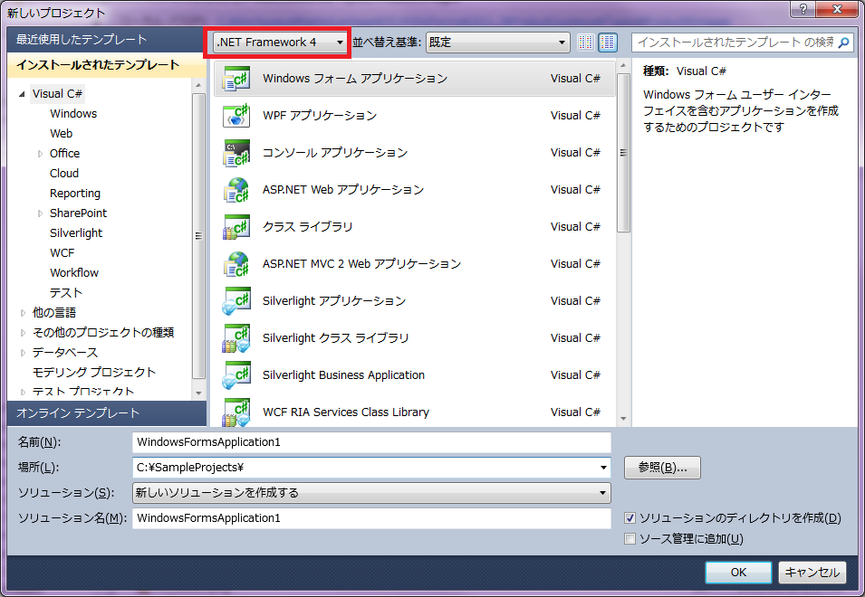

////

|metadata|
{
    "name": "whats-new-new-clr4-builds-of-winforms-assemblies",
    "controlName": [],
    "tags": ["Application Blocks","Getting Started","How Do I"],
    "guid": "255bc99c-5d3a-45fd-aec2-6f09b1a63f57",  
    "buildFlags": [],
    "createdOn": "2011-08-04T13:46:20.6078662Z"
}
|metadata|
////

= WinForms アセンブリの新しい CLR4 ビルド

{ProductName} の 2011 Volume 2 リリースによって、ユーザーのソリューションは、最新バージョンの CLR4 フレームワークを実行して、同じ CLR バージョンを使用してアセンブリを利用できます。

== CLR4 で新しい Windows Forms アプリケーションを作成

CLR4 でアプリケーションを作成するには、Visual Studio で新しいプロジェクトを作成する時に、以下の図 1 に示すように、.NET Framework 4 オプションを必ず選択します

([新しいプロジェクト] ダイアログ > フレームワークの選択ドロップダウン (中央のペインの左上にある) > .NET Framework 4) 。

図 1: Visual Studio 2010 の [新しいプロジェクト] ダイアログで .NET Framework 4 を選択

デザイン ビューでインフラジスティックスのコントロールのひとつをフォームにドラッグすると、Visual Studio は参照されたアセンブリの適切な CLR ビルドを自動的に使用します。

== 追加リソース

Microsoft の CLR4 の新機能の詳細は、以下の MSDN の記事をご覧ください。

link:http://msdn.microsoft.com/ja-jp/library/ms171868.aspx[http://msdn.microsoft.com/ja-jp/library/ms171868.aspx]

== 関連トピック

* link:whats-new-in-2011-volume-2.html[2011 Volume 2 の新機能]