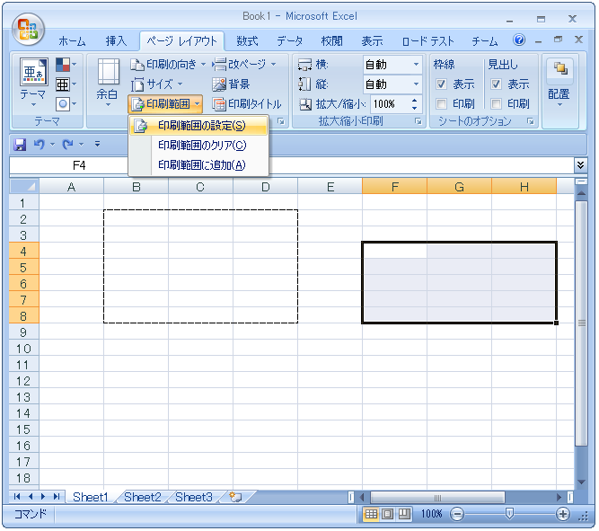
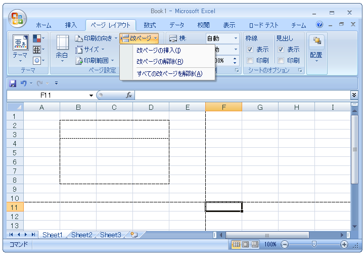
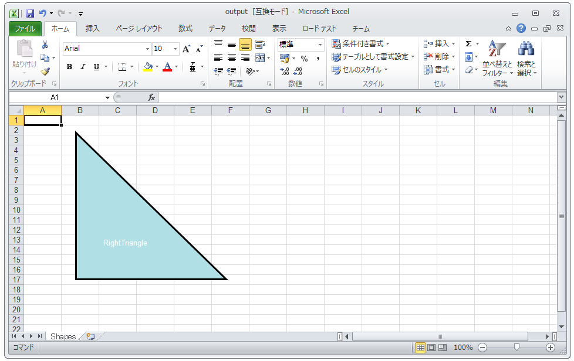

////

|metadata|
{
    "name": "whats-new-new-excel-additions-data-validations-print-areas-page-breaks-print-titles-and-shapes-support",
    "controlName": [],
    "tags": ["Application Blocks","Extending","Validation"],
    "guid": "b511e040-fab5-4aae-9b88-6b8a130413c2",  
    "buildFlags": [],
    "createdOn": "2011-10-03T17:26:34.0646958Z"
}
|metadata|
////

= 新しい Excel の追加機能: データの検証、印刷範囲、改ページ、印刷タイトルおよび図形のサポート

{ProductName} の 2011 Volume 2 以降、Infragistics Excel Library への新しい追加機能が使用可能となりました。新しい機能には、データの検証、印刷範囲、改ページ、印刷タイトルおよび定義済みの図形が含まれます。

== Excel の追加

以下の表は、Infragistics Excel Engine の追加を簡単に説明します。

[options="header", cols="a,a"]
|====
|機能|説明

|<<One,データ検証>>
|ユーザーが入力したデータをコミットする前に特定な条件によって確認します。

|<<Two,印刷範囲>>
|重複せずに印刷範囲として機能する矩形の領域。個別の領域はそれぞれ固有のページに表示します。

|<<Three,改ページ>>
|ワークシートで印刷の境界を定義する垂直または水平のページ区切り。

|<<Four,印刷タイトル>>
|印刷された各ページで繰り返される行/列の連続したセット。

|<<Five,定義済みの図形>>
|定義済みの図形リストからのワークシートの図形作成:ひし形、楕円形、ハート、不規則なシール 1、不規則なシール 2、稲妻、線、五角形、四角形、直角三角形、直線コネクター。

|====

[[One]]
== データ検証

データ検証は、ユーザーが入力したデータをコミットする前に特定な条件によって確認するプロセスです。Infragistcs Excel Engine の新しい機能では、Excel の検証機能についてワークシート、単一/複数のセルに検証ルールを設定することが可能になります。データ検証の使用は、指定された基準内にとどめる必要があるデータをユーザーに入力させたい時に役に立ちます。

== 関連トピック

* link:excelengine-datavalidation.html[データ検証 ]

[[Two]]
== 印刷範囲

印刷範囲はワークシートの重複しない矩形の領域で、固有のページに印刷するシートの印刷可能なセクションを定義します。印刷範囲はより整った印刷をするために、セルの領域を単一のページに印刷するように定義したい時に役に立ちます。

図 1: 破線内の印刷領域を示す Microsoft Excel。

== 関連トピック

* link:excelengine-print-areas.html[印刷範囲 ]

[[Three]]
== 改ページ

改ページによってワークシートで印刷の境界を定義する垂直または水平のページ区切りを作成できます。垂直または水平の改ページの使用は、印刷プロセスの間にデータの異なるセクションを区切る印刷境界として機能するように列と行に区切りを作成したい時に役に立ちます。

図 2: 垂直および水平の区切りを示す Microsoft Excel。

== 関連トピック

* link:excelengine-page-breaks.html[改ページ ]

[[Four]]
== 印刷タイトル

印刷タイトルによって、印刷された各ページで繰り返される行/列の連続したセットを指定できます。印刷タイトルの使用は、新しい各ページが行/列の指定されたセットで開始するようにしたい時に役に立ちます。

== 関連トピック

* link:excelengine-print-titles.html[印刷タイトル ]

[[Five]]
== 定義済みの図形

定義済みの図形を使用すると、より多くの図形のタイプを作成できることによって、既存の図形のサポートを追加します。これらの定義済みの図形には、ひし形、楕円形、ハート、不規則なシール 1、不規則なシール 2、稲妻、線、五角形、四角形、直角三角形、直線コネクターが含まれます。

図 3: 定義済みの図形、直角三角形を含む Microsoft Excel ワークシート。

== 関連トピック

* link:excelengine-using-predefined-shapes.html[定義済みの図形の使用]
* link:excelengine-creating-a-predefined-shape.html[定義済みの図形の作成]