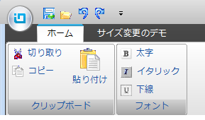

////

|metadata|
{
    "name": "whats-new-new-ig-styleset",
    "controlName": [],
    "tags": ["How Do I","Styling","Theming"],
    "guid": "105a0753-06bd-495f-8440-54c75932214d",  
    "buildFlags": [],
    "createdOn": "2011-05-13T18:00:45.9456752Z"
}
|metadata|
////

= 新規 IG スタイルセット

== 2011 Volume 1 の新しい IG テーマ

今回のリリースでは、IG テーマという新しいテーマが採用されました。このテーマは {ProductName} のすべてのコントロールに適用できます。このテーマは、黒、白、いくつかのグレーと強調表示とアクセント カラーとして青を使用するモノクロです。

このテーマは、IG.isl ファイルに保存されている IG スタイルセットによって実装されます。IG.isl ファイルの製品インストールのパスは C:\Users\Public\Documents\Infragistics\2011.1\Windows Forms\AppStylist for Windows Forms\Styles です。新しいスタイルセットを使用するには、 link:{ApiPlatform}win{ApiVersion}~infragistics.win.appstyling.stylemanager.html[StyleManager] クラスの link:{ApiPlatform}win{ApiVersion}~infragistics.win.appstyling.stylemanager~load.html[Load] メソッドを使用して、IG.isl ファイルをアプリケーションにロードします。これにより、IG テーマがアプリケーション全体に適用されます。テーマをコントロールに適用する方法については、 link:styling-guide-loading-a-stylelibrary.html[「スタイル ライブラリのロード」]を参照してください。

以下の図 1 と図 2 は、IG テーマが適用された WinGrid コントロールと適用されていないコントロールを示します。

image::images/Whats_New_New_IG_Theme_in_2011_Volume_1_01.png[]

====== 図 1: IG テーマが適用されていない WinGrid コントロール

image::images/Whats_New_New_IG_Theme_in_2011_Volume_1_02.png[]

====== 図 2: IG テーマが適用された WinGrid コントロール

以下の図 3 と図 4 は、IG テーマが適用された WinToolbarsManager コンポーネントのリボンと適用されていない WinToolbarsManager コンポーネントのリボンを示します。

====== 図 3: IG テーマが適用されていない WinToolbarsManager コントロールのリボン

image::images/Whats_New_New_IG_Theme_in_2011_Volume_1_04.png[]

====== 図 4: IG テーマが適用されている WinToolbarsManager コントロールのリボン