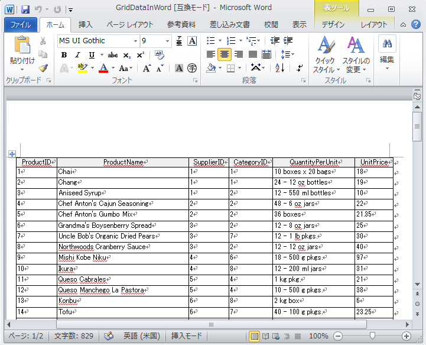

////

|metadata|
{
    "name": "whats-new-new-wingridwordwriter",
    "controlName": [],
    "tags": ["Exporting","Getting Started","Grids"],
    "guid": "09ae0759-3acc-4658-af47-5025e9a1531a",  
    "buildFlags": [],
    "createdOn": "2011-05-13T15:36:26.0816752Z"
}
|metadata|
////

= 新しい WinGridWordWriter

今回の {ProductName} 2011 Volume 1 のリリースでは、WinGridWordWriter™ という新しいコンポーネントが採用されました。このコンポーネントによって、Infragisitcs.Documents.IO アセンブリ内の新しい link:{ApiPlatform}documents.io{ApiVersion}~infragistics.documents.word.worddocumentwriter.html[WordDocumentWriter] オブジェクトに基づき WinGrid™ を新しい Word ドキュメントにエクスポートできます。複数の WinGrid コントロールだけでなく、段落、画像などの追加のコンテンツもエクスポートできます。WordDocumentWriter オブジェクトを使用すると、フォーワードのみのストリーマー アプローチによって、UltraWinGrid コントロールはメモリにドキュメントを作成することなく直接ファイルにエクスポートされます。プロセスが使用する RAM が大幅に少ないためにこのアプローチはメリットがあります。したがって、大きいデータ セットをエクスポートすることによって発生するメモリの問題の回避に役立ちます。WinGridWordWriter の link:{ApiPlatform}win.ultrawingrid.wordwriter{ApiVersion}~infragistics.win.ultrawingrid.wordwriter.ultragridwordwriter~export.html[Export] メソッドはオーバーロードとして、WinGrid コントロールのエクスポートとストリームまたは WordDocumentWriter オブジェクトの両方またはいずれか一方を受け付けます。

図 1: Word にエクスポートされた WinGrid

== 関連トピック

* link:wingridwordwriter-about-wingridwordwriter.html[WinGridWordWriter について]
* link:wingridwordwriter-export-multiple-wingrid-to-word.html[複数の WinGrids を Word にエクスポート]
* link:wingridwordwriter-export-wingrid-with-paragraphs-to-word.html[段落がある WinGrid を Word にエクスポート]