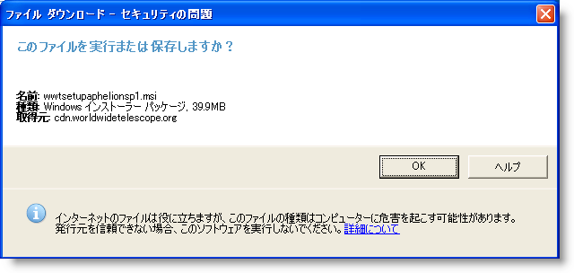

////

|metadata|
{
    "name": "whats-new-new-winmessageboxmanager-component",
    "controlName": [],
    "tags": [],
    "guid": "{1EDECFBC-5C6F-4993-9DD2-EC21F3CDFE3B}",  
    "buildFlags": [],
    "createdOn": "0001-01-01T00:00:00Z"
}
|metadata|
////

= 新しい WinMessageBoxManager コンポーネント

WinMessageBoxManager™ コンポーネントは、スタイリングおよびカスタマイズのオプションがあるモーダル ダイアログ ボックスを使用してアプリケーション固有のメッセージと情報メッセージを表示する方法を提供します。 標準の .NET MessageBox ダイアログと異なり、WinMessageBoxManager のダイアログ ウィンドウおよびこのダイアログ ウィンドウ内に表示されるテキストは、WinFormattedTextEditor™ から使用可能なフォーマット機能を使用してフォーマットし、Appearance オブジェクトおよび Infragistics Appstyling を使用してスタイリングできます。

== 関連トピック

* link:winmessageboxmanager.html[WinMessageBoxManager の理解]