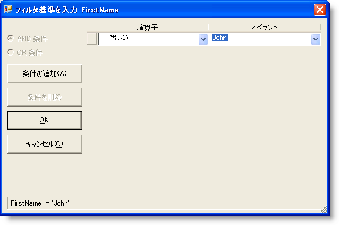
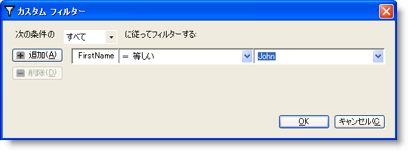
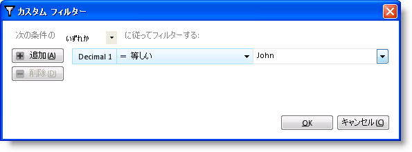
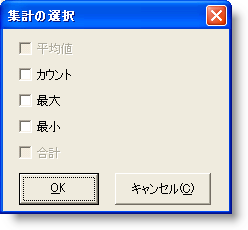
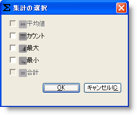

////

|metadata|
{
    "name": "whats-new-restyled-run-time-dialogs",
    "controlName": [],
    "tags": [],
    "guid": "f4e67c49-376c-48f4-9643-e22cc4766a66",  
    "buildFlags": [],
    "createdOn": "2010-06-02T16:11:58.0112809Z"
}
|metadata|
////

= スタイルが変更されたランタイム ダイアログ

レイアウトの変更、ダイアログのコントロールの修正、追加スタイルの適用を行っていくつかのランタイム ダイアログのスタイルを変更しました。これらの新しい変更によって、Infragistics アプリケーションのスタイリングが適用される時に、ランタイム ダイアログを残りのアプリケーションと一致させることができるようになりました。以下のランタイム ダイアログが変更されました。

WinGrid™ - 集計ダイアログ、CustomRowFilter ダイアログ（新しい参照 - {ApiPlatform}Win.Misc）

WinPrintPreviewDialog™ - UltraStatusPrintDialog

WinToolBarsManager™ - CustomizeDialog、CustomizeDialogAddCommand、CustomizeDialogKeyBoard、CustomizeDialogNewToolbar、CustomizeDialogRearrangeCommands、CustomizeDialogRenameToolbar、MoreItemsDialog および MoreWindowsDialog

これらの変更の結果、新しいプロパティがダイアログに追加され、これによりカスタマイズ オプションが提供されます。複数の新しいリソース文字列も追加されました。

link:{ApiPlatform}win.ultrawingrid{ApiVersion}~infragistics.win.ultrawingrid.ultragrid~beforesummarydialog_ev.html[BeforeSummaryDialog] イベントの eventargs で公開される WinGrid の集計ダイアログに追加されたプロパティは 、 link:{ApiPlatform}win.ultrawingrid{ApiVersion}~infragistics.win.ultrawingrid.summarydialog~imageaverage.html[ImageAverage]、 link:{ApiPlatform}win.ultrawingrid{ApiVersion}~infragistics.win.ultrawingrid.summarydialog~imagecount.html[ImageCount]、 link:{ApiPlatform}win.ultrawingrid{ApiVersion}~infragistics.win.ultrawingrid.summarydialog~imagemaximum.html[ImageMaximum]、 link:{ApiPlatform}win.ultrawingrid{ApiVersion}~infragistics.win.ultrawingrid.summarydialog~imageminimum.html[ImageMinimum]、 link:{ApiPlatform}win.ultrawingrid{ApiVersion}~infragistics.win.ultrawingrid.summarydialog~imagenone.html[ImageNone]、 link:{ApiPlatform}win.ultrawingrid{ApiVersion}~infragistics.win.ultrawingrid.summarydialog~imagesum.html[ImageSum]、 link:{ApiPlatform}win.ultrawingrid{ApiVersion}~infragistics.win.ultrawingrid.summarydialog~isusinginfragisticscontrols.html[IsUsingInfragisticsControls]、 link:{ApiPlatform}win.ultrawingrid{ApiVersion}~infragistics.win.ultrawingrid.ultragridbase~stylelibraryname.html[StyleLibraryName]、 link:{ApiPlatform}win.ultrawingrid{ApiVersion}~infragistics.win.ultrawingrid.ultragridbase~stylesetname.html[StyleSetName] および link:{ApiPlatform}win.ultrawingrid{ApiVersion}~infragistics.win.ultrawingrid.ultragridbase~useappstyling.html[UseAppStyling] です。同様に、CustomRowFilters ダイアログには新しいプロパティが追加されました。これは、 link:{ApiPlatform}win.ultrawingrid{ApiVersion}~infragistics.win.ultrawingrid.ultragridbase~beforecustomrowfilterdialog_ev.html[BeforeCustomRowFilterDialog] イベントの eventargs で公開されます。それらは link:{ApiPlatform}win.ultrawingrid{ApiVersion}~infragistics.win.ultrawingrid.customrowfiltersdialog~imageaddbutton.html[ImageAddButton]、 link:{ApiPlatform}win.ultrawingrid{ApiVersion}~infragistics.win.ultrawingrid.customrowfiltersdialog~imagedeletebutton.html[ImageDeleteButton] および link:{ApiPlatform}win.ultrawingrid{ApiVersion}~infragistics.win.ultrawingrid.customrowfiltersdialog~isusinginfragisticscontrols.html[IsUsingInfragisticsControls] です。

link:{ApiPlatform}win.ultrawingrid{ApiVersion}~infragistics.win.ultrawingrid.ultragridlayout.html[UltraGridLayout] オブジェクトの link:{ApiPlatform}win.ultrawingrid{ApiVersion}~infragistics.win.ultrawingrid.ultragridlayout~filterdropdownbuttonimage.html[FilterDropDownButtonImage] プロパティは、CustomRowFilterDialog のキャプションのアイコンに使用されます。このプロパティを使用して、アイコン画像をカスタマイズできます。同様に、UltraGridLayout オブジェクトの link:{ApiPlatform}win.ultrawingrid{ApiVersion}~infragistics.win.ultrawingrid.ultragridlayout~summarybuttonimage.html[SummaryButtonImage] プロパティは、SummaryDialog のキャプションのアイコンで使用されます。

スタイル変更の前後のランタイム ダイアログのスクリーンショットは以下のようになります。

*CustomRowFilterDialog (WinGrid)*

スタイル変更前：

スタイル変更後

適用される AppStyling

*集計ダイアログ (WinGrid)*

スタイル変更前：

スタイル変更後

適用される AppStyling

image::images/Re-Styled_Runtime_Dialogs_05.png[]