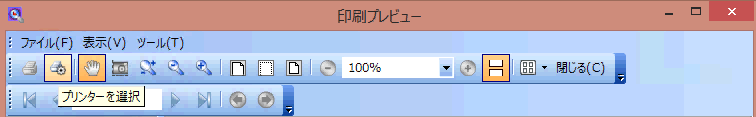
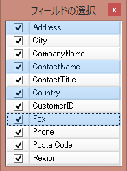

////

|metadata|
{
    "name": "whats-new-whats-new-in-2015-volume-1",
    "controlName": [],
    "tags": [],
    "guid": "f96d9c3b-053f-4489-81b8-66de536dd9e3",  
    "buildFlags": [],
    "createdOn": "2015-02-10T19:03:24.482821Z"
}
|metadata|
////

= 2015 Volume 1 の新機能

== トピックの概要

=== 目的

このトピックは、Infragistics® Windows Forms 2015 Volume 1 リリースの新しいコントロール、新機能、および更新機能の概要を示します。

== 新機能の概要

=== 新機能の概要表

以下の表は 2015 Volume 1 の新機能の概要を示します。詳細については、概要表の下をご覧ください。

==== アニメーション GIF のサポート

[options="header", cols="a,a"]
|====
|機能|説明

|<<AnimatedGifSupport,アニメーション GIF のサポート>>
|既存の静的画像サポートの他、Infragistics のプレゼンテーション層フレームワーク (PLF) はすべてのコンポーネントでアニメーション画像の表示をサポートします。

|====

==== Word エンジン

[options="header", cols="a,a"]
|====
|機能|説明

|<<BulletandNumbering,行頭文字と段落番号>>
|2015 Volume 1 リリースでは、Infragistics WordDocumentWriter クラスを使用した行頭文字と段落番号の自動設定が可能になりました。

|====

==== 新規の ISL ファイル

[options="header", cols="a,a"]
|====
|機能|説明

|<<NewISLFiles,新規の ISL ファイル>>
|2015 Volume 1 リリースでは、ISL ファイルを多数追加しました。

|====

==== WinDockManager

[options="header", cols="a,a"]
|====
|機能|説明

|<<CloseButtonsonTabs,タブの閉じるボタン>>
|以前のバージョンでは、閉じるボタンがペインのキャプション領域でのみ使用できました。2015 Volume 1 リリースでは、閉じるボタンが任意のドック領域のタブ自体に表示可能になりました。

|====

==== PrintDialog ボタン ツール

[options="header", cols="a,a"]
|====
|機能|説明

|<<PrinterOptionsButton,PrintDialog ボタン>>
|この機能では、プリンターの選択やその他の印刷設定を変更するために、PrintDialog ボタン ツールが表示できます。

|====

==== WinGridColumnChooser

[options="header", cols="a,a"]
|====
|機能|説明

|<<MultiSelect,複数選択>>
|2015 Volume 1 リリースでは、 _WinGrid_™ の ColumnChooser に複数行選択を可能にする機能を追加しました。

|====

== _アニメーション GIF のサポート_

[[AnimatedGifSupport]]

=== アニメーション GIF

Infragistics のプレゼンテーション層フレームワーク (PLF) は、既存の静的画像サポートの他、すべてのコンポーネントでアニメーション画像の表示をサポートします。時間ベースのフレームを含む画像の表示を自動的に処理する、新たな AnimatedImageManager クラスをフレームワークに追加しました。

==== 関連トピック:

* link:plf-animated-gif-support.html[アニメーション GIF のサポート]

== _Word エンジン_

[[BulletandNumbering]]

=== 行頭文字と段落番号

このトピックでは、Infragistics WordDocumentWriter クラスを使用して、wordprocessingML に適合するドキュメントで行頭文字と段落番号の自動設定をする方法を説明します。 

==== 関連トピック:

* link:word-using-bullet-lists-and-automatic-numbering.html[行頭文字と段落番号の自動設定の使用]

== _新規の ISL ファイル_

[[NewISLFiles]]

=== 新規の ISL ファイル

本リリースでは、ISL ファイルを 3 ファイル新たに追加しました。それらは Microsoft Visual Studio の 3 つのテーマです。

* VS2013 - Blue.isl
* VS2013 - Dark.isl
* VS2013 - Light.isl

== _WinDockManager_

[[CloseButtonsonTabs]]

=== タブの閉じるボタン

以前のバージョンでは、閉じるボタンはペインのキャプション領域にのみ使用しました。 _CloseButtonLocation_  プロパティを追加して、閉じるボタンが任意のドック領域のタブ自体に表示できるようになりました。

以下のスクリーンショットでは、キャプション領域、タグ グループのタブ、またはピン解除のタブに表示される時の閉じるボタンのプレビューを示します。

image::images/Close_Button_On_Tabs_1.png[]

==== 関連トピック:

* link:windockmanager-close-buttons-on-tabs.html[タブの閉じるボタン]

== _PrintPreviewDialog_

[[PrinterOptionsButton]]

=== [プリンター オプション] ボタン

PrintDialog ボタン ツールでは、プリンターの選択、印刷部数の選択、ページ範囲の設定、その他のプリンター設定を選択します。

==== 関連トピック:

link:winprintpreviewdialog-adding-printdialog-button-tool.html[PrintDialog ボタン ツールの追加]

== _WinGridColumnChooser_

[[MultiSelect]]

=== 複数選択

UltraGridColumnChooser コントロールに MultiSelectEnabled という新しいプロパティを追加しました。このプロパティは、複数行選択時に有効化され、単一の操作で多数列の表示状態および位置の変更が可能になります。

以下のスクリーンショットでは、グリッドのボタンをクリックし複数の行を選択すると表示されるダイアログでの列チューザーの外観を示します:

==== 関連トピック:

* link:wingrid-enabling-multiple-row-selection.html[複数行選択の有効化]