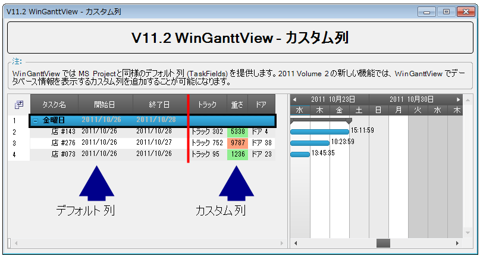

////

|metadata|
{
    "name": "whats-new-winganttview-custom-columns",
    "controlName": [],
    "tags": ["Application Scenarios","Grids"],
    "guid": "592523e8-9046-4134-8d40-d16eb0e63059",  
    "buildFlags": [],
    "createdOn": "2011-09-26T12:21:57.2112661Z"
}
|metadata|
////

= WinGanttView カスタム列

{ProductName} の 2011 Volume 2 以降、WinGanttView™ コントロールのグリッド セクションによってカスタム列の作成によってカスタム データを表示できます。

図 1: カスタム列を含むグリッド セクションを表示する WinGanttView

== 関連トピック

* link:winganttview-custom-columns.html[カスタム列]
* link:winganttview-databinding-support-for-winganttview.html[WinGanttView のデータバインディング サポート]
* link:winganttview-customize-grid-section-of-winganttview.html[WinGanttView のグリッド セクションのカスタマイズ]