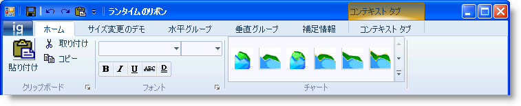

////

|metadata|
{
    "name": "whats-new-wintoolbarsmanager-new-scenic-ribbon-style",
    "controlName": [],
    "tags": [],
    "guid": "{3963ED8C-195C-4C46-83DF-3DF52E0A82B1}",  
    "buildFlags": [],
    "createdOn": "0001-01-01T00:00:00Z"
}
|metadata|
////

= WinToolBarsManager の新しい Scenic Ribbon スタイル

Windows 7 オペレーティング システムのリリースにより、Microsoft® は新しい Ribbon スタイルである "Scenic Ribbon" を導入しました。 今回の {ProductName} 2010 Vol1 のリリースには、WinToolbarsManager™ コンポーネント内に新しい ScenicRibbon スタイルのサポートが含まれています。 この機能が追加されたことによって、Windows 7 のルック アンド フィールと整合したアプリケーションを作ることができます。 この新しいスタイルは、コントロールの pick:[win-forms="link:{ApiPlatform}win.ultrawintoolbars{ApiVersion}~infragistics.win.ultrawintoolbars.ultratoolbarsmanager~style.html[Style]"]  プロパティによって WinToolbarsManager コンポーネントに適用できます。

== 関連トピック

* link:wintoolbarsmanager-scenic-ribbon-look-and-feel.html[Scenic Ribbon のルック アンド フィール]