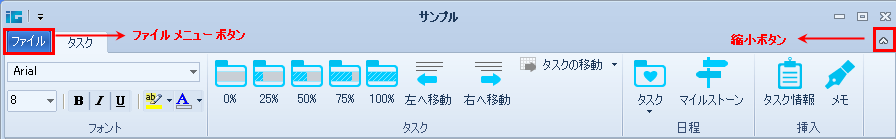

////

|metadata|
{
    "name": "whats-new-wintoolbarsmanager-office-2010-ribbon",
    "controlName": [],
    "tags": [],
    "guid": "dafd8b94-422e-4b63-8778-d820652ea9fa",  
    "buildFlags": [],
    "createdOn": "2010-09-20T14:23:38.8461299Z"
}
|metadata|
////

= WinToolbarsManager Office 2010 リボン

Office 2010 のリリースによって、Microsoft® は新しいリボン スタイルを採用しました。今回の Infragistics® Windows Forms 2010 Volume 3 のリリースには、WinToolbarsManager コンポーネント内に新しい Office 2010 スタイルのリボンに対するサポートが含まれています。このスタイルで使用されているすべての色を管理するために新しい link:{ApiPlatform}win{ApiVersion}~infragistics.win.office2010colortable.html[Office2010ColorTable] が追加されました。新しいピン設定/ピン解除ボタンがリボンの右上隅に追加されており、リボンを縮小/展開するために使用できます。

WinToolbarsManager コンポーネントの Style プロパティを Office2010 に設定するだけで、アプリケーションのリボンのためにこの新しいルック アンド フィールを取得できます。リボン タブ（タブ ストリップ領域の新しい拡張されたグラス）、クイック アクセス ツールバー（QAT）、リボン グループ、コンテキスト タブ グループ、ファイル メニュー ボタンなどのリボンのさまざまな部分が新しい Office 2010 スタイルを取得します。

link:{ApiPlatform}win.ultrawintoolbars{ApiVersion}~infragistics.win.ultrawintoolbars.ribbon~filemenustyle.html[FileMenuStyle] と呼ばれる新しいプロパティも link:{ApiPlatform}win.ultrawintoolbars{ApiVersion}~infragistics.win.ultrawintoolbars.ribbon.html[Ribbon] オブジェクトに追加されており、[ファイル] メニュー ボタンがクリックされた時にドロップダウンするメニューのタイプ（ApplicationMenu、ApplicationMenu2010、None）を定義します。FileMenuStyle プロパティを ApplicationMenu2010 に設定することによって、Microsoft Office 2010 Backstage ビューに似た新しいアプリケーション メニューを取得できます。この Office 2010 スタイル アプリケーション メニューは、ヘッダー、ナビゲーション メニュー、コンテンツ領域で構成されます。アプリケーション メニュー 2010 の詳細は、「Office 2010 スタイル アプリケーション メニュー」を参照してください。

関連トピック

link:wintoolbarsmanager-office-2010-ribbon-look-and-feel.html[Office 2010 リボンのルック アンド フィール]

link:wintoolbarsmanager-office-2010-style-application-menu.html[Office 2010 スタイル アプリケーション メニュー]

link:styling-guide-office-2010-look-and-feel.html[Office 2010 のルック アンド フィール]