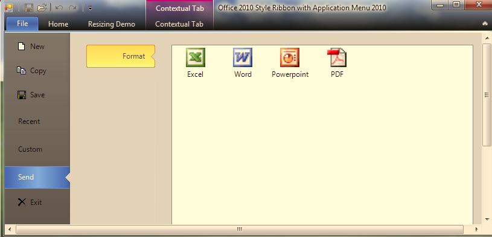

////

|metadata|
{
    "name": "whats-new-wintoolbarsmanager-wintoolbarsmanager-office-2010-style-application-menu",
    "controlName": [],
    "tags": [],
    "guid": "6b1e1e4c-9e66-4bf5-bf87-e8ad7c05f384",  
    "buildFlags": [],
    "createdOn": "2010-09-23T20:49:28.7253391Z"
}
|metadata|
////

= WinToolbarsManager Office 2010 スタイル アプリケーション メニュー

Microsoft® Office 2010 のリリースにより、リボンにはアプリケーション メニューのための新しいインターフェイスが付きました。Infragistics 2010 Volume 3 から、WinToolbarsManger コンポーネントにはこの Office 2010 スタイル アプリケーション メニューに対するサポートが含まれます。新しい link:{ApiPlatform}win.ultrawintoolbars{ApiVersion}~infragistics.win.ultrawintoolbars.ribbon~filemenustyle.html[FileMenuStyle] プロパティが UltraToolbarsManager コンポーネントの link:{ApiPlatform}win.ultrawintoolbars{ApiVersion}~infragistics.win.ultrawintoolbars.ribbon.html[Ribbon] オブジェクトに追加されており、メニュー ボタンがクリックされた時にドロップダウンするメニューのスタイル（ApplicationMenu、ApplicationMenu2010、None）を定義します。FileMenuStyle が ApplicationMenu2010 に設定されると、標準のアプリケーション メニューの代わりに新しい Office 2010 スタイル メニューが表示されます。

Office 2010 アプリケーション メニューの左側はナビゲーション メニュー（標準的なアプリケーション メニューの ToolsAreaLeft に似ている）で、UltraToolbarsManager ツールを表示できます。右側はコンテンツ領域で、ナビゲーション メニューからポップアップするサブ項目/コントロールが表示されます。

関連トピック:

link:wintoolbarsmanager-office-2010-style-application-menu.html[Office 2010 スタイル アプリケーション メニュー]

link:wintoolbarsmanager-add-tools-to-application-menu-2010.html[ツールをアプリケーション メニュー 2010 に追加]

link:wintoolbarsmanager-customize-areas-of-application-menu-2010-and-file-menu-button.html[アプリケーション メニュー 2010 の領域およびファイル メニュー ボタンのカスタマイズ]