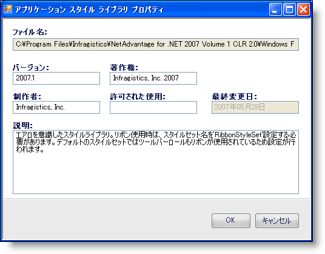

////

|metadata|
{
    "name": "win-add-your-personal-information-to-a-style-library-whats-new-20071",
    "controlName": [],
    "tags": [],
    "guid": "{50FEECDD-5C9D-42FD-841B-9E02DD5C1045}",  
    "buildFlags": [],
    "createdOn": "2006-11-12T15:05:31Z"
}
|metadata|
////

= スタイル ライブラリに個人情報を追加

アプリケーション スタイリングの概念が 2006 Volume 1 で採用されて以来、複数の開発者だけでなくデザイナが、さまざまなシナリオで使用するためにスタイル ライブラリを作成してきました。これらのスタイル ライブラリのいくつかは極めて創造的かつ独創的なものでした。創造的で優れた能力によるこれらの偉業をコミュニティと共有したいという希望はごく自然なものです。

今まで、固有のものとしてスタイル ライブラリをマークする方法はありませんでした。このたび、固有の個人情報をスタイル ライブラリのプロパティに入れる機会をご提供します。[ファイル] メニューで [スタイル ライブラリ プロパティ...] メニューをクリックすると、[アプリケーション スタイル ライブラリ プロパティ] ダイアログ ボックスが表示します。このプロパティに追加できる情報としては、ファイルのバージョン、著作権、制作者、許可される使用、全般的な説明が挙げられます。スタイル ライブラリ プロパティは、ファイル名と最新更新日も追跡しますが、これらのフィールドを修正できません。

== 関連トピック

link:styling-guide-personalizing-your-style-library.html[スタイル ライブラリのパーソナライズ]