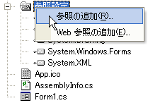

////

|metadata|
{
    "name": "win-adding-an-assembly-to-a-project",
    "controlName": [],
    "tags": ["FAQ","Getting Started"],
    "guid": "{ADDD829B-9E21-4E78-8BEA-CC06D0681866}",  
    "buildFlags": [],
    "createdOn": "2005-02-12T00:00:00Z"
}
|metadata|
////

= アセンブリのプロジェクトへの追加

通常は、アセンブリ参照をプロジェクトに手動で追加する必要はありません。なぜならば、Infragistics ツールをデザイン表面に配置すると、Visual Studio が自動的に適切な参照をプロジェクトに追加するからです。ただし、プロジェクトにアセンブリへの参照を手動で追加する必要が生じることもあります。アセンブリは、Visual Studio プロジェクトに簡単に追加することができます。

*注：* アプリケーションで使用する {ProductName} アセンブリを配置する方法については、 link:win-deploying-your-application.html[「アプリケーションの配備」]を参照してください。

[start=1]
. Visual Studio ソリューション エクスプローラで Reference フォルダを見つけます。
[start=2]
. References フォルダを右クリックして、[参照の追加] メニュー オプションを選択して、[参照の追加] ダイアログを開きます。

[start=3]
. [参照の追加] ダイアログでアセンブリを指定し、[選択] ボタンをクリックします。
[start=4]
. アセンブリを選択したら、[OK] ボタンをクリックして参照を追加し、ダイアログを閉じます。

[参照の追加] ダイアログでは、一度に複数の参照を選択して、追加できます。プロジェクトに複数の参照を追加する方法の詳細については、MSDN ライブラリで次のトピックを参照してください。

* link:http://msdn.microsoft.com/ja-jp/library/wkze6zky.aspx[プロジェクト参照]
* link:http://msdn.microsoft.com/ja-jp/library/wkze6zky.aspx[参照の追加と削除]
* link:http://msdn.microsoft.com/ja-jp/library/ftcwa60a.aspx[[参照の追加] ダイアログ ボックス (英語)]