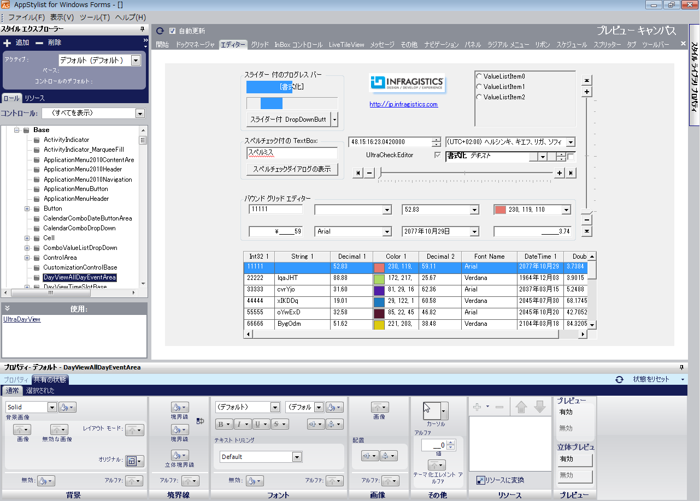

////

|metadata|
{
    "name": "win-application-styling-framework-whats-new-2006-2",
    "controlName": [],
    "tags": [],
    "guid": "{5AE48702-1570-472A-82A0-63D61A4A69E3}",  
    "buildFlags": [],
    "createdOn": "0001-01-01T00:00:00Z"
}
|metadata|
////

= Application Styling Framework

アプリケーション スタイリングは、開発者とグラフィック デザイナのより効率的な協力を可能にする Windows Forms開発の画期的な概念です。開発者はアプリケーションを作成しますが、その間同時にグラフィック デザイナはそのアプリケーションで使用できるスタイルを作成します。終了すると、グラフィック デザイナはスタイル ライブラリを、コード 1 行のみでアプリケーションにロードする開発者に渡します。スタイリッシュなルック アンド フィールの世界クラスのアプリケーションを開発することがこれほど簡単なことは今までありませんでした。個人商店または大企業のいずれを経営しているかにかかわらず、すべての人が Infragistics® link:styling-guide-application-styling-framework-asf.html[Application Styling Framework™] (ASF) のメリットを享受できます。メリットの鍵が、Infragistics の AppStylist™ の中にあります。

== Infragistics AppStylist

Infragistics AppStylist は Microsoft® Visual Studio® IDE の外で動作するスタンドアロン アプリケーションです。Infragistics AppStylist を使用すれば、ユニークな link:win-appearance-objects.html[Appearance] オブジェクトや link:win-plf-overview.html[Presentation Layer Framework™] の支援でアプリケーションの詳細をスタイルすることができます。InboxControlStyler コンポーネントの支援でインボックス コントロールをスタイルすることもできます。単純なポイント アンド クリックのインタフェースを使用してキャンバスのスタイル変更を確認します。ユーザー インターフェイスは 3 つの直感的なセクションに分割されています。

* キャンバス – このセクションは、スタイルの設定を変更した時に動的に更新する現在のスタイルの例を示します。
* スタイル エクスプローラ – このセクションでは、修正したいスタイルを選択でき、ユーザー インターフェイスまたは個々のコンポーネントとしての役割を果たすロールに基づいてスタイルを変更できます。
* プロパティ パネル – このセクションで、異なる状態のルック アンド フィールを変更するためにほとんどの時間を費やします。

== 豊富なスタイリング オプション

Infragistics AppStylist は単なるデザイン タイム アプリケーションではありません。AppStylistRuntime コンポーネントとともに、ランタイムに Infragistics AppStylist を使用することもできます。pick:[win-forms="link:{ApiPlatform}win.appstylistsupport{ApiVersion}~infragistics.win.appstyling.runtime.appstylistruntime~showruntimeapplicationstylingeditor.html[ShowRuntimeApplicationStylingEditor]"]  メソッドで、自分自身のアプリケーションと統合した AppStylist のフル機能版を起動できます。

== 開発者のための拡張されたサポート

アプリケーションでスタイルを使用することは、実際のスタイル自体を作成するよりも簡単です。AppStylistSupport コンポーネントで StyleLibrary をpick:[win-forms="link:{ApiPlatform}win{ApiVersion}~infragistics.win.appstyling.stylemanager~load.html[ロード]"] するだけです。結果として、コントロールはデフォルトのスタイルセットをピックアップするか、そのコントロールを特に対象としたスタイルセットを使用します。それを機能させるために他には何も設定する必要はありません。ただし、Infragistics の製品から予測される正確さを必要とする場合、カスタムのスタイルセットに pick:[win-forms="link:{ApiPlatform}win{ApiVersion}~infragistics.win.ultracontrolbase~stylesetname.html[StyleSetName]"]  プロパティを設定して各コントロールをカスタマイズできます。スタイルセットが pick:[win-forms="link:{ApiPlatform}win{ApiVersion}~infragistics.win.appstyling.stylemanager~stylechanged_ev.html[StyleChanged]"]  イベントで修正した場合にも確認できます。

== 関連トピック

link:styling-guide-setting-up-your-application-for-styling.html[スタイリングのためにアプリケーションを設定]

link:styling-guide-styling-your-application.html[アプリケーションのスタイリング]

link:win-inboxcontrolstyler.html[InboxControlStyler]

link:appstylistruntime.html[AppStylistRuntime]