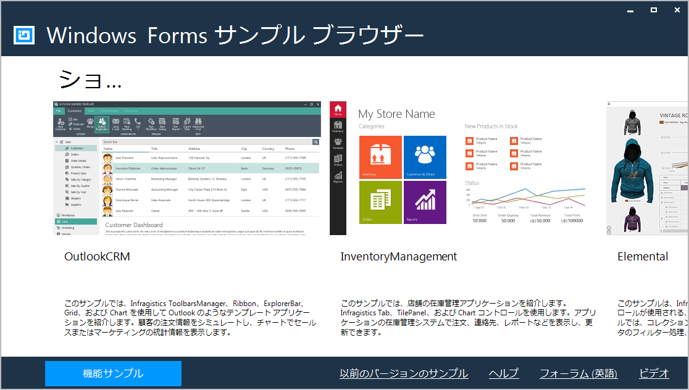

= {ProductName} サンプル

[[Infragistics-WPF-Features-Browser]]
== サンプル ブラウザー

サンプル ブラウザーは、{ProductName} コントロールのさまざまな機能を使用したサンプルで、アプリケーションのアイデアを提供します。ショーケース サンプル、機能別サンプル、以前のバージョンのサンプル、更に C# と VB.NET プロジェクトの完全なソースコードが含まれます。

link:https://jp.infragistics.com/products/windows-forms/download/samples_browser[サンプル ブラウザーのダウンロード]

