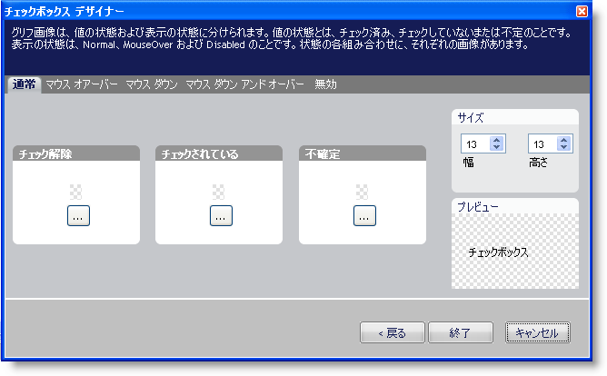

////

|metadata|
{
    "name": "win-new-designer-for-wincheckeditor-and-winoptionset",
    "controlName": [],
    "tags": [],
    "guid": "{CE858D34-EFB7-4A24-93DF-51440120B1E7}",  
    "buildFlags": [],
    "createdOn": "0001-01-01T00:00:00Z"
}
|metadata|
////

= WinCheckEditor および WinOptionSet の新しいデザイナ

今まで、WinCheckEditor™ および WinOptionSet™ の両方のルック アンド フィールに制限がありました。これらの 2 つのコントロールに新しい link:styling-guide-office-2007-look-and-feel.html[Microsoft® Office® 2007 スタイル]を最近リリースしましたが、ユーザー自身の画像を使用するレベルにこれらの 2 つのコントロールのルックを変更することはできませんでした。WinCheckBox および WinOptionSet にユーザー自身の画像を使用することによって、アプリケーションが求める時に常にルックを変更することができ、新しい WinCheckBox および WinOptionSet デザイナはユーザーにこれを行うことを許可します。

新しいデザイナで、コントロールのスタイルを設定するために直感的でステップバイステップの手続きからユーザーを導きます。選択できるスタイルは Office 2007 スタイル、標準スタイル、およびカスタム スタイルです。

image::images/Win_New_Designer_for_WinCheckEditor_and_WinOptionSet_01.png[]

カスタム スタイルを設定することで、コントロールの各状態に画像を選択できます。

== 関連トピック

link:wincheckeditor-apply-the-office-2007-style-to-wincheckeditor.html[Office 2007 スタイルを WinCheckEditor に適用]

link:winoptionset-apply-the-office-2007-style-to-winoptionset.html[Office 2007 スタイルを WinOptionSet に適用]

link:wincheckeditor-creating-a-custom-style-for-wincheckeditor.html[WinCheckEditor のカスタム スタイルを作成]