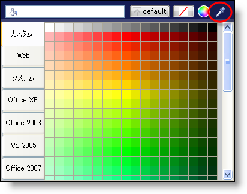

////

|metadata|
{
    "name": "win-new-eyedropper-whats-new-20063",
    "controlName": [],
    "tags": [],
    "guid": "{9130A940-A257-4053-A9CF-9F602081F760}",  
    "buildFlags": [],
    "createdOn": "0001-01-01T00:00:00Z"
}
|metadata|
////

= 新しい Eyedropper

== 新しい Eyedropper で画面の任意の場所から色を取得

カラー ピッカー ボタンの新しい Eyedropper によって、画面に表示される任意の色をキャプチャすることができます。ユーザーがしなければならない作業は、Eyedropper 領域でクリックして画面上で Eyedropper をドラッグすることだけです。キャプチャしたい色を確認したら、マウスのボタンを放すと、その色が現在のロールに適用されます。

