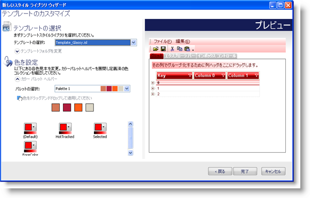
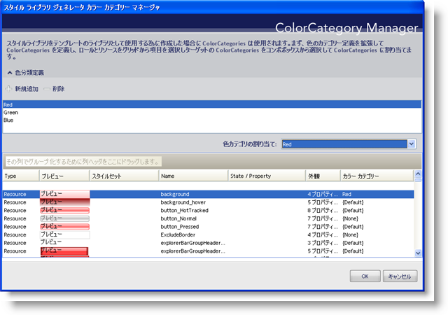

////

|metadata|
{
    "name": "win-new-isl-generator-whats-new-20071",
    "controlName": [],
    "tags": [],
    "guid": "{F30302D1-6866-45CC-8B9D-FA6BB865274B}",  
    "buildFlags": [],
    "createdOn": "2006-11-12T15:06:37Z"
}
|metadata|
////

= 新しい ISL ジェネレータ

スタイルセットですべての単体の UI ロールをスタイルすることは、完全にカスタマイズしたスタイルの概念に満足しているとしても、時間のかかる困難なタスクです。Infragistics は、ボタンをクリックして完璧なスタイルセットを自動作成するスタイル ライブラリ テンプレートを提供することによって、この分野を支援したいと考えています。

テンプレートに基づいたテーマ化されたスタイル ライブラリの作成は、色の選択と同じくらい簡単です。[新しいスタイル ライブラリ] フライアウト メニューの [テンプレート] メニュー項目から [新しいスタイル ライブラリ] をクリックすることで、[テンプレートから新しいスタイル ライブラリ] ダイアログ ボックスが表示します。修正するテンプレートのスタイル ライブラリを選択すると、独自のスタイルのためにカラー カテゴリーと色を一致させることができます。[生成] ボタンをクリックすると、スタイル ライブラリ全体を自動的に作成します。

テーマ化されたスタイル ライブラリを生成するときに使用するためにスタイル ライブラリ テンプレートを作成すると、大幅に作業時間を削減することができるだけでなく、いくつかの異なるロールのために色をカスタマイズする機能を提供します。テンプレートして普通のスタイル ライブラリを使用することは可能ですが、スタイル ライブラリのリソースの色をカスタマイズすることも可能です。[スタイル ライブラリ ジェネレータ カラー カテゴリー マネージャ] ダイアログ ボックスによって、カラー カテゴリーを生成することができ、これでリソースまたは特定の UI ロールに指定することができます。これらのカラー カテゴリーが作成されると、[スタイル ライブラリを生成] ダイアログ ボックスで色を指定することができます。可能な組み合わせは無限です。

== 関連トピック

link:styling-guide-the-style-library-generator-colorcategory-manager-dialog-box.html[スタイル ライブラリ ジェネレータ カラー カテゴリー マネージャ ダイアログ ボックス]

link:styling-guide-creating-a-style-library-from-a-template.html[テンプレートからスタイル ライブラリを作成]