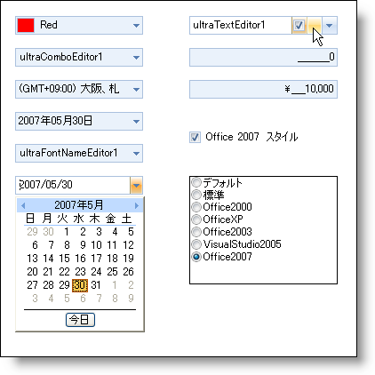

////

|metadata|
{
    "name": "win-new-look-and-feel-for-wineditors-whats-new-20063",
    "controlName": [],
    "tags": [],
    "guid": "{4EF0DA4D-66B0-42A8-AD77-9A997197FEDB}",  
    "buildFlags": [],
    "createdOn": "0001-01-01T00:00:00Z"
}
|metadata|
////

= WinEditors の新しいルック アンド フィール

弊社の各エディタは、新しい Microsoft® Office 2007 のルック アンド フィールを採用しています。既存の DisplayStyle プロパティを Office2007 に変更することによって、エディタに新しいルック アンド フィールを採用するために必要なことはすべて完了です。エディタ ボタンも Office 2007 のルック アンド フィールを表示する機能を持ちます。

== 関連トピック

link:styling-guide-office-2007-look-and-feel.html[Office 2007 のルック アンド フィール]

link:wincheckeditor-apply-the-office-2007-style-to-wincheckeditor.html[Office 2007 スタイルを WinCheckEditor に適用]

link:winoptionset-apply-the-office-2007-style-to-winoptionset.html[Office 2007 スタイルを WinOptionSet に適用]