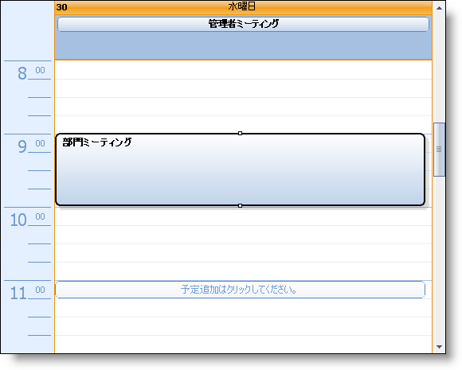
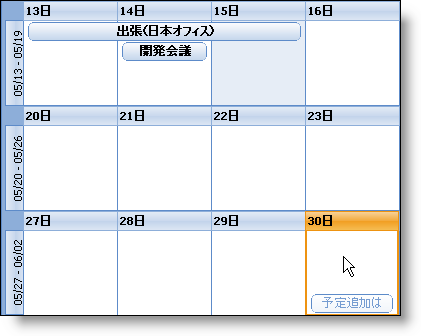
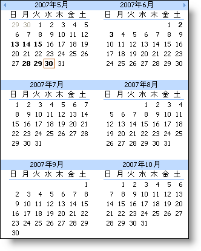
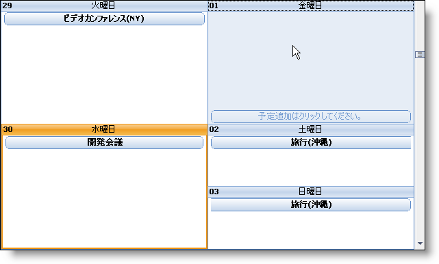

////

|metadata|
{
    "name": "win-new-look-and-feel-for-winschedule-whats-new-20063",
    "controlName": [],
    "tags": [],
    "guid": "{FC23BBE4-F537-49AA-A626-2AC7DB1D6599}",  
    "buildFlags": [],
    "createdOn": "0001-01-01T00:00:00Z"
}
|metadata|
////

= WinSchedule の新しいルック アンド フィール

Microsoft® Office 2007 は全く新しいルック アンド フィールになっています。Microsoft Outlook 2007 も例外はありません。ユーザー インターフェイス全体が鮮明な外観で再デザインされました。すぐに忘れることができないような UI エクスペリエンスのため、これらの新しいスタイルを弊社の WinSchedule コントロールとコンポーネントに適用しました。カレンダー項目とオーナーのカラー スキームは、感じの良いパステルの外観に変更されました。

「Click to Add」機能は、カレンダーに予定を素早く追加するために簡単な方法です。[日付] 表示または [月] または [週] 表示のタイムスロットにマウスを置くと、インジケータが表示されて予定を追加するかどうかを尋ねられます。

マイクロソフトは Office 2007 製品に週の表示を廃止しましたが、まだ使用できます。WinWeekView の現在のユーザーおよび愛好者は心配する必要はなく、弊社がすべてのベースをカバーしました。WinWeekView を装備したアプリケーションに最新のルック アンド フィールを提供するための色とスキームを推定しました。

== 関連トピック

link:winschedule-use-the-click-to-add-indicator.html[追加インジケータにクリックを使用]

link:winschedule-working-with-the-outlook-2007-color-scheme.html[Outlook 2007 カラー スキームでの作業]