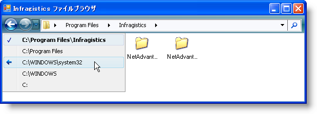
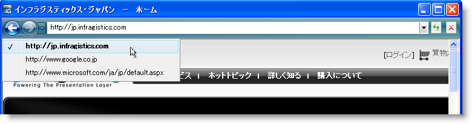

////

|metadata|
{
    "name": "win-new-navigation-toolbar-whats-new-20073",
    "controlName": [],
    "tags": [],
    "guid": "{EF054047-91A1-4FB0-B31C-9CD8DC920BA7}",  
    "buildFlags": [],
    "createdOn": "0001-01-01T00:00:00Z"
}
|metadata|
////

= 新しいナビゲーション ツールバー

ナビゲーション ツールバーは、ツールバーの WinToolbarsManager™ ファミリーへの最新の追加です。ナビゲーション ツールバーによって、項目のコレクションをナビゲートできます。コレクションが文字列の単純な配列または複雑なファイル システムのいずれであろうとも、ナビゲーション ツールバーはユーザーのためにすべてナビゲーションを行います。ユーザーが実行しなければならないのは、ナビゲート時のアクションを実行するコードを書くことだけです。

項目にナビゲートする時、ナビゲーション ツールバーは項目とオプションの関連付けられたオブジェクトを固有の内部履歴に自動的に追加します。[戻る] または [次へ] ボタンをクリックすると、 link:{ApiPlatform}win.ultrawintoolbars{ApiVersion}~infragistics.win.ultrawintoolbars.ultratoolbarsmanager~afternavigation_ev.html[AfterNavigation] イベントが起動し、Web サイトを閲覧したりフォルダを参照するなどのカスタムのナビゲーション コードを実装します。

== 馴染みのある環境でナビゲート

見知らぬ近所を車で運転することを楽しむ人はいません。迷子になるのは目に見えています。これが、人気のある Windows® Vista™ Windows Explorer および Microsoft® Internet Explorer® 7 のナビゲーション ツールバーをモデルにする理由です。そして、エンド ユーザーはどこに行けば良いかを既に知っています。これらの馴染みのある UI テーマを使用しているという事実は、エンド ユーザーに何を期待すべきかの手掛かりを与えます。ただし、[戻る] および [次へ] ボタンは最近開発された新しいパラダイムを表しません。このタイプのナビゲーションは、過去のユーザー インターフェイス（特にインターネット ブラウザ）で証明済みで、エンド ユーザーは体験から利益を得ます。

== ファイルおよびインターネット閲覧

WinNavigationBar コントロールと協力して（文字通り）使用すると、また新しいこのリリースを使用すると、Microsoft の独自の Windows Explorer に匹敵するファイル システム ブラウザを完全に機能するように設計できます。

image::images/Win_New_Navigation_Toolbar_Whats_New_20073_02.png[NavigationToolbar の WinNavigationBar の画像]

あるいは、Internet Explorer 7 と同様のインターネット閲覧エクスペリエンスのために、 link:wintoolbarsmanager-combobox-about-the-combobox-tool.html[ComboBox] ツールと複数の link:wintoolbarsmanager-button-about-the-button-tool.html[Button]ツールをナビゲーション ツールバーに配置することができます。

== 関連トピック

link:wintoolbarsmanager-navigation-toolbar-about-the-navigation-toolbar.html[ナビゲーション ツールバーについて]

link:wintoolbarsmanager-using-the-navigation-toolbar.html[ナビゲーション ツールバーの使用]