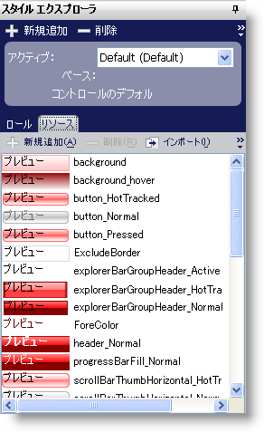
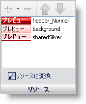

////
|metadata|
{
    "name": "win-new-resource-previews-whats-new-20063",
    "controlName": [],
    "tags": [],
    "guid": "{8E33F269-A264-439E-9045-C6FE711EF9B6}",
    "buildFlags": [],
    "createdOn": "0001-01-01T00:00:00Z"
}
|metadata|
////

= 新しいリソース プレビュー

== 複数の領域でリソースをプレビューすることができるようになった

これまで、リソースをプレビューしたい場合には、[プレビュー] ペインをオンにする必要がありました。これからはスタイル エクスプローラの [リソース] タブと UI ロール エディタの [リソース] ペインの両方でリソースを簡単に見ることができます。

== 関連トピック

link:styling-guide-resources.html[リソース]

link:styling-guide-resources-pane.html[リソース ペイン]