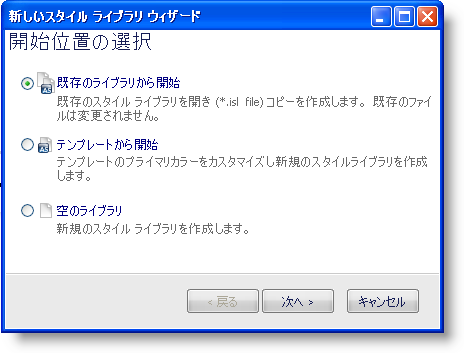

////

|metadata|
{
    "name": "win-new-style-library-wizard-whats-new-20072",
    "controlName": [],
    "tags": [],
    "guid": "{1BEC812F-4B83-4CAD-8EA8-6E4AFBD78753}",  
    "buildFlags": [],
    "createdOn": "0001-01-01T00:00:00Z"
}
|metadata|
////

= 新しいスタイル ライブラリ ウィザード

Infragistics AppStylist™ for Windows Forms の 2007 Volume 2 リリースは、新しいスタイル ライブラリを作成するための新しく簡単な方法を導入しています。新しいスタイル ライブラリ ウィザード（[新しいスタイル ライブラリ...] をクリックした時に表示する [ファイル] メニューにある）は、新しいスタイル ライブラリを作成するための個別の 3 つの方法を提供します。

* 新しいブランクのスタイル ライブラリを作成する。
* 既存のスタイル ライブラリのコピーを作成する。
* テンプレートから新しいスタイル ライブラリを作成する。

最初と 3 番目のオプションは両方とも 2007 Volume 1 で使用可能でした。2 番目のオプション（既存のスタイル ライブラリのコピーを作成する）は、今回のリリースでスタイル ライブラリを作成するための新しい方法です。スタイル ライブラリを選択するだけで、AppStylist は修正用の複製を作成します。

このウィザードで新しいスタイル ライブラリを作成することにより生産性が向上し混乱は削減されます。

