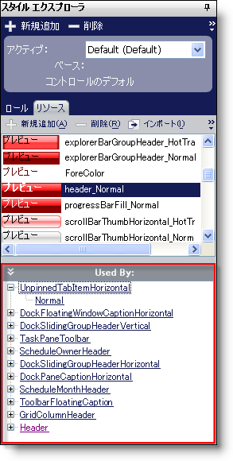

////
|metadata|
{
    "name": "win-new-used-by-list-whats-new-20063",
    "controlName": [],
    "tags": [],
    "guid": "{D0B03249-26F8-4E26-8672-BF7B6D953144}",
    "buildFlags": [],
    "createdOn": "0001-01-01T00:00:00Z"
}
|metadata|
////

= 新しい Used By リスト

== スタイル エクスプローラのリソース タブに "Used By" リストを追加した

どのロールがどのコンポーネントによって使用されているかを述べるための "Used By" リストはロール エディタに既にありました。どのリソースがどのロールによって使用されているかを述べるための "Used By" リストが今回追加されました。任意のロールの任意状態がリソースを使用できます。したがって、 "Used By" リストは、リソースが適用される UI ロールと、UI ロールの特定のどの状態の子ノードに適用されるのかを示すリストを表示します。

== 関連トピック

link:styling-guide-resources.html[リソース]