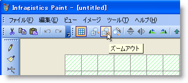
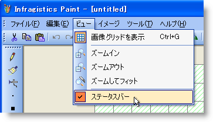

////

|metadata|
{
    "name": "win-new-windows-vista-style-for-wintoolbarsmanager-whats-new-20073",
    "controlName": [],
    "tags": [],
    "guid": "{F016EB21-9436-42C3-8112-E4EDF0B8E696}",  
    "buildFlags": [],
    "createdOn": "0001-01-01T00:00:00Z"
}
|metadata|
////

= WinToolbarsManager の新しい Windows Vista スタイル

Microsoft® Windows® Vista™ ユーザー インターフェイス (UI) は、過去の UI と大きく異なっています。UI は革新的で、Windows エクスペリエンスによりフレンドリになっています。本リリースでは、Infragistics は新しい Vista のルック アンド フィールで WinToolbarsManager™ のために同じルック アンド フィールをユーザーに提供しています。今回、ルック アンド フィールは WinToolbarsManager および WinToolbarsManager のコンポーネントを作成するために使用するそれらのコントロール/コンポーネントだけに影響します。

=== ツールバー

ツールバーは、そのボタン用の WindowsVistaToolbarButton ButtonStyle を使用します。ツールバーで独自の水平方向および垂直方向のグラデーションも見ることができ、両方ともがグラス効果を含みます。

=== メニュー

ツールバー メニューは Vista スタイルもサポートします。最も顕著な機能は、独自のホーバー効果を生み出すアニメートされたフェードインです。

== 関連トピック

link:styling-guide-windows-vista-look-and-feel.html[Windows Vista のルック アンド フィール]

link:wintoolbarsmanager-change-the-style-of-wintoolbarsmanager.html[WinToolbarsManager のスタイルの変更]