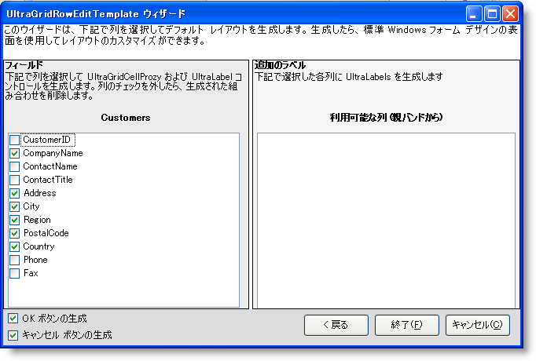

////

|metadata|
{
    "name": "win-new-wingridrowedittemplate-control",
    "controlName": [],
    "tags": [],
    "guid": "{402E78EA-7CB2-427A-B1F4-8D7B3CEF49A8}",  
    "buildFlags": [],
    "createdOn": "0001-01-01T00:00:00Z"
}
|metadata|
////

= 新しい WinGridRowEditTemplate コントロール

データ入力の作業をする場合、開発者がエンド ユーザーに実行を期待しているとおりにエンド ユーザーが実行できない場合があります。このため、データ入力の処理全体で可能な限りユーザーを導くことが重要です。WinGridRowEditTemplate™ はこの処理をより簡単にします。

新しい WinGridRowEditTemplate コントロールによって、基本的に WinGrid™ 上にフォーム全体を表示できますが、変更が必要なデータだけをエンド ユーザーに表示します。WinGridRowEditTemplate は 1 行からデータを表示することができるため、エンド ユーザーは現在編集しているデータに集中できます。

行の編集テンプレートの作成は、UltraGridRowEditTemplate ウィザードで簡単になります。フォームに WinGridRowEditTemplate をドロップし、それをバンドに接続すると、ウィザードが表示するので、テンプレートで表示したい列を選択できます。完了すれば、テンプレートが自動的に移植されるので、実行しなければならないのはコントロールを配置することだけです。

== 関連トピック
link:wingridrowedittemplate.html[WinGridRowEditTemplate]

link:wingridrowedittemplate-understanding-wingridrowedittemplate.html[WinGridRowEditTemplate の理解]

link:wingridrowedittemplate-using-wingridrowedittemplate.html[WinGridRowEditTemplate の使用]

link:wingridrowedittemplate-api-overview.html[API の概要] 