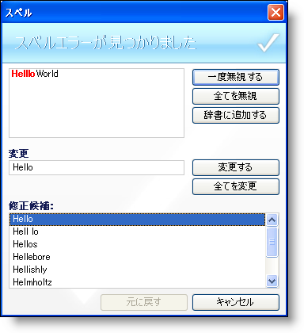

////

|metadata|
{
    "name": "win-new-winspellchecker-control-whats-new-2006-2",
    "controlName": [],
    "tags": [],
    "guid": "{47AD4A53-3E7F-4C9E-80CA-5997B586D64C}",  
    "buildFlags": [],
    "createdOn": "0001-01-01T00:00:00Z"
}
|metadata|
////

= 新しい WinSpellChecker コントロール

WinSpellChecker コンポーネントは、{ProductName} 2006 Volume 2 の新しいコンポーネントです。WinSpellChecker を使用すれば、TextBoxes、RichTextBoxes、そして IProvideTextBox または ISupportSpellChecking インタフェースを実装するオブジェクトを含む複数のコントロールのスペルチェックを行うことができます。WinSpellChecker コンポーネントは、エンド ユーザーが入力時にスペルチェックをし、ミススペルしやすい言葉を自動的に修正できます。ミススペルした言葉には、わかりやすいように赤色の波線で下線が引かれます（または好みの色に変更できます）。

WinSpellChecker は、英語、オランダ語、フランス語、ドイツ語、イタリア語、ポルトガル語、スペイン語の 7 ヶ国語の辞書パックが付属して出荷されています。ユーザー辞書に言葉を追加することもできます。

WinSpellChecker を使用すれば、右クリックのコンテキスト メニューを作成し、修正候補のリストを表示し、エンド ユーザーがツールバー ボタンを押すとスペルチェック ダイアログ ボックスが起動し、アプリケーションの下のステータス バーにスペル チェッカーの状態を表示することができます。WinSpellChecker はワープロ社会の標準となっている Microsoft® Word のスペルチェック機能を繰り返すことができます。

== 関連トピック

link:winspellchecker-about-winspellchecker.html[WinSpellChecker について]

link:winspellchecker-adding-winspellchecker-to-a-form.html[WinSpellChecker をフォームに追加]

link:winspellchecker-using-the-spell-checker-dialog.html[スペル チェッカー ダイアログを使用]