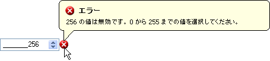

////

|metadata|
{
    "name": "win-new-winvalidator-control",
    "controlName": [],
    "tags": [],
    "guid": "{4A472A5C-B43D-4B2A-B997-C59873AB075F}",  
    "buildFlags": [],
    "createdOn": "0001-01-01T00:00:00Z"
}
|metadata|
////

= 新しい WinValidator コントロール

Windows Forms コントロールの検証では、少なくともわずなかコードが常に必要です。これは組み込みバリデータで ASP.NET コントロールを検証するほど簡単ではありません。ユーザーが実行する検証はコントロールの OnValidating イベントで行われ、一度で複数のコントロールを検証する場合は多くのコードを作成することになります。必要となるのは、ユーザーのためにすべての検証するタスクを実行するためのひとつのコンポーネントです。WinValidator™ が必要です。

WinValidator は、コントロールの Validating イベントを通して任意の Windows Forms コントロールを検証でき、または Infragistics 組み込みエディタを使用する場合、OnPropertyValueChanged イベント中に検証するために link:{ApiPlatform}win.misc{ApiVersion}~infragistics.win.misc.ultravalidator~validationtrigger.html[ValidationTrigger] を変更できます。それが公開するエクステンダ プロパティを通して異なるコントロールで WinValidator を使用できます。これらのプロパティを通して検証する新しい条件を簡単に追加できます。

WinValidator は組み込み条件の 3 つのタイプを提供します：

* link:{ApiPlatform}win{ApiVersion}~infragistics.win.operatorcondition.html[演算子] – 演算子条件によって、コントロールの値および OperatorCondition の link:{ApiPlatform}win{ApiVersion}~infragistics.win.operatorcondition~comparevalue.html[CompareValue] の複数の標準比較操作を実行することができます。条件の完全なリストについては、 link:{ApiPlatform}win{ApiVersion}~infragistics.win.conditionoperator.html[ConditionOperator] を参照してください。
* link:{ApiPlatform}win{ApiVersion}~infragistics.win.rangecondition.html[範囲] – 範囲条件によって、固有の値が link:{ApiPlatform}win{ApiVersion}~infragistics.win.rangecondition~minimumvalue.html[MinimumValue] および link:{ApiPlatform}win{ApiVersion}~infragistics.win.rangecondition~maximumvalue.html[MaximumValue] の間であるかどうかを決定できます。
* link:{ApiPlatform}win{ApiVersion}~infragistics.win.containedinlistcondition.html[リスト] – ContainedInListCondition オブジェクトによって、供給された link:{ApiPlatform}win{ApiVersion}~infragistics.win.valuelist.html[ValueList] に固有の値が含まれるかどうかを決定できます。デザイン タイムで新しい ValueList を供給するか、ラン タイムで作成した ValueList を使用できます。 link:{ApiPlatform}win{ApiVersion}~infragistics.win.listitemmatchmode.html[ListItemMatchMode] によって、ValueListItem の link:{ApiPlatform}win{ApiVersion}~infragistics.win.valuelistitem~displaytext.html[DisplayText] または link:{ApiPlatform}win{ApiVersion}~infragistics.win.valuelistitem~datavalue.html[DataValue] に一致できます。

デフォルトでは、検証が失敗した時に、WinValidator はコントロールの横に画像を表示します。コントロールがメッセージ ボックス、バルーン ヒントまたはダイアログ ボックスへの検証に失敗する場合、WinValidator が実行する Action を変更できます。情報配達のこれらのメソッドは、 link:{ApiPlatform}win.misc{ApiVersion}~infragistics.win.misc.notificationsettings.html[NotificationSettings] オブジェクトを通してすべてカスタマイズできます。このオブジェクトを通して、キャプション、テキスト、および画像をアプリケーション全体に適する何かに設定するか、個別のコントロール自体のエクステンダ プロパティを通してこれらのプロパティを設定することで各通知をオーバーライドできます。

== 関連トピック

link:winvalidator.html[WinValidator]

link:winvalidator-understanding-winvalidator.html[WinValidator の理解]

link:winvalidator-using-winvalidator.html[WinValidator の使用]

link:winvalidator-api-overview.html[API の概要]