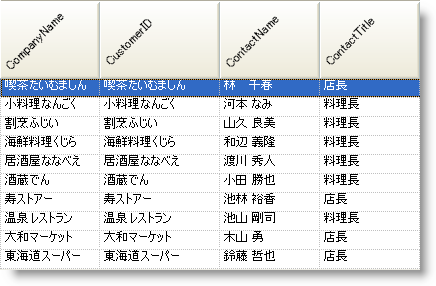

////

|metadata|
{
    "name": "win-rotating-column-headers",
    "controlName": [],
    "tags": [],
    "guid": "{F3284A47-C412-48EE-B5BC-B79ACB80317B}",  
    "buildFlags": [],
    "createdOn": "0001-01-01T00:00:00Z"
}
|metadata|
////

= 列ヘッダの回転表示

Excel 表計算のように表示や印刷ができる Microsoft® Excel® 機能を含み、WinGrid™ 内に必要でありまた希望する機能を含むことに常に弊社は注意を払っています。本リリースでは、弊社は列ヘッダーの回転を Excel の機能で継続して提供します。

列ヘッダーの回転は、より使用しやすくクリーンなユーザー インターフェイスの実現を支援すると同時に、グリッドの幅全体を大幅にスリム化します。列ヘッダーの回転は、水平方向の画面領域の量を大幅に取り戻し、垂直方向の領域では小さい部分しか犠牲にしません。この方法は、列のデータではなくヘッダーによって列の幅が長く伸ばされる大量の数値データを表示する時に最も役立ちます。

== 関連トピック

link:wingrid-rotating-text-in-wingrids-column-headers.html[WinGrid の列ヘッダーでテキストを回転]