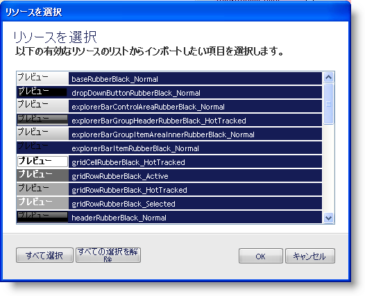

////
|metadata|
{
    "name": "win-selective-importing-whats-new-20063",
    "controlName": [],
    "tags": [],
    "guid": "{721A1141-D6F7-4014-82B1-DC3F27058867}",
    "buildFlags": [],
    "createdOn": "0001-01-01T00:00:00Z"
}
|metadata|
////

= 選択的なインポート

== インポートしたいリソースを選択できるようになった

メインの [ファイル] メニュー、またはスタイル エクスプローラの [リソース] タブで [リソースをインポート] をクリックして、スタイル ライブラリを開くと、[リソースを選択] ダイアログ ボックスが開きます。このダイアログ ボックスは、選択したスタイル ライブラリからインポート可能なすべてのリソースを表示します。Shift キーまたは Ctrl キーのいずれかを使用していくつかのリソースを選択することによって、インポートしたいリソースを指定できます。リソースのいずれかがスタイル ライブラリにすでに存在する場合には、名前の競合を解決する方法を尋ねます。この新しいダイアログ ボックスは増大するリソース ライブラリの管理を支援CtrlCtrlの非常に優れた方法です。

image::images/AppStyling_AppStylist_Enhancements_Whats_New_20063_06.png[リソース競合 ダイアログ ボックスの画像]

== 関連トピック

link:styling-guide-resources.html[リソース]

link:styling-guide-importing-and-exporting-resources.html[リソースのインポートとエクスポート]