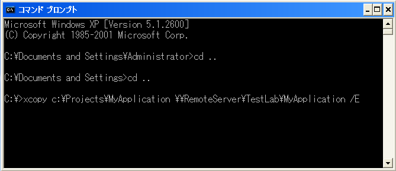

////

|metadata|
{
    "name": "win-using-xcopy-deployment",
    "controlName": [],
    "tags": [],
    "guid": "{D7979A38-7A4E-489E-A617-5E710B20D8E3}",  
    "buildFlags": [],
    "createdOn": "2005-07-06T00:00:00Z"
}
|metadata|
////

= XCOPY 配備を使用

$$.NET$$ Framework の主な目標のひとつは、XCOPY 配備という処理を可能にして配備を簡単にすることです。.NET が導入される以前は、アプリケーション コンポーネントの配備には各ファイルの適切なディレクトリへのコピーとレジストリの正しい変更が必要でした。この処理を行うには通常、高いセキュリティ権限が必要でしたし、同じアプリケーション コンポーネントの異なるバージョンのインストールには厳しい制限がありました。このような問題から "DLL Hell" と呼ばれるコンポーネント配備プロセスが導かれました。

$$.NET$$ は、以前の配備プロセスが持っていた制限の多くを取り除くことで問題を解決しようとしました。.NET コンポーネントをインストールするためにやるべきことは、コンポーネント アセンブリをアプリケーション ディレクトリにコピーすることだけで、こうすればすぐにアプリケーションでこのコンポーネント アセンブリを使い始めることができます。これができるのは、.NET アセンブリが自己記述性を持っているからです。.NET Framework 内のコンパイラは識別子またはメタデータをコンパイル済みモジュールに埋め込み、共通言語ランタイム（CLR）はこの情報を使って適切なバージョンのアセンブリをロードします。識別子には、モジュールをロード、実行するのに必要な情報や、アセンブリから参照される他のモジュールすべてを見つけるのに必要な情報がすべて含まれています。

XCOPY 配備というこの配備はインストール マシンには何の影響も与えません。それは、レジストリ項目またはコンポーネントを構成することがまったくないからです。XCOPY 配備はまたシステムにどのような影響も及ぼさずにコンポーネントをアンインストールすることを可能にします。アンインストールを終了させるのに必要な作業は、特定のファイルを特定のディレクトリから除去することだけです。

== XCOPY によるアプリケーションの配備

XCOPY 配備を使ってアプリケーション コンポーネントを配備する際、行うべきことは、コマンド プロンプトで XCOPY コマンドを用いて必要なファイルを特定のディレクトリにコピーすることだけです。

次のスクリーンショットでは、XCOPY 配備を使用して DeploymentExampleWebApp という Web アプリケーションを RemoteServer というターゲット サーバーに配備しています。

XCOPY コマンドは次のようにいくつかの引数をサポートしています。

* / E - ソース引数のディレクトリ、サブディレクトリ、ファイルをコピーします（空を含める）。
* / K - 既存のファイル/フォルダの属性を保持します。XCOPY を使ってファイルまたはディレクトリ ツリー構造をコピーすると、XCOPY はデフォルトでファイルの属性を除去します。たとえば、ファイルに読み取り専用属性がある場合、その属性はファイルのコピー後に失われます。コピー後のファイルに元の属性を保持するには、/k パラメータを使う必要があります。
* / R - 読み取り専用ファイルを上書きします。
* / O - ファイルおよびフォルダのセキュリティ関連権限 ACL をすべて保持します。
* / H - 隠しファイル、システム ファイルをともにコピーします。
* / I - コピー先がディレクトリであると想定し、まだ存在していないものとして作成します。

link:http://www.microsoft.com/resources/documentation/windows/xp/all/proddocs/en-us/xcopy.mspx[XCOPY コマンド (英語)] がサポートする各オプションについては、MSDN ヘルプ ドキュメントを参照してください。