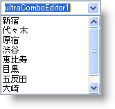

////

|metadata|
{
    "name": "win-valuelist-scrollbars-are-now-stylable-whats-new-2006-2",
    "controlName": [],
    "tags": ["Application Scenarios","Styling"],
    "guid": "{E50DE24A-ACC0-4828-B7E8-57EF26915474}",  
    "buildFlags": [],
    "createdOn": "0001-01-01T00:00:00Z"
}
|metadata|
////

= ValueList スクロールバーはスタイル可能

以前はスタイルすることができなかった {ProductName} アプリケーションのひとつは ValueList のスクロールバーでした。{ProductName} 2006 Volume 2 を使用すれば、ValueList スクロールバーのスタイリングは、pick:[win-forms="link:{ApiPlatform}win{ApiVersion}~infragistics.win.appearance.html[Appearance]"]  オブジェクトの割り当てに関わるすべてと同じように単純な作業です。Appearance オブジェクトを作成し、pick:[win-forms="link:{ApiPlatform}win{ApiVersion}~infragistics.win.ultrawinscrollbar.scrollbarlook.html[ScrollBarLook]"]  の Appearance プロパティに指定するだけです。Appearance オブジェクトを使用して、良いと思わなければ、デザインタイムに ScrollBarLook オブジェクトの Appearance を変更するオプションがありますので、そちらを使用して変更してください。

ValueLists を使用するコントロールは、以下を含む新しい機能を活用することができます。

* WinComboEditor および派生的コントロール
* WinExplorerBar
* WinGrid
* WinListView
* WinSchedule
* WinTree

以下の左右の事例のスクリーンショットは、スタイルされた ValueList スクロールバーのない WinComboEditor とスクロールバーがある WinComboEditor を示しています。

image::images/Win_ValueList_Scrollbars_are_Now_Styllable_Whats_New_20062_02.png[]

== 関連トピック：

link:winexplorerbar-style-the-scrollbars-of-winexplorerbar.html[WinExplorerBar のスクロールバーのスタイル]

link:winlistview-style-the-scrollbars-of-winlistview.html[WinListView のスクロールバーのスタイル]

link:wintree-style-the-scrollbars-of-wintree.html[WinTree のスクロールバーのスタイル]