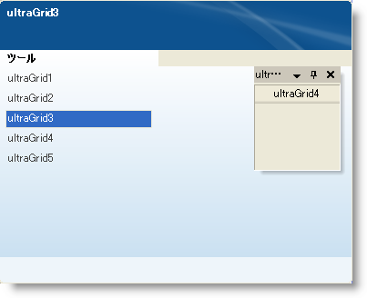

////

|metadata|
{
    "name": "win-visual-studio-2008-window-style-for-windockmanager",
    "controlName": [],
    "tags": [],
    "guid": "{EDA8381F-F248-4A5B-BC4E-16D8A0AEF63A}",  
    "buildFlags": [],
    "createdOn": "0001-01-01T00:00:00Z"
}
|metadata|
////

= WinDockManager 用の Visual Studio 2008 Window Style

Microsoft® Visual Studio® 2008 のリリースによって、Windows® XP および Windows Vista の両方に新しいドッキング ペイン スタイルが提供されました。弊社は WinDockManager でこの新しいスタイルをエミュレートしており、ユーザーはアプリケーションで Visual Studio 2008 スタイルのドッキングを使用することができます。 link:{ApiPlatform}win.ultrawindock{ApiVersion}~infragistics.win.ultrawindock.ultradockmanager~captionstyle.html[CaptionStyle] および  link:{ApiPlatform}win.ultrawindock{ApiVersion}~infragistics.win.ultrawindock.ultradockmanager~windowstyle.html[WindowStyle] プロパティを VisualStudio2008 に設定することで、この新しいスタイルにアクセスできます。

さらに、Windows Vista のドラッグ インジケータの外観は Windows XP の外観と非常に異なっているので、Vista のルック アンド フィールをアプリケーションに提供するために新しい link:{ApiPlatform}win.ultrawindock{ApiVersion}~infragistics.win.ultrawindock.ultradockmanager~dragindicatorstyle.html[DragIndicatorStyle] 列挙体を追加しました。

[cols="a,a"]
|====
|image::images/Win_Visual_Studio_2008_Window_Style_for_WinDockManager_01.png[]
|image::images/Win_Visual_Studio_2008_Window_Style_for_WinDockManager_02.png[]

|Visual Studio 2008 XP
|Visual Studio 2008 Vista

|====

選択した項目のプレビューを含み、Visual Studio 2008 では Navigator の外観が完全に異なっていることにも気づくかもしれません。心配は不要です。弊社はすべての必要な外観オブジェクト、そしてプレビュー機能を link:{ApiPlatform}win.ultrawindock{ApiVersion}~infragistics.win.ultrawindock.ultradockmanager~navigatorsettings.html[NavigatorSettings] オブジェクトに追加しました。

== 関連トピック

link:windockmanager-change-windockmanagers-style.html[WinDockManager のスタイルの変更]

link:windockmanager-show-or-hide-the-preview-in-the-navigator.html[Navigator でプレビューを表示または非表示]