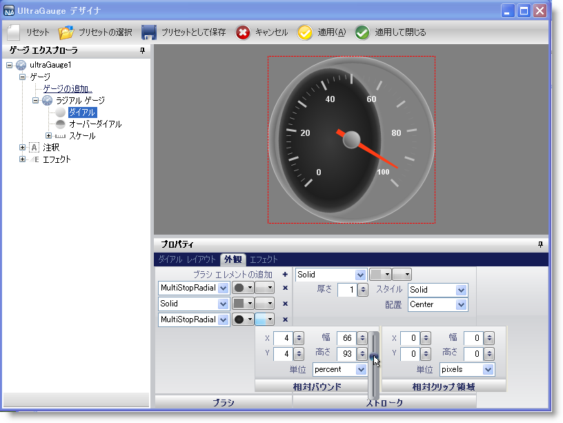

////

|metadata|
{
    "name": "win-wingauges-new-relativebounds-designer-editor",
    "controlName": [],
    "tags": [],
    "guid": "{627386DE-9F0D-428A-9C9F-130231A1AB16}",  
    "buildFlags": [],
    "createdOn": "2007-07-09T11:51:28Z"
}
|metadata|
////

= WinGauge の新しい RelativeBounds デザイナ エディタ

2007 Volume 3 リリースでは、BrushElements の Relative Bounds エディタが WinGauge™ のデザイナ用に使用できます。Relative Bounds エディタは、Relative Bounds エディタと Relative Clip Bounds エディタの 2 つの異なるエディタで構成されます。

BrushElement フレームワークによって、複数の BrushElement をレイヤ化することができます。これらの新しいエディタの導入によって、デザイナを使用して各レイヤのバウンドをシフトおよびスケールすることができます。Collection エディタを使用してコードを書くことなくデザイナで複雑なブラシを作成できます。

以下のスクリーンショットは、Relative Bounds エディタを使用して編集された BrushElements でラジアル ゲージを示します。

== 関連トピック

link:wingauge-relative-bounds.html[相対バウンド]

link:wingauge-relative-clip-bounds.html[相対クリップ領域]