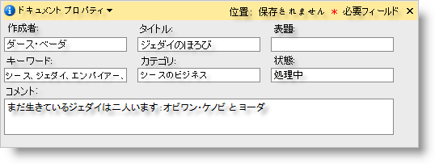
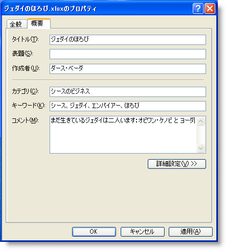

////

|metadata|
{
    "name": "win-you-can-now-add-document-properties-to-excel-workbooks-whats-new-20072",
    "controlName": [],
    "tags": [],
    "guid": "{97E433ED-514D-4568-843C-1A2C97C6A3C0}",  
    "buildFlags": [],
    "createdOn": "0001-01-01T00:00:00Z"
}
|metadata|
////

= Excel ワークブックにドキュメント プロパティを追加できるようになった

2007 Volume 2 のリリースで、識別情報を Microsoft® Excel® ワークブックに追加できるようになりました。pick:[win-forms="link:{ApiPlatform}documents.excel{ApiVersion}~infragistics.documents.excel.documentproperties.html[DocumentProperties]"]  オブジェクトは、pick:[win-forms="link:{ApiPlatform}documents.excel{ApiVersion}~infragistics.documents.excel.documentproperties~author.html[Author]"] 、pick:[win-forms="link:{ApiPlatform}documents.excel{ApiVersion}~infragistics.documents.excel.documentproperties~title.html[Title]"] 、pick:[win-forms="link:{ApiPlatform}documents.excel{ApiVersion}~infragistics.documents.excel.documentproperties~subject.html[Subject]"] 、pick:[win-forms="link:{ApiPlatform}documents.excel{ApiVersion}~infragistics.documents.excel.documentproperties~comments.html[Comments]"] 、およびいくつかのその他のプロパティを含んでいます。エクスポートしてから、Excel ファイルを右クリックして、[プロパティ] を選択し、[プロパティ] ダイアログ ボックスで [概要] をクリックすると、これらのプロパティを確認できます。Excel 2007 を使用している場合、Excel ファイルを開いた後で、[Office ボタン] をクリックして [配布準備] をポイントし、次に [プロパティ] をクリックします。

== 関連トピック

link:excelengine-add-document-properties-to-a-workbook.html[ドキュメント プロパティをワークブックに追加]