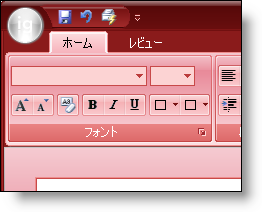

////

|metadata|
{
    "name": "win-you-can-now-blend-a-custom-color-with-the-office-2007-color-scheme-whats-new-20071",
    "controlName": [],
    "tags": [],
    "guid": "{2A8B365A-5422-4840-9DB9-E1BA817CD82E}",  
    "buildFlags": [],
    "createdOn": "0001-01-01T00:00:00Z"
}
|metadata|
////

= カスタム カラーと Office 2007 スタイルのカラー スキームをブレンド

2006 Volume 3 では、弊社は Microsoft® Office 2007 スタイルのルック アンド フィール全般をリリースしました。このルック アンド フィールを達成するために、青、黒、およびシルバーの 3 つのカラー スキームを採用しました。65,000 以上から 3 色しか使用できないということは若干の制約があります。したがって、2007 Volume 1 では、3 つの既存のカラー スキームと任意の色をブレンドする機能を提供しています。 pick:[win-forms="Office2007ColorTable"]  オブジェクトの新しい  pick:[win-forms="CustomBlendColor"]   プロパティを使用して、青、黒、またはシルバーのカラー スキームとシステム カラーをブレンドできます。

== 関連トピック

link:win-blend-a-custom-color-with-office-2007-style-color-schemes.html[カスタム カラーと Office 2007 スタイルのカラー スキームをブレンド]