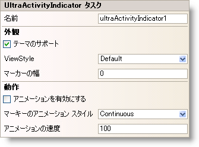

////
|metadata|
{
    "name": "winactivityindicator-winactivityindicator-smart-tag",
    "controlName": ["WinActivityIndicator"],
    "tags": ["API","Design Environment","Performance","Styling"],
    "guid": "{94BAD796-C214-412D-827C-5E39E7BD5387}",
    "buildFlags": [],
    "createdOn": "0001-01-01T00:00:00Z"
}
|metadata|
////

= WinActivityIndicator スマートタグ

Visual Studio 2005/2008（.NET Framework 2.0/3.5）以降、{ProductName} の個々のコントロール/コンポーネントにはスマートタグがあります。 コントロールやコンポーネントを選択するだけで、スマートタグのアンカーが表示されます。 このアンカーをクリックするとポップアップ パネルが表示され、そこからコントロール/コンポーネントの最もよく使うプロパティや設定にすばやく簡単にアクセスできます。

WinActivityIndicator™ スマートタグには、以下のセクションと共にコントロールの名前が含まれます。

* 外観 - コントロールの外観やルック アンド フィールに関連する一般的なタスクがあります。
* 動作 - フォーム上でのコントロールの動作を制御するプロパティに簡単にアクセスできます。

各セクションの項目（フィールド、ドロップダウン リスト、チェックボックスなど）の説明と、各項目が対応するプロパティ グリッドのプロパティについては、以下の表を参照してください。

[options="header", cols="a,a,a"]
|====
|外観|説明|対応するプロパティ

|テーマのサポート
|このチェックボックスを選択して Microsoft OS テーマを使用してコントロールを描画します。
|pick:[win-forms="link:{ApiPlatform}win{ApiVersion}~infragistics.win.ultracontrolbase~useosthemes.html[UseOsThemes]"] 

|ViewStyle
|コントロールに適用されるスタイルを選択します。
|pick:[win-forms="link:{ApiPlatform}win{ApiVersion}~infragistics.win.ultraactivityindicator.ultraactivityindicator~viewstyle.html[ViewStyle]"] 

|マーカーの幅
|コントロールが Marquee モードの時にマーカーの幅を決定する値を入力します。
|pick:[win-forms="link:{ApiPlatform}win{ApiVersion}~infragistics.win.ultraactivityindicator.ultraactivityindicator~marqueemarkerwidth.html[MarqueeMarkerWidth]"] 

|====

[options="header", cols="a,a,a"]
|====
|動作|説明|対応するプロパティ

|アニメーションを有効にする
|このチェックボックスを選択して WinActivityIndicator コントロールでアニメーションを開始します。
|pick:[win-forms="link:{ApiPlatform}win{ApiVersion}~infragistics.win.ultraactivityindicator.ultraactivityindicator~animationenabled.html[AnimationEnabled]"] 

|マーキー アニメーション スタイル
|連続したマーキー アニメーション スタイルとバウンスバックするマーキー アニメーション スタイルのどちらかを選択します。
|pick:[win-forms="link:{ApiPlatform}win{ApiVersion}~infragistics.win.ultraactivityindicator.ultraactivityindicator~marqueeanimationstyle.html[MarqueeAnimationStyle]"] 

|アニメーション速度
|アニメーション速度をミリ秒単位で選択します。
|pick:[win-forms="link:{ApiPlatform}win{ApiVersion}~infragistics.win.ultraactivityindicator.ultraactivityindicator~animationspeed.html[AnimationSpeed]"] 

|====