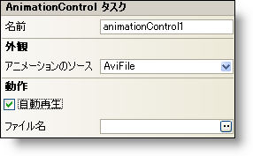

////

|metadata|
{
    "name": "winanimation-smart-tag",
    "controlName": [],
    "tags": ["Getting Started"],
    "guid": "{E4665DA6-BE24-4FE3-AFD4-0ACD890F30F3}",  
    "buildFlags": [],
    "createdOn": "2005-07-11T00:00:00Z"
}
|metadata|
////

= WinAnimation スマート タグ

Visual Studio 2005（.NET Framework 2.0）では、{ProductName} コントロール/コンポーネントがそれぞれ固有のスマート タグを備えています。コントロールやコンポーネントを選択するだけで、スマート タグのアンカーが表示されます。このアンカーをクリックするとポップアップ パネルが表示され、そこからコントロール/コンポーネントの最もよく使用するプロパティや設定にすばやく簡単にアクセスできます。

AnimationControl スマート タグには、コントロールの名前と次のセクションがあります。

* Appearance -- コントロールの外観やルック アンド フィールに関連する一般的なタスクがあります。
* Behavior -- フォーム上でのコントロールの動作を制御するプロパティに簡単にアクセスできます。

各セクションの項目（たとえば、フィールド、ドロップダウン リスト、チェック ボックス）およびプロパティ グリッドの項目の対応するプロパティの説明については以下を参照してください。

[options="header", cols="a,a,a"]
|====
|外観|説明|対応するプロパティ

|アニメーションのソース
|アニメーションのソースには、AVI ファイルか、Windows のデフォルトに基づく既定のアニメーションを指定できます。Windows のデフォルト アニメーションには、FindFolder、FindFile、FindComputer などがあります。
| link:{ApiPlatform}win.misc{ApiVersion}~infragistics.win.misc.commoncontrols.animationcontrol~animationsource.html[AnimationSource]

|====

[options="header", cols="a,a,a"]
|====
|動作|説明|対応するプロパティ

|AutoPlay
|コントロールのアニメーションを自動的に開始できます。
| link:{ApiPlatform}win.misc{ApiVersion}~infragistics.win.misc.commoncontrols.animationcontrol~autoplay.html[AutoPlay]

|ファイル名
|AnimationSource プロパティを AviFile に設定することで、使用するファイルを指定できます。このファイルは AVI 形式である必要があります。
| link:{ApiPlatform}win.misc{ApiVersion}~infragistics.win.misc.commoncontrols.animationcontrol~filename.html[FileName]

|====