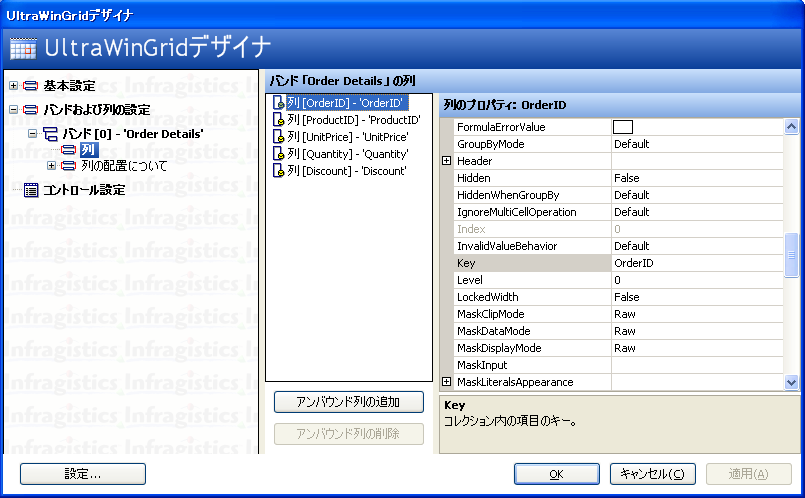
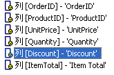
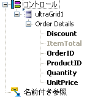
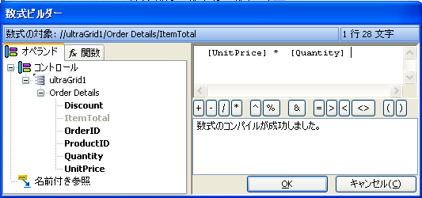
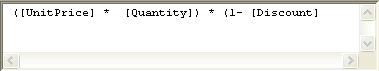
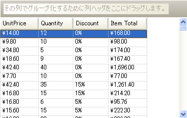

////

|metadata|
{
    "name": "wincalcmanager-creating-a-calculated-column-in-wingrid",
    "controlName": ["WinCalcManager"],
    "tags": ["How Do I"],
    "guid": "{B863BD3A-AAC3-4BE0-8DD0-C613026A9988}",  
    "buildFlags": [],
    "createdOn": "0001-01-01T00:00:00Z"
}
|metadata|
////

= WinGrid での計算された列の作成

== 始める前に

WinCalcManager には、WinGrid 列内で計算を実行する機能があります。この方法を手順に沿って説明します。

== 以下の手順を実行します。

[start=1]
. WinCalcManager と WinGrid を使用したプロジェクトを設定します。Visual Studio で、Visual Basic .NET または C# いずれかの Windows アプリケーションを新規作成します。UltraCalcManager と UltraWinGrid をフォームに追加します。
[start=2]
. 次に WinGrid をデータ バインドします。この方法の詳細については、pick:[win-forms="link:wingrid-binding-wingrid-to-a-flat-data-source-clr2.html[「WinGrid をフラットデータソースにバインドする」]"] を参照してください。ここでは、Northwind データベースの Order Details テーブルをデータとして使用します。Northwind データベース（Nwind.mdb）は Infragistics SDK インストールの一部として使用できます。デフォルトで、NWind.mdb ファイルは、オペレーティング システムによって、以下のインストール フォルダに配置されています。

** XP -- {InstallPathXP}{ProductNameVersion}\Samples\WinForms\Data
** Vista -- {InstallPathVista}{ProductNameVersion}\Samples\WinForms\Data

[start=3]
. これでグリッドのデータ ソースが設定されました。次に、計算のためにアンバインド列を作成します。アンバインド列を WinGrid に追加します。WinGrid を右クリックして [UltraGrid デザイナ] を選択し、グリッド デザイナを起動します。
[start=4]
. WebGrid デザイナで、ノードをドリルダウンします。[バンドおよび列の設定] > [Band[0] - 'Order Details'] の順にノードを展開します。このノードを選択すると、このバンドで使用可能な列が中央ペインに表示されます。

[start=5]
. 下の [アンバウンド列の追加] ボタンをクリックして、新しい列をバンドに追加します。

[start=6]
. 列のキーを "ItemTotal" に変更します。列の Header.Caption を "Item Total" に変更します。列の DataType を System.Decimal に変更します。

[start=7]
. 見た目を整えるため、UnitPrice 列と Item Total 列の pick:[win-forms="link:{ApiPlatform}win.ultrawingrid{ApiVersion}~infragistics.win.ultrawingrid.ultragridcolumn~format.html[Format]"] プロパティを c2 （通貨）に設定し、Discount 列の Format を "p0"（%）に設定します。また、OrderID 列と ProductID 列の pick:[win-forms="link:{ApiPlatform}win.ultrawingrid{ApiVersion}~infragistics.win.ultrawingrid.ultragridcolumn~hidden.html[Hidden]"]  プロパティを True に設定します。
[start=8]
. アンバインド列の数式を作成するため、Item Total 列の pick:[win-forms="link:{ApiPlatform}win.ultrawingrid{ApiVersion}~infragistics.win.ultrawingrid.ultragridcolumn~formula.html[Formula]"]  プロパティで省略（...）ボタンをクリックして FormulaBuilder を起動します。

左側に Operands リストがあります。[Controls] ノードをクリックし、キーボードの数字キーパッドのアスタリスク（$$*$$）を押します。これでツリー全体が展開されます。UltraGrid1 とそのひとつのバンド（Order Details）、およびグリッドの 6 つの列がツリーに表示されます。

リスト中のアンバインド列はグレー表示になっています。これは "Item Total" 列の数式を編集しようとしているためです。それ自体を参照する数式は循環参照になるため、編集対象のノードは無効にされます。
[start=9]
. 列の数式では、UnitPrice と Quantity を掛けてから、Discount をパーセントで適用します。まず UnitPrice と Quantity を掛けます。これには、標準の乗算演算子（$$*$$）を使う方法と product 関数を使う方法の 2 通りがあります。ここでは、標準の乗算演算子の方法を示します。

まず、UnitPrice 列への参照を数式ウィンドウに挿入する必要があります。これには次の 3 通りの方法があります。

** オペランド ツリーで [UnitPrice] ノードをダブルクリックする。
** 数式ウィンドウを右クリックして [オペランドの挿入] を選択し、メニューをドリルダウンして [UnitPrice] を選択する。
** 数式ウィンドウに直接入力する。

[start=10]
. 次に、乗算演算子を追加します。数式ウィンドウの下に並んだボタンの中から $$*$$ ボタンをクリックするか、適切な位置にアスタリスクを入力します。
[start=11]
. 次に、UnitPrice を追加したときと同様に Quantity への参照を追加します。

この時点で、右下の数式ステータス ウィンドウには数式のコンパイルが成功したことが表示されます。これは作成した数式がすでに有効であることを示しますが、まだ割引を適用していません。
[start=12]
. この数式を設計するための方法は多数あります。1 マイナスの割引を掛けて完了します。数式がどのように表示されるかの例を以下に示します。以下の数式はすべて有効です。

[start=13]
. 数式が完成したら、[FormulaBuilder] ダイアログで [OK] をクリックします。作成した数式がグリッド列の Formula プロパティに表示されます。

[適用] をクリックしてデザイナで行った設定を保存してから、[OK] をクリックしてグリッド デザイナを終了します。
[start=14]
. アプリケーションを実行して結果を確認します。

== まとめ

この詳細なガイドの目的は、WinCalcManager を使用して WinGrid に計算列を作成する手順を説明することです。