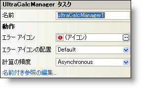

////

|metadata|
{
    "name": "wincalcmanager-smart-tag",
    "controlName": ["WinCalcManager"],
    "tags": ["Design Environment","Extending"],
    "guid": "{19BD56E5-3FC1-4938-B7D2-EA856305757F}",  
    "buildFlags": [],
    "createdOn": "2005-09-11T00:00:00Z"
}
|metadata|
////

= WinCalcManager スマート タグ

Visual Studio 2005（.NET Framework 2.0）では、それぞれの {ProductName} コントロール/コンポーネントが固有のスマート タグを備えています。 コントロール/コンポーネントを単に選択すると、Smart Tag のアンカーが表示されます。このアンカーをクリックするとポップアップ パネルが表示され、そこからコントロール/コンポーネントの最もよく使用するプロパティや設定にすばやく簡単にアクセスできます。

WinCalcManager スマートタグには、コンポーネントの名前と次のセクションがあります。

* Behavior -- フォーム上でのコントロールの動作を制御するプロパティに簡単にアクセスできます。

各セクションの項目（たとえば、フィールド、ドロップダウン リスト、チェック ボックス）およびプロパティ グリッドの項目の対応するプロパティの説明については以下を参照してください。

[options="header", cols="a,a,a"]
|====
|動作|説明|対応するプロパティ

|計算頻度
|この項目は WinCalcManager による計算をどれくらいの頻度で実行するかを指定します。"Asynchronous"、"Synchronous"、"Manual"の中から選択できます。
| link:{ApiPlatform}win.ultrawincalcmanager{ApiVersion}~infragistics.win.ultrawincalcmanager.ultracalcmanager~calcfrequency.html[CalcFrequency]

|エラー アイコン
|WinCalcManager による数式の計算中にエラーが発生した場合は、エラー ダイアログが現れてこのアイコンが表示されます。アイコンを変更するには、省略(...)をクリックします。[ファイルを開く] ダイアログが表示され、アイコン ファイル ($$*$$.ico) を選択できます。
| link:{ApiPlatform}win.ultrawincalcmanager{ApiVersion}~infragistics.win.ultrawincalcmanager.ultracalcmanager~erroricon.html[ErrorIcon]

|エラー アイコン配列
|エラー ダイアログ上のエラー アイコンを表示する位置を 6 箇所から選択します。
| link:{ApiPlatform}win.ultrawincalcmanager{ApiVersion}~infragistics.win.ultrawincalcmanager.ultracalcmanager~erroriconalignment.html[ErrorIconAlignment]

|名前付き参照の編集
|名前付き参照は基本的に、計算に使用するためにプログラマが設定する一定の変数です。これらの変数をすべて含む NamedReferences コレクションが存在します。省略（...）ボタンをクリックして名前付き参照を追加または編集します。
| link:{ApiPlatform}win.ultrawincalcmanager{ApiVersion}~infragistics.win.ultrawincalcmanager.ultracalcmanager~namedreferences.html[NamedReferences]

|====